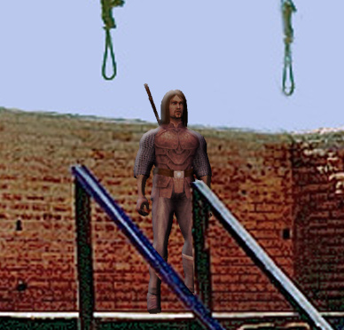

Back to: [West Karana](/posts/westkarana.md) > [2008](/posts/2008/westkarana.md) > [October](./westkarana.md)
# The Death of Stout Henry

*Posted by Tipa on 2008-10-17 08:45:20*

"This man," shouted the Magistrate, "who has come before us, an inhuman wretch, devoid of pity; void and empty; stands before you exposed. Let they who have issue with him come forth, and tell to us his crimes."

"Crimes?" grinned Stout Henry, his quilted jerkin somewhat soiled, the tattered cape with an embroidered wolf on the back, its muzzle raised to howl at the moon, much the worse for wear. "The only crime here is how little you offered for those good, solid candlesticks that look JUST LIKE GOLD. I could get twice as much in Greenswold, you know."

The Magistrate grimaced. "By the pleasure of the Duke, I summon Farmer Jonas..."

The hours wore on. Farmer Jonas cried once more as he described the tragic fate of his prize beagle, Poochie. The pastor of the chapel that Henry had robbed described, with a dead, flat, voice, the carnage of that day. The owner of the ducal livery stables explained how Henry had distracted him and stolen the Duke's proud mare. The merchants of the bazaar recounted in amazement the sort of animal remains that Henry attempted to sell them.

"Have you nothing to say to this?" demanded the Magistrate after each person had their time to recount Stout Henry's crimes.

Stout Henry would only shrug. "Next!" he'd say. "Next! Next! Next! Continue! OK! Man, I hate these friggin' walls of talk. Could you all just speak faster so we can get to the end and you all can just tell me where I have to go and what I gotta kill?"

"It ends now," snarled the Magistrate. "Good Duke Ferd, this man waits upon your judgment."

The Duke rose from his chair. He'd not said a word throughout the entire trial.

"Make room," said the Duke, "and let this villain stand before us." The jailers grabbed Stout Henry off the stand and shoved him before the Duke.

"Henry," continued the Duke. "The whole of this village thinks, and we think, too, that you cannot be alone in your villainy. and that you lead'st in the fashion of your malice to the last hour of your thought. How say you?"

"What the farg are you on about?" said Stout Henry. "Talk ENGLISH. Friggin' roleplayers. You want to know why I do what I do? You're such a noob. Killing stuff is the only way to WIN."

"Then," said the Duke, dismissively, "we win. Magistrate, conduct this villain to the care of the gallows keeper, and let his death seal his crimes."

The villagers who had crowded the courthouse let out a roar, and were barely kept from tearing apart Stout Henry as he was hustled to the courtyard where the gallows stood ready. The hooded gallows keeper settled the noose around Stout Henry's neck, and adjusted and tightened the knot. Guardsmen kept the crowd not more than a spear's length from the gallows. Duke Ferd himself stood on the porch of the courthouse.

"Gallows keeper," shouted the Duke, "perform your office. Let Stout Henry be hanged until he is dead, and may God have mercy on his soul."

The gallows keeper put two massive hands on the lever that would release the trap door beneath Stout Henry's feet and looked out at the crowd. They roared for blood. He slammed the lever to the other side. The trap door fell away, and Stout Henry began to fall.

The crowd suddenly fell silent.

So did everything else.

A gnome stood beneath the gallows. There was a strange, glowing contraption strapped to his back. He cut Stout Henry's noose, and Henry fell to the ground.

"About time you got here," growled Henry. "I almost had to run back from the graveyard."

"Give me a break," sniped the gnome. "One of those paws you gave me was twisted, and I had to run it through my Tarsalator. You're just lucky my Chronopawser only killed one of my assistants when I tested it, or I'd have been too late."

"Let's get going," said Stout Henry. "I hear they have some battleground action going on in Nodding Fields."

By the time the crowd noticed Henry's sudden disappearance, both Stout Henry and the mysterious gnome were halfway out of the county.

---

*Who is the mysterious gnome? Where is Nodding Fields? Why does Duke Ferd talk so funny? Tune in next week where we'll answer at least some of these questions, in Stout Henry Gets Lost.
*
## Comments!

**[Openedge1](http://simple-n-complex.blogspot.com/)** writes: Wowsers...good thing Stout's quest log was not full or that would have been the end..

Good stories..

Cheers

---

**[Cow Nose the 50 Pound Cat](http://cownosethe50poundcat.blogspot.com)** writes: Haha awesomeee!

---

**[tenfoldhate](http://tenfoldhate.com)** writes: Again, I'm loving the concept of a L337-mentality player dropped into an honest-to-goodness fantasy world. "I hear they have some battleground action" had me ROFL. The barbarians are truly at the gates--in fact, I think they may have already stormed the castle without us knowing it. If your satire didn't strike so close to the social reality of MMORPGs at present, I'd be laughing even more.

Bah, I think I'm just eternally screwed being an old pen-and-paper RPGer who came to MMORPGs a little late in the game, to find these fantastic virtual worlds overpopulated with Stout Henry types.

Maybe there'll be a little solace in the non-"overhyped blockbuster" European games due to release soon like Chronicles of Spellborn and Earthrise. Both seem like they're gonna try to break free of the great big American cookie cutter a bit. Speaking of which, I haven't heard much on Spellborn even though it's due out around Thanksgiving, no?

Ok, I'm veering off topic...

---

**[Tipa](https://chasingdings.com)** writes: I am really looking forward to Spellborn. All I really want in an MMO is a storybook world which lets me play how I like to play -- very socially. EQ came the closest, but lost it when it shifted its focus to raids. I haven't played Spellborn yet, but from what I have seen, it looks like it's story heavy, and you can dress your character how you like it. If I can make fantasy characters in TCoS as freely as I can make heroes in CoH, they've already earned my money.

As for Stout Henry... we'll find out where he comes from and why he is the way he is eventually ;)

---

**[tenfoldhate](http://tenfoldhate.com)** writes: Yes, the story element of Spellborn, coupled with how they're describing the game play elements--and the fact that clothing is more about customizing your character than stats and other e-peen anti-immersive B.S., make it very appealing. Right now I'm playing WAR, which is a very well crafted, extremely entertaining game, but it feels like just that--a really good GAME and not so much an RPG.

Hmmm...once Spellborn gets off the ground, would you ever consider organizing a little West Karana-guild in the vein of what you did with "Nostalgia" in EQ?

---

**[Tipa](https://chasingdings.com)** writes: Well, I'll definitely be trying out Spellborn. I've been skipping FotM after FotM because I knew it was coming. Will I make a guild? I dunno. It's a lot of work. If a lot of people wanted to start a casual guild that grouped together but wasn't all about getting to the top and wtf pwning the curve -- just people who enjoyed playing together for fun -- that would be cool :)

Though I love W101, its utter lack of social features makes it kinda barren for me. I think I'll probably be giving up W101 when Spellborn comes out, which means two-three nights a week, I'll be there.

---

