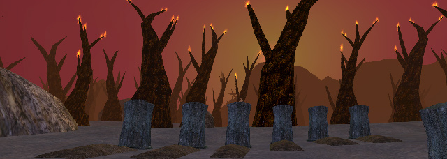
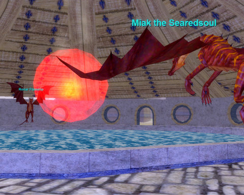
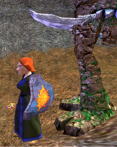

Back to: [West Karana](/posts/westkarana.md) > [2008](/posts/2008/westkarana.md) > [October](./westkarana.md)
# EQ: Burning in the Plane of Fire

*Posted by Tipa on 2008-10-18 10:32:57*

  
*Doomfire, the Burning Lands*

Last night was another light night; by seven, there were only four of us on: Stolig, who had heroically leveled from 46 to 53 -- just two levels from being able to enter the Plane of Storms for hot zone xp goodness; Kanad; Mantis and myself. Stolig only had an hour before real life would call him away, and was having fun further mutilating the mutilated, undead frogs of Lower Guk, so the rest of us were left figuring out what we could do.

Kanad asked me if I had Endless Quiver, the ranger ability that gives you an unending supply of arrows. I did! It was the first Class AA I got, actually. So he suggested we try out kiting in the Plane of Fire.

  
*The wardens who guard the portal to the Plane of Fire*

Could I even zone in? Traditionally, access to the Plane of Fire was achieved only by completing all the raids up to and including the raid on the Tower of Solusek Ro, which would drop you into the Plane of Fire after you killed the Burning Prince himself.

  
*The Fennin Ro shield, one quarter of the Key of Time*Later on, you could get permanent access to PoF -- one of the two best AA xp spots in the entire Planes of Power expansion, the other being the Plane of Earth -- simply by hailing a spirit that appears after killing Fennin Ro, the ultimate boss of the plane, and receiving a shield called the Globe of Dancing Flame from it. The spirit would only give out 40 shields, but you'd get everyone their shield after the first couple of times killing him. His loot was good enough that you would want to farm him for awhile as part of the gear-up to the Plane of Time. After all the mains were flagged, people would use the "5 out of 6" rule -- for every five flagged character, you could bring in one unflagged character -- to bring in their alts to grab the shield and get instantly flagged for the Plane of Fire, as if they had done all the pre-requisite raids.

That's how Tsuki, my 65 mage over on Stromm, got hers :) She even went on a few pickup Fire raids.

Anyway, last night, the (ahem) burning question was whether SOE had relaxed the flag requirements to zone into the Plane of Fire? 

I found the portal the Doomfire in the Plane of Tranquility, clicked on it and I zoned right in.

A level 60 character with no flags for anything could definitely enter the Plane of Fire, and probably the other planes as well. Including the Plane of Earth, with that [named croc who spawns right in front of the zone in](http://eqbeastiary.allakhazam.com/search.shtml?id=13956) and drops [the ranger pet-weapon](http://everquest.allakhazam.com/db/item.html?item=21441) sometimes.

Not that I care, right?

Mmmm.... pet weapon :) Procs a wolf!

Well, Kanad was happy we could group in PoF if we wanted, but kinda pissed (I thought) that SOE had done away with all the flagging requirements for the zone. He'd done the raiding, he got the flag legit, and now some still wet behind the ears newbie carpetbaggers were going to be able to come right in and stink up the joint.

And that was our night. I'd pull un-snareable mobs, and we'd all madly dash back and forth trying to not die. Well, most were snareable, but it was the ones that couldn't be snared that were the MOST fun. We all turned our regular experience back on, because the goal right now is to level to 65 and start terrorizing the Bastion of Thunder. All of us dinged to level 61 during the night, so our inevitable rise to power has begun.

We got a lot of cash loot for a fairly decent split, as well as a Defiant sword and a Defiant plate breastplate, so Defiant stuff is still clearly dropping even after the Living Legacy event has long been over.

EverQuest's next expansion, the Seeds of Destruction, comes out Tuesday, and that brings Hirelings into the mix. A good warrior hireling could be VERY handy. But if anyone has a 55-65 warrior on some server somewhere and are interested in seeing some of old EverQuest on a casual basis, give us a holler. Any class, really.

Otherwise, we'll be giving hirelings a try.

## Comments!

**Egat** writes: Mmmm, so many good memories in PoFire, both raiding and grouping.

I went back recently to finally farm up my warrior pet proc weapon, only took about 36 hours before it dropped!

---

