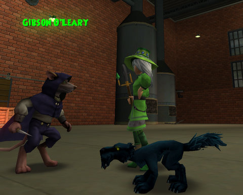
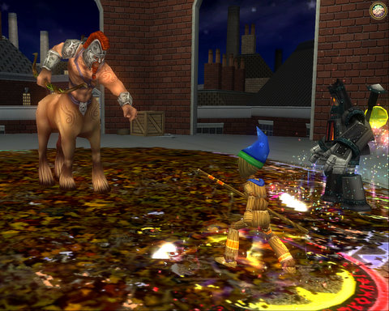
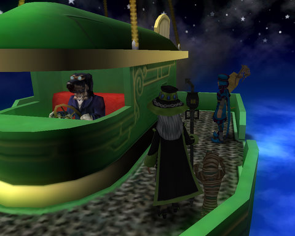
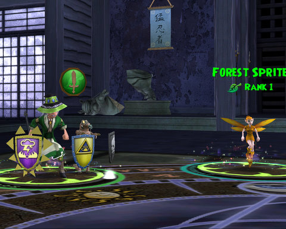

Back to: [West Karana](/posts/westkarana.md) > [2008](/posts/2008/westkarana.md) > [October](./westkarana.md)
# W101: The long journey to Moo Shu

*Posted by Tipa on 2008-10-19 23:32:08*

It took the better part of two days and the help of a handful of friends, but I finally finished the story line missions in Marleybone to unlock Moo Shu, Wizard 101's fourth (and so far, final) world.

What was the hurry? None, really. But -- I love Wizard 101. It's original, has deep, strategic gameplay, it's different, fun and funny... So when EQ2's expansion, The Shadow Odyssey, comes out, and Chronicles of Spellborn, I don't want to just dump the game.

Just like World of Warcraft was for me, when I played, what I like about Wizard 101 is that it's a MMO you can finish. There is a storyline that runs through the game, and each "world" is another chapter in it. And though you can't finish the story yet, you can play through the first four chapters -- the corruption and evil of the Professor of the Death School, Malistaire, in Wizard City. His search for the source of ultimate evil, the Krokonomicon, in the Egyptian-themed world of Krokotopia. Following the book to the Victorian, steampunk world of Marleybone, where it had been shipped unbeknownst to the Royal Museum. The theft of the book by master criminal Meowiarty, who sold it to Malistaire, who took it too his home in the world of Dragonspyre. Traveling to the Oriental world of Moo Shu in hopes to discover a path to Dragonspyre.

That's as far as the story goes. So I figure I have about a month to get to the end of the story and to help all my friends get there as well, and then I can put the game away until Dragonspyre is opened .

So as of this afternoon, I am in Moo Shu.

But first, the clothes. There's such an enormous variety of outfits in the world that after awhile, you have several sets that have decent enough stats that you can pick out what looks best to you. And you can dye them any combination of colors.

Here's mine :)

|  |  |  |
| --- | --- | --- |
|
 Level 30 |

 Level 31 |

 Level 32-33 |

| Level 34 |

 Level 35 |

I liked the black one in the center the best. I wore that for a long time. Around the same time I picked up a steam-power staff which you just have to admire for the sheer kookiness of it. It casts Myth magic which, unlike my previous Life magic staff, doesn't trigger my Life blades and traps, so it makes it a little easier to play my hand for maximum damage.

The robe in the last picture is an RMT robe from the Zeke in Moo Shu. Why buy one? My old robes weren't bad by any means. But I had the Crowns, so why not? I got to level 35 without them, so the better stats and the special card that comes with it -- I didn't need. 

Besides, I had my Sprite Guardian to keep me alive and a bunch of friends to help the time go by swiftly.

This picture seems so long ago. Here I am trying to convince a dirty stinking rat to give up a secret code. At my side is my faithful kitty, Millie. She actually gives a card that lets her attack occasionally, so unlike most pets, she isn't just for show. She is fiercely intimidating that rat, and he does end up giving me the code.

They always do, in the end.

Ah, the nefarious Dr. Katzenstein. The boss, as you'd guess, of Katzenstein's Lab. A friend and I were doing Katz's Lab, but in different instances, and we could simply not get over to the others' instance, so I ended up doing it myself.

This is where I got the steampunk staff, by the way, though I didn't start using it until afterward, when was back in town and going over my loot and found it.

After Katty's defeat, you have to help Katz's assistant, Grunt, try to figure out who is controlling the clockwork army by making a clockwork out of parts and powering it up using the immense devices in the lab. It's a regular fireworks show. The answer led to a prominent monument in Marleybone.

But there was a little side quest you could do. There seemed to be more buildings out back, and if you just built a little bridge you could cross over to them. Hidden in the back was a huge clockwork named Smogger, along with a sneaky friend.

It was late and I wasn't paying careful attention, so it was a few rounds in before I noticed that Smogger had four. Thousand. Health points. I wasn't sure I even had that many points of damage in my deck. I'd been doing my typical play style of madly discarding through my deck until I had the cards I wanted to play in my hand.

That had to stop immediately. I would need every single card I had. Luckily, I hadn't played or discarded my Judgment card. Judgment does 125 points of damage for every pip spent, so in theory, playing that card can take down any monster in one hit -- if you wait long enough. Since it's a Balance school spell, Life power pips won't count for double, but 4000/125 = 32 pips = 32 turns of passing or playing cards without a pip cost would kill it. I dealt with the add before they killed me. There's only so much damage a Sprite Guardian can heal, but once I was facing just the boss, it was manageable (though one of Smogger's AE killed her, so I had to spend four pips to bring out another).

I'd recently put some very high rank cards in my deck; the rank 5 heal over time (50 points + 1100 points over three turns) and the rank 6 centaur spell. When boosted by Life Blade, the centaur can do over 700 damage (I have gotten it over 900).

I'm not sure how long that fight took. It seemed nothing I could do with it budged its health. But eventually, I whittled it down until he died. I had to help out my Sprite a couple of times with those massive heals over time. My only worry really was that I would run out of cards with which to do damage -- in which case we lose -- or my Sprite would run out of cards to heal me with -- in which case, we lose, unless I have another Sprite in my hand.

Which I did, the one time I needed it in the fight. I'd stopped discarding any cards. I only had 30, plus another 10 on my sideboard. 

Anyway, that eventually ended. I was so keyed up, I continued on even though I was exhausted, and went on to Big Ben, which I knew was the last storyline instance in the game. I struggled through Counterweight East somehow, and collapsed afterward into bed.

I helped some friends with some quests and boss fights when I sat back down to the game around noon. I convinced one of them to help me with the other side of Big Ben, Counterweight West. That went fairly well. Neither of the Counterweights are really all that exciting; eight or nine or ten battles, culminating with a boss fight at the top.

Naturally, once we finished with Counterweight West, it was my turn to help with instances. Here's a friend and I traveling to the Ironworks, with [the faithful Mr. Personality](http://thefriendlynecromancer.blogspot.com/2008/10/stoicism.html) at the controls of the balloon taxi. We finished Ironworks in short order. This being my third time through it, I got no xp from it. Thanks, KingsIsle. Exp for helping friends? Pshaw!

After a couple of hours of helping with boss fights and instances, I delicately broached the subject of a couple of easy -- EASY -- fights in a small clocktower. Ten minutes, TOPS.

Heh... no, I was up front about it. I knew it would take at least an hour, and I think it may have taken a little more. Seemed like we were in there for a long time.

Not sure how many floors there are, with a boss fight on most of them. Maybe a dozen? The fights were actually really well-paced. After a few fights, there'd be a rest floor with mana and health wisps. So after each fight, you could run back down to the most recent rest floor and get full health and mana before moving on.

One floor, we found a bottle of milk. My friend Andrew tried to pick it up, but it spilled (he didn't cry, though). A few floors up, he found another, and spilled that as well. A voice whispered to him that he ought not do that again, or there would be trouble.

A few floors up, there's ANOTHER bottle, and Blaze, the level 13 wizard who'd tagged along, knocked it over on purpose.

That triggered a really tough fight. We grumbled, but it was all good.

Big Ben is pretty much a level 30 instance. I was 34, Andrew was 24 I think, and Blaze was 13. One of Wizard 101's strengths is that low level and higher level people can group and still be totally effective. Blaze even ended up tanking in some battles. He and my Sprite grew very close. I was unsure about having him along, but he did so well that I soon was relying on him.

At the top of Big Ben, we found Malistaire taking the Krokonomicon from Meowiarty. Malistaire paused to insult us, then fled off to his home in Dragonspyre, leaving us for Meowiarty to deal with. [The Friendly Necromancer](http://thefriendlynecromancer.blogspot.com/) had warned us to take out the Life wizard first, so we did just that. It was a long fight, but the end was never in doubt, and in the end, when we'd divided the loot and run around and gotten the quest bits in the area, when they asked NOW what, all I could think to say what I do after each fight.

Take screen shots :)

So that's what we did.

Andrew is the wizard in the red tux. Blaze is the colorful one.

I'm in the middle, along with Baby Ben, one of the two rare pets I obtained while helping Andrew and his friend, Richard, in the Tomb of Storms in Krokotopia. So yes, I finally have some rare pets. The other one is an orange Mander, looks awful so I don't let him out.

I didn't really want to continue, but I really wanted to level to 35. I was so close to it after Big Ben. I went to Moo Shu at 34, did some of the first quests -- the Test of Body, a combat test, is pictured above. You can see my faithful Sprite. Without her, I'd have to heal in groups. Well, heal more. It's not like I never heal. 

I don't know what the scroll reads. My Kanji dictionary has the top and bottom kanji to mean "mosa" (moe-sa), a brave man. The top kanji has the meaning of brave, ferocious, fierce, and can be read as "take" (ta-keh), as in the name Takeshi.

The center kanji I couldn't find in any dictionary, not paper and not online. So I dunno what it all means, probably something about being a brave man.

So, Moo Shu at last. I have to return to Marleybone and finish up some quests in Knight's Court. My plan was to completely finish with Knight's Court before doing Big Ben and moving to Moo Shu, but I got impatient and took advantage of having friends on to help.

But since I have fifteen levels to make up and with the fast xp exploits closed (which is indirectly why instances only give experience the first two times you do them), I can't afford to leave any quest undone. 

From what I understand, Moo Shu is one of the largest worlds, but with the xp exploits closed, I keep hearing there's only enough content to bring you to your mid-forties even so. Once you've finished all your quests and done every instance twice, you literally cannot progress (straight killing gives nearly no experience). There's a lot of people sitting in their 40s, waiting for Dragonspyre to go live so they can finish leveling.

Sorry for the picture-heavy post :P

## Comments!

**[Crookshankz](http://thegaminggoob.wordpress.com)** writes: Your spoilers burn my eyes!!! HA! I see I still have plenty to look forward too. I am defintely enjoying my time in Wizard City and am looking forward to my further adventures. Thanks Tipa, for writing about W101. Otherwise I may be missing out on a truely charming game :-)

---

**[Tipa](https://chasingdings.com)** writes: Yeah, it's really a lot of fun :) Just think, an MMO that was actually designed to be fun. What a concept!

---

**[Robert](http://worldofsolitaire.com)** writes: I tried out Wizard 101. I really wanted to love the game.
I played Magic the Gathering and World of Warcraft each for many years.
I loved the cutesy style of Wizard 101, the game 'felt' nice too. Running around, etc.
The battle animations had sort of a console game feel, which I also actually liked.
Add to that the excellent art direction and the fact that there is some sort of story, made me really want to fall in love with the game.
Kick ass outfits, extra bonus.

Sadly there was one big thing that I could not get past.
The card game.

In my opinion, it sucks.
6+ schools or something, and if you actually look at the spells each one casts, they are really similar.
In their zeal to make the card game really simple so that a 4 year old could understand, while still trying to make it 'complex' enough so that there is enough depth, I think they ended up with a rather icky card game.
Since the card game is a BIG part of the game, maybe the BIGGEST part, not really liking it pretty much made the game unplayable for me :(

I really hope it succeeds though, as other companies could learn a lot from them in terms of polish and doing things a new way :)

---

**[Tipa](https://chasingdings.com)** writes: Okay, you're definitely a pro if you come from the M:tG world. I'm not sure, though, how far you got into Wizard 101. I don't think the game would ever be as complex as M:tG, since W101 is meant to be accessible to children, but you do get pretty strategic play as the battles become tougher. Life wizard casting a group one-shot accuracy bonus right before the Storm wizard sets up a killing spell to wipe out every enemy at once -- if it doesn't fizzle. That sort of thing. Dropping a heal over time on a Fire wizard just before he does an Immolate, etc. Shutting down your opponents by brutally slashing their accuracy so they can't play any cards...

I'm just glad it's not a 'press A to Autoattack' kinda game. 

I played M:tG some back in the 90s, but was never pro, though I did have a great Green deck I loved. I'd definitely play an MMO based on a REALLY strategic card game like that one, but W101 is a good first step.

---

**Ernie** writes: Enjoyed that read! Been reading your blog for quite some time (being an ex-EQ1 addict) and always enjoy the way you write up your adventures. You're also responsible for me starting W101 (and totally neglecting my "should-be-my-next-love" WAR warrior priest. Come to think of it, my guild wouldn't like you much).

Unrelated question:
Is there a way I can find you/add you as a friend in W101? I can't figure out how to search for friends let alone add them.

Cheers!
-Rowan Swiftpants

---

**[Tipa](https://chasingdings.com)** writes: Heh :) I was actually surprised by how much I liked W101 when I installed it. I try a lot of MMOs, but few really grab me like W101 did.

There's a Friend Code you can generate and then give to a friend and they can enter it in game, but I have never been able to get it to work. The only way I've found to meet friends in game is to make specific plans to meet at a specific spot in a specific realm and specific area at a specific time. All but two of my friends in game I just met randomly.

You can write me at brendahol@gmail.com and we can set up a meeting, or if you use Xfire, look for me as tipadaknife and if you see me on, shoot me a message and we can friend each other :)

---

**Zikka** writes: How do you take screenshots? I'm just curios, because I want to post shots of my character, andI am having a difficult time :( Please help me! You're like a role-model to us wizards stuck with limited free account!

---

**[Tipa](https://chasingdings.com)** writes: I use Fraps, but you can use the PRINT SCREEN button to make a copy of it, then open up Paint and paste it in, and save it.

Not the easiest thing in the world, but it's what works :/

Thanks for the kudos :)

---

