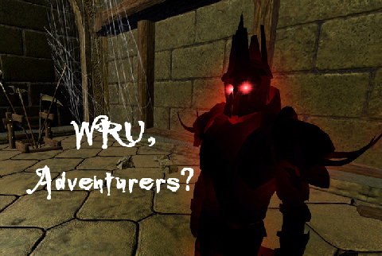

Back to: [West Karana](/posts/westkarana.md) > [2008](/posts/2008/westkarana.md) > [October](./westkarana.md)
# Will EQ2's Shadow Odyssey repeat Warhammer's mistakes?

*Posted by Tipa on 2008-10-21 08:05:07*

The WAR bloggers are pretty united; they love scenarios, but people only appear to queue up for a couple of them out of all available. They love public quests, but if you want to do one, you pretty much have to get it started yourself. They love world RvR, but people would rather attack than defend. Mythic is hard at work balancing these things out, but, inevitably, this will lead to all new balance problems.

EQ2's new expansion, The Shadow Odyssey, has twenty new dungeons and associated missions. Some are easier than others. Some are way easier. Some way harder.

How is SOE going to learn from WAR's balance problems, and make it worthwhile for players to explore all the new content?

They haven't had a great track record thus far.

I have to admit, though, they totally nailed it with EverQuest's Lost Dungeons of Norrath. Back when that was popular, you could travel to any Wayfarer camp and get a group pretty quickly. Eventually, though, the Guk adventures dwindled, but the others kept their popularity until the Dragons of Norrath expansion offered newer missions, and LDoN died.

DoN totally screwed the pooch. Lower level players did that one Stillmoon Temple instance over and over. Can't remember its name. Max level players did Nest missions for AA -- one in particular. Took 30 minutes, you earned 3 AA with Lesson of the Devoted (the once a day, 30 minute double xp veteran reward) running. And that's ALL anyone did. Depths of Darkhollow had incredible loot and xp, but were really hard, so everyone did DoNs still. I have no direct knowledge of any expansions past that, so maybe they fixed it with The Buried Sea -- I dunno.

Looking at EQ2. Desert of Flames, Kingdom of Sky -- total success. You could go to any dungeon you wanted and get a group, no trouble. Echoes of Faydwer -- huge variety of dungeons, you could get an Obelisk or Crypt group without any trouble. For lower levels, there was always a Mines or Chamber of Innovation or a Kaladim or a Klak'Anon group going.

Then came the Rise of Kunark expansion. Karnor's Castle was immediately pegged as horrible xp, little to no loot, but immense risk, and even after a few attempts at rebalancing is essentially deserted to this day, a stark contrast to its enduring popularity in EQ. Chardok and Sebilis are open dungeons that nobody goes to unless they have to -- to get to the instances inside them. Korocust's Throne Room, Chardok's group instance, was popular when you could farm the boss once for each member of the group. SOE fixed that and now nobody goes there, either. 

Chelsith was popular for awhile, but now people cannot even remember its name. (Seriously. People try to describe it -- that one with the frogs and those tentacles... oh, you mean Chelsith? Yeah!). Actually, Chelsith is, in my opinion, a really great instance. I don't know why it isn't popular.

Crypt of Agony, Maiden's Chamber and Vault of Eternal Sleep (and Veksar to a dwindling extent) -- if you want a group in Kunark, those are your choices. Most of Kunark was devoted to quest chains which people do once, and then never return. So most of Kunark is entirely devoid of players. I thought that was a mistake from Day One, saw it coming, was totally vindicated. Nobody wants to be locked into ten levels of mandatory solo quest chains. That's World of Warcraft's gig, not EQ's. EQ is about grouping with friends and crawling through dungeons.

SOE seems to have gone to the clue store and picked up a six pack. The Shadow Odyssey is nearly ALL dungeon crawls.

But a month or two in, how many of these dungeons will still have groups? Will there be three popular ones and seventeen that nobody goes to? How will they balance them out?

Will they put class-specific armor in each of the dungeons? That worked for Echoes of Faydwer. Right up until Kunark was released and did an armor reset, you could always get an EoF group for a dungeon that contained a bit of class armor.

Lure people places with promises of their Master spells and abilities? That's the reason anyone goes to the Kunark instances. A rare Master on Najena can bring 400p -- or more -- in a single drop.

That's a carrot-and-stick approach, but it's what seems to work to get players to go someplace.

The question is, what's going to be the carrot that gets us to go to twenty separate instances?
## Comments!

**[Stargrace](http://www.mmoquests.com)** writes: "Actually, Chelsith is, in my opinion, a really great instance. I don’t know why it isn’t popular"

When dungeons become a 2-3 hour grind, that's when they start to lose their flare imo. Chelsith is the longest of the RoK dungeons (though it's also my personal favorite). I'm not sure who decided we need 3 day look out timers (or longer) on instances so that we can return to them like raid zones, but it was a bad idea. Players don't have 2-3 hours to spend in ONE instance for a "chance" at some loot. Add some class gear that is on smart loot like Unrest and EoF and you've got yourself a better reason to go spend a few hours there. Other wise? It's going to get over looked. Instances are too long, plain and simple. 

What ever happened to our zones like SoS and Palace of the Awakened, etc anyhow. I miss those. Doing multiple quests in those zones were always pretty fun, SoS was SO popular and crowded when Claymore quest chains sent you in there.

---

**[Tipa](https://chasingdings.com)** writes: Chelsith isn't 2-3 hours, not with a good group. I forgot about the three-day lockout timer.

Chardok and Karnor's Castle were SUPPOSED to be "our" RoK open dungeons. They made KC impossible for low-70s adventurers and unrewarding for high level ones, and made Chardok difficult to travel through -- whose bright idea was the locked gates that ensured making a group for any of the deeper areas was going to be impossible?

PLUS the 0.1% xp per kill, which is just totally, insanely wrong. It should be 10x that for heroic mobs.

I *leveled* through my high 50s, low 60s in SoS, and then *leveled* to 70 in other KoS instances. Just by going in there and killing and getting great xp. I was so, so disappointed that RoK couldn't match what was, to my mind, EQ2's best expansion thus far -- the Kingdom of Sky.

---

**[almagill](http://almagill.livejournal.com)** writes: *sucks teeth* Seems to me, sonny, that the trouble is with these young 'uns these days just having too much choice. Yup, indeedy. Back in the day we were happy just to play PONG. Yep, just Pong, no Ping. One ball, two flippers and a beep beep bop sound track.

Now you all want PvP but on your own terms, and world exploration but with little or no risk and LOTS of variations on the same themes.

(Above v much tongue in cheek, btw)

Not sure if SOE will learn from WAR or not (C'mon, it's SOE, they don't do 'learning' till it's painfully obvious it's necessary) but the Scenario Queue Scenario where everyone ends up playing the same scenario over and again seems, in part, to be down to how the game sets up / picks what scenarios are going to be run.

There's just no way that a bunch of elves are always going to plop for Nordenwatch (the Empire T1 scenario) but that seems to be the one that plays most often, because there are more Empire players available maybe? Folk COULD deselect Nordenwatch but that'd then mean waiting a little longer and who wants to do that when you can get the same XP and rep from doing the 'popular' scenario?

As for 'balance issues'... oh gods, no. Years of playing SWG and hearing the constant carping between, oh pick any two classes at random, over who was overpowered, under powered , nerfed, needed a nerf or whatever.. *shudder*

---

**[Tipa](https://chasingdings.com)** writes: I don't mind risk if the reward is there. KC and Chardock were risk for no reward. (They later added better Master drops in KC but as far as I know, there is still no reason to enter Chardok unless you have to for your epic). Heck, I'm an EQ player. It's pretty much all risk. I totally don't mind risk. But make a reason for it. Will TSO dungeons be all risk and no reward?

Dunno.

---

**Gnova** writes: LDON's were popular but everyone did one mission type, collect. I remember standing around waiting while the leader selected and rejected mission after mission until they got the collection one. In the end SOE made it so that you could just select the type you wanted to eliminate what was already happening. What they did right though was make the actual dungeon map for the mission unknown until you zoned in and switched up mob layouts in the maps. You knew you were doing a collect mission but didn't know the map or mob layout until you zoned in and got a pretty long reset timer.
The only real way I can see all of the dungeons being used in the new expansion is if they introduce a variation of WoW's heroic dailys. Make two or three have slightly better loot drop chances and maybe a really nice bonus random loot table each day and rotate through them. If they don't, people will quickly figure out which dungeons give the maximum amount of reward for the least amount of effort and they will become the only ones populated...

As for Chelsith, I don't think it is the time factor keeping people out of there. In my opinion it is the ridiculous number of the floating "blob" adds that occur and frequently wipe groups. They just feel too random.

---

**[Stargrace](http://www.mmoquests.com)** writes: "Chelsith isn’t 2-3 hours, not with a good group"

Not everyone gets a good group. Take your average non-mythical-non-raid gear group with adept1's and not all adept3's and see how long it takes. Even with the group I typically go with, it's an hour and a half run (which is why Shadowgeist doesn't run it).

---

**[tenfoldhate](http://tenfoldhate.com)** writes: One would hope that players' curiosity and desire to drink in some new content would be enough to "lure" them into each of the dungeons--unless we have truly become so jaded that we don't even want to leave our virtual comfort zones unless there's a guaranteed brand new shiny in it for us.

= )

---

**[Tipa](https://chasingdings.com)** writes: @Gnova -- you must mean "kill" missions. Collect missions were bugged at the start -- sometimes there weren't enough things to collect in the entire dungeon even if you killed everything. "Kill" missions were guaranteed finishes. "Boss" missions were also pretty popular, except the boss didn't drop loot, so you had to make side trips to check for nameds if you wanted loot. "Escort" missions were like Boss missions, except you had to fight your way all the way back to the beginning. Since all anyone really wanted were the LDoN points, anyway, "Kill" became the go-to mission type, on Erollisi Marr and Stromm, anyway. But at least you could always get a GROUP for LDoN, which was the point. And sometimes people would go for a random type.

@Stargrace -- I've seen Maiden's turn into a two hour run for a non-well equipped group. Our run last weekend was VERY untypical. Hell, I've seen VoES turn into a two hour run. Truth. It's the lack of any great loot for Chelsith, I feel, more than anything else. I can't think of anything that comes out of there.

@tenfoldhate -- I'm sure all the dungeons will be popular at the beginning just because of that. What will keep them all popular in six months?

---

**[rao](http://raoworld.wordpress.com/)** writes: Wow. From reading this post, I have to say that our experiences in both EQ and EQ2 have been VASTLY different. The popularity of LDoN on my server died out FAST. People did it for a month or two and then left and the camps were ghost towns. DoN was never popular... even the creator mission. Darkhollow, however, was HUGE. There were always multiple groups for nearly all of the instances... so many in fact that there was often a waiting line to get in because all of the instances were full.

Over on Guk, Kunark is still packed with people. Kylong and Seb have two instances almost all the time. Chardok typically has 2 to 3 groups in there... mostly vying for the Queen rotation of course. Karnor's, however, I completely agree with. Dead doesn't even begin to describe it.

I haven't been to Chelsith yet myself, but there is typically at least 1 group in my guild there most nights and it generally doesn't take them more than an hour to run it. CoA, Vaults, and Maiden's, of course, are all nightly favorites.

I'm not necessarily disagreeing with you on any point... although I still find the Kunark questing to be very enjoyable myself. I'm just saying that my experiences in both games have been drastically different from yours it seems.

---

**[Tipa](https://chasingdings.com)** writes: Yeah, that's definitely not my experience on Befallen or Najena. I was camping zone mobs for Kasul's epic on Dora the other night, and some people came by and triggered the ring event but didn't finish it, dunno why. A couple of other people came in and helped us camp zone mobs. I didn't see anyone else there while we were there, until I fell asleep, anyway.

I do see multiple instances for Seb sometimes, but that's when raids are gathering for Venril or Protector's Realm. I do see groups there, but from listening to people trying to get groups there, they tend to be for epic quests.

I'm glad it's doing better on Guk.

For LDoNs -- seriously? They were HOPPING on EMarr. The onlly DoDh groups I ever saw were for the spell line quests. If it wasn't required for a spell, it didn't get done -- EVEN though the loot was pretty good. A lot of them were just really hard. Still, when DoDh was new, I did a LOT of these missions, because I was a raid-geared cleric :) Then they all pretty much trailed off and it was back to Nest missions for AAs.

---

**[rao](http://raoworld.wordpress.com/)** writes: Yeah. It was odd. LDoN just never gained much popularity on Seventh Hammer. When I transferred to Quell after GoD, LDoN's were still being run there to some extent and Quess was where I was at when Darkhollow was released. Darkhollow was HUGE on Quell for some reason. I enjoyed them, but I ran all of those missions so many times that I honestly burned out after a while.

Even up until the day that I quit EQ1 just days before the Pirates of the Burning Norrathian Sea (or whatever it was called) was released, I was still getting daily invites to come pull missions in Darkhollow.

---

**[Toldain](http://toldaintalks.blogspot.com)** writes: Well, there's one reason to go into Kunark and Chardok - collectibles. That's kind of not a group effort, though. 

LDoN's were very popular on Tholuxe Paells when I played.

---

**Isanox** writes: KC.... gawd how awful is that place. And who thought putting a L&L book for level 68 mobs in a zone for 75+ was a good idea. I don't think I ever gotten it before 78.

"Desert of Flames, Kingdom of Sky — total success. You could go to any dungeon you wanted and get a group, no trouble. "

Wow, with the exception of Sinking sands I consider those a huge failure. Mainly because in that level range there are only about 53 quests that are solo'able. That and the incredible shrink zones sizes force people into places like Sots

"thought that was a mistake from Day One, saw it coming, was totally vindicated. Nobody wants to be locked into ten levels of mandatory solo quest chains. That’s World of Warcraft’s gig, not EQ’s. EQ is about grouping with friends and crawling through dungeons."

Quick name me a for-pay fantasy MMO thats has a larger playerbase than EQ2. Answer... nearly all of them. And it's forced grouping that's largely to blame. What's the biggest feature Seeds of Destruction? Hireable mercenaries.

You want to improve EQ2. Here's how:

1) Add persistence to all dungeons
2) Up the loot % of trash mobs in a dungeon so it's not just 'kill the boss'
3) Add a % boost based on dungeons & zones use. i.e. Less used areas get bigger % chance of drops.
4) Add a system where you can flag what quests or dungeons you want to do, then when you get invited you are automatically ported there.
5) Add an option on a dungeon door for sub-zones, so that if you have been flag for it, you can go right there.
6) Change raids from 4x to 2x. The playerbase can't support it. There are few raid guilds, then the rest of the pb who have to hope to get a pug. "So at level 80, every major encounter and every big boss fight can be experienced with a group of 10." -- It's be nice if EQ2 could say that
7) Add a XP bonus for pure healers and pure tanks. I’ve got 15 people at 80 and only 1 guardian and 1 templar. I can’t tell you how often I can’t get a guild only group together because I don’t have a healer or a tank.

---

**[Tipa](https://chasingdings.com)** writes: I actually was playing WoW while DoF was current content, but when I came back, I had no trouble getting groups for all the various instances. Troubadours still had the good charm then, so I charmed mobs and used them to help me solo, but mostly I had xp groups in that orc city and at the Ancient Tables and they went great.

Kingdom of Sky was total win for me. I dunno. Different experiences, I guess.

I have no idea if EQ2 would be more popular if it were more solo friendly. RoK was pretty much a solo expansion and while it was busy when people were leveling, nowadays it's dead and I have heard more stories of people who just can't make it through the solo grind from 70-80. Now, if the xp was better so the pain didn't last as long, maybe... I found it nearly impossible to solo effectively in RoK. Either I had to kite, which took a very long time per mob, or I tried toe-to-toe, which meant I had to rest and heal after each battle, also taking a long time. But the xp was so bad I couldn't find anyone who wanted to help, unless they happened to be on the same quests. Those happy chances were my only groups while leveling, but mostly it was just me.

I was forced to move my cleric to a separate account and two box through RoK. I wasn't happy about it, but I did it.

But all that time, I wasn't wishing that soloing could be made easier. I was wishing that GROUPING could be made more rewarding, because World of Warcraft bored me to TEARS. I simply found myself logging in and just standing around because I couldn't bear to go out there and grind mobs for faction any more. I just couldn't.

Never played WoW since that day. Don't want to play EQ2 if it decides it needs to be WoW. RoK was EQ2's last chance. I love the game, but if it pulls that solo-only crap one more time, I'll go play a single player game.

1) Add persistence to all dungeons -- have them all be open dungeons? Not sure what you mean here. The instances persist for up to 18 hours.

2) Up loot from trash mobs. More loot is good, but I'd be happy if no named mob in an instance could drop wooden or adept chests. Also, more masters.

3) I like THIS idea a lot. Warhammer could use an idea like this as well.

4) Meh, not sure that's right for EQ2. WoW and Warhammer do things like this.

5) Would make Seb, KC and Chardok even MORE of a ghost town.

6) It'd be nice if I could get my mythical epic without having to pay 350 plat. But 10 mans in WoW turned out to be guild killers; the 10 uber people would go, everyone else would be left out. With EQ2's 24 classes, what are the odds SOE could even BUILD a 10 (well, 12) man that would be balanced for the different permutations of classes? Nice idea, but...

7) Before AA mirrors, I'd have said Amen to this. But now you can switch between group, raid and solo specs so easy... my inquisitor soloes WAY better than my troub. Not even close. I think the real problem with tanks and healers, though, is pressure. Everything that goes wrong in a group is Your Fault. Another reason I had to quit WoW. The pressure as a priest was just too great, and every act of idiocy on someone else's part, like running ahead of the group and AEing a random set of mobs in LBRS or Dire Maul, was directly blamed on me when it went all wrong. Couldn't, wouldn't take it. If tanks are uber, everything goes well, but if they have less than uber gear, everything goes south as well. Just too much pressure on those classes.

I'd just get rid of the concept of healers and tanks altogether. Give every class the ability to heal some and tank some. Wizard 101 has that, DC Universe Online has that, Guild Wars has that. The whole tank/healer/dps model is archaic and shouldn't be a part of any modern MMO. It's never caused anything but problems and I fail to see why, after it worked SO WELL for EQ, that any other game thought that was a valid class model.

Thanks for the ideas :) I think we both can agree that SOE had pretty do something pretty revolutionary for TSO.

---

**[loredena](http://gnomedepot.net)** writes: I'm still loving EQ2, but, my main is 64. I've only spent time in Kunark with my crafters! I play a guardian as my main, and Sisca 2-boxes a monk and fury. I love being a tank -- I have guardian, paladin, and sk so far. We form the core group though, and that might make the difference. I make no claims of being uber or even amazingly well geared, but I've played a main tank since 99 and like to think I have a clue how ;)

---

**[Ogrebears](http://www.ogrebear.com)** writes: I like Chelsith to, but it takes to long compared to the other dungeons, which is why most people don't go there.
Korocust’s Throne Room is out of the way and it not worth the time for the chance of loot. If there were more names in there, people would go there more often.

For the open zones, if the names dropped better armor then the instances, people would do it more. IF there were quest in each of thous zones that reward good reward, people would do it as well.

I fear the same thing you do, and i can see the dungeons that have few names, or take to long being the ones no one goes to. If SoE is plans the dungeons right so they all take about the same amount of time to finish, and have the similar number of names. With the harder ones giving better reward then the easier ones. Then i don't think we'll see what we see now.. I don't know what there going to do.

---

**Willlow** writes: Chelsith is a wicked zone, looks awesome, done very well, and tends to have a very good master drop rate if you run through and clear all the names.

Takes long? Good!

I miss the days when a dungeon crawl was that... a crawl, not a lame little 20min jobber with 3 rooms.

---

**[Journeys with Jaye &raquo; Cheese vs. Wootah](http://www.journeyswithjaye.com/?p=1377)** writes: [...] tons of wootah moments in Vanguard, but no one stuck around to find out.  And in a few weeks, as Tipa pointed out recently, it might be why the bulk of the EQ2 population will run the same 2 or 3 [...]

---

