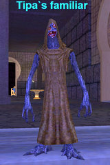

Back to: [West Karana](/posts/westkarana.md) > [2008](/posts/2008/westkarana.md) > [October](./westkarana.md)
# EQ: Seeds of Destruction: Meet Caiffin, the Merc.

*Posted by Tipa on 2008-10-22 00:53:11*

So this screen shot entirely contains my philosophy of life. I'm in this really stormy place, and I'm fighting for my life, but some souless minion is trying to save me, but he's about to be eaten by a giant bear he can't see, and there's some huge guy with a "wide stance" lurking about, and someone not even in the screen shot keeping everyone alive.

That's it. Now you know everything important about me.

But seriously.

The mercenary hirelings in EverQuest's new expansion, Seeds of Destruction, are made of 200-proof AWESOME.

 I don't know anything about the new zones because, what the heck, I'm only level 61. I'm twenty five levels from the good stuff. But after I finished buying SoD (yup, no free expansion for me), second thing I did was to hunt up the Hireling trainers in the Plane of Knowledge. The first thing I did was to redeem the LDoN loot card everyone got for this ugly little pet that sometimes reflects spells cast at you back at the caster.

Isn't he sweet looking?

And then I went to PoK to find the hireling trainers. I opened the Find window (^F) and saw that there were hireling trainers for a lot of races, in fact, for every race that was out when Planes of Power was released. They are, or were, the guards of the Plane of Knowledge. I went straight to the closest Halfling trainer.

I was totally confused by all the options, but I THINK I have a picture of what it all means.

Hirelings, first of all, are your level; at least, mine was. It would be odd if I just randomly chose one that just happened to be my level, but I don't think chance had much to do with it.

Hirelings act like a group member. They JOIN the group, can take group buffs like any PC, are not counted as a pet, DO count as a PC for purposes of Leadership experience and abilities, and likely take a share of the experience as well. As far as I can tell judging from the windows, you can only hire one hireling per person at a time.

Hirelings have an initial cost (mine cost over 600 plat, but they have both cheaper and more expensive varieties) and a proportional maintenance cost (for me, 15p 3g every 15 minutes. Again, some are cheaper, some more expensive). You can suspend your hireling, which will remove him from the group and camp him, and the timer on the maintenance clock stops when he's suspended. After a few minutes, you can bring him out again. SOE says you can keep hirelings suspended indefinitely. I don't know if that's only while you are logged in, or what. He did stay with me through some crashes.

You can also dismiss your hireling, after which, I imagine, you don't have it anymore. You may also assign the hireling to someone else -- does this give it to them permanently? I didn't try it.

Hirelings have a rank -- Apprentice and Journeyman were the ranks I had available, I imagine higher level people have more choices. Within each rank are tiers -- Tier I through V -- which is a measure of how well they do their jobs. Tier I Apprentice hirelings are very very cheap, but do their jobs poorly. Tier V Apprentice hirelings do their jobs well, but don't have the abilities of higher ranks. Tier I Journeyman hirelings have a bunch of new abilities, but don't use them all that well yet. And so forth.

Both Healer and Tank hirelings are available; Healers can eventually even rez you if you die, which is a nice touch. I hired an Apprentice Tier V Tank and went searching for stuff to kill.

The most impressive magic done the entire evening was the magic that convinced [Stargrace](http://mmoquests.com) to re-open her EQ1 account :) She logged in her druid, and we went off to Grieg's End to see how he'd act under pressure.

He did really well. He was very sensitive to what I was attacking, so I could get him to change targets by changing what I was targeting. He would sometimes change targets himself, especially if I drew aggro. I don't know how many hit points he had, but it seemed to be a lot; Stargrace said he was easier to heal than an actual real tank.

Kanad logged in, so we figured we'd give him a REAL tryout, and we all met up in the Plane of Storms (btw, a level 61 character can zone into the Bastion of Thunder. Not sure we're ready for that yet, but we can zone in).

Caiffin did really, really well. Sometimes we had adds, a lot of them, but he'd be right there, taunting away. His taunt works a LOT better than a PC's.

SEVERAL bubs of experience. Stargrace's cleric dinged.

I'd rather have a real player do the tanking, because there's always going to be situations that need a real person making decisions. But for casual grouping and especially with only one mob at a time -- the tank merc does amazingly well.

I honestly didn't think SOE would dare give us a hireling that could even come close to taking the place of a real player. But, that's exactly what they did do.

And my hireling was the lowest rank -- an apprentice. I'd love to see what the high level ones can do. Tank raids? I really doubt it. Tank Riftseeker's? Bet they could.

Until we build the Nostalgia ranks up again, there's going to be a hireling in the team.

## Comments!

**[Stargrace](http://www.mmoquests.com)** writes: I had a lot of fun last night, and the hirelings work amazingly well for what we're lacking at the moment (a tank). He was easy to heal and while he doesn't have the thought process (I would hope...) of an actual player able to change fights on a dime, as a meat shield? Pure magic.

---

**[MmoQuests.com » Only Halflings Need Apply](http://mmoquests.com/2008/10/22/only-halflings-need-apply/)** writes: [...] for a game I played once a week, but perhaps with these hirelings (which you can read more about in more detail at West Karana of course) I’ll feel a little more inclined to play. I had a LOT of fun last night, in any [...]

---

**[Hudson](http://hudshideout.blogspot.com/)** writes: Freaking AWESOME. So wait, what levels can you hire at and where do you have to get to hire them? This is awesome!

---

**[Tipa](https://chasingdings.com)** writes: I think any level, but your level seems to limit the amount of awesomeness your merc possesses.

You can hire many different kinds and races in the Plane of Knowledge. You'll see them on the Find window (^F).

They are REALLY awesome.

---

**Egat** writes: I thought you'd like the hirelings! They are able to be used on raids as well.

---

**[Tipa](https://chasingdings.com)** writes: I'd LOVE to see a hireling healer CH rotation :)

I wonder if they get together and do one by themselves on raids...

---

**[wilhelm2451](http://tagn.wordpress.com/)** writes: Hrmm... sounds good if a bit dear in price. Will they take a check or do you have to keep plat coins in your pocket to hand over every 15 minutes? 

What sort of interface do you have to tell him what to do? 

I may have to explore how a healer merc does, if I can afford it.

---

**[Tipa](https://chasingdings.com)** writes: It doesn't cost that much, in EQ1 terms. The cost is one-time only, you keep it until you dismiss it. If you're killing stuff, you make 15p in just a couple of kills -- I made enough testing the hireling in Dulak to pay for the maintenance for the entire night, which was good, because Storms was pretty crappy for cash loot.

The Journeyman Tier I hireling was a LOT more expensive, though. Luckily, we didn't need anything that uber for what we were doing.

You control the hireling through a small hireling window that allows you to set the stance (passive/aggressive for Apprentice hirelings; you get more stances with higher ranks), assign the hireling to someone, dismiss it, suspend it, show its info window (same one you saw when you hired it), and how much time before the next maintenance charge. Its stance controls how it generally acts. The tank hireling is smart enough not to attack things that are too far away, so pulling is possible, but he did intercept stuff coming in to the camp when we would have liked him to wait until it was actually all the way into the camp before attacking. He also didn't turn the mob.

It's possible higher rank hirelings would be able to do these things.

The maintenance fees are deducted from the coin you have on you. I don't know what happens if you run out of money, or the hireling dies.

---

**Gnewton** writes: Wow. This new gameplay option sounds really cool. Someone definitely put in some thought to a game with a much smaller player base (as alluded to earlier). Very cool indeed.

Just thought I poke my head in here and say HOWDY! /hugs from Gnewt

---

**[Tipa](https://chasingdings.com)** writes: You can also use the group roles popup to set your hireling as, say, the main tank :)

HI GNEWT!!!!

Yeah, it's just wonderful how a ten year old game can still be a leader in innovation. People have been wishing EQ dead for years, but EQ hasn't gotten the news yet, so it just keeps on keeping on.

---

**[wilhelm2451](http://tagn.wordpress.com/)** writes: Well, the price sounds a bit dear to me because I'm a lot lower level and even in newer zones I still get drops that vendor back for a copper. A copper?!?

---

**[Tipa](https://chasingdings.com)** writes: Yeah, bootstrapping can be a problem. Blightfire Moors has a lot of good trash loot dropping mobs -- those gnolls, for instance, exist purely to make you rich and give you defiant armor :)

What level are you? And would you be on the Luclin, Erollisi Marr, or Stromm servers?

If you're in your fifties, Plane of Innovation is pretty much a cash loot farm, but the xp isn't that great.

A guildmate, Mantis, does solo loot runs into Veksar all the time. He pretty much has no money problems at all.

The old world dungeons, especially Old Sebilis, are just gem city. You can get thousands of plat just from vendor junk in a couple of hours.

Money is not really that hard to get in EQ, but sometimes you just have to decide you're going to go to a place with good cash drops. Dulak mobs, for instance, drop 5+ plat in cash alone, plus the trash they also drop. And they are great xp for high 30s-low 50s.

---

**[rob](http://www.lostaneighth.com)** writes: Damnit ... here I was, FREE of MMO addiction and eagerly awaiting the release of fallout 3 and I just HAD to go and read West Karana. :) I think I may need to pick this expansion up. Did you buy a box in a shop, or did you pay for the digital download?

The concept of mercenaries has been done before in FFXI. You can do a quest in that game that earns you an earring that summons your "companion" to your side for a little while. Then there are points in cities where you can change the settings of your companion and have conversations with them. Unlike EQ mercs, they cost no money, but are only available once per day for like 15 minutes. As you use them they can level up and gain new equipment and what not.

I think my SK is in his mid 40s. I don't know how much money I have on him, but the mercs sound like they could wipe his bank account clean. Then again, when I was playing I was leveling so fast in the hot zones that all my money went into trying to keep my equipment up to par.

Thanks Tipa. Once again, for me, you do what all the SOE marketing failed to. :)

---

**[Tipa](https://chasingdings.com)** writes: Guild Wars built a game around the concept, even. Lord of the Rings Online has the Captain's Herald who can do various things depending on the sort of herald you summon; tank, dps, heal... It's not so much that it's new, but that it's in EverQuest. At ten years, you'd figure they'd just be coasting along. Instead, they revamped twenty old zones and added hirelings. I didn't know about the FFXI one :)

Mercs are definitely far from free, but I think they were designed to be affordable for the zone you're likely to fight in. You wouldn't want the one I hired in your 40s. Stargrace has been trying out the healer, and she says it's fantastic. In your forties, you could probably do pretty well in Dalnir or Nurga, and both those zones are rich in drops.

Defiant armor is fairly common and cheap (in EQ1 terms), and that's near raid level armor. These days, everyone is a little uber, and that totally transformed the game over the summer.

Defiant armor and weapons combined with a pocket healer -- where couldn't you go?

---

**[Hudson](http://hudshideout.blogspot.com/)** writes: This post makes me happy in pants. Now I have a serious decision to make. If I can go back to EQ1 and simply get help replacing group members I am missing, I may have to check this out. Either way I usually two box and this would add all sorts of possibilities. You can hire DPS correct?

---

**[Tipa](https://chasingdings.com)** writes: No, no dps yet. That's coming. Just Tank and Healer for now.

---

**[rob](http://www.lostaneighth.com)** writes: Thats funny. You'd think DPS would be the simplest merc to code up. :)

---

**[Tipa](https://chasingdings.com)** writes: Also the easiest to find for a group.

Or given some of the pickup groups I've been on, even easier.

"Okay, Corpsestabber, just noticed you spent the last fight just standing in one spot over there."

"Yeah, sorry, my mom was yelling at me."

"And yet, you looted the corpse before anyone else had a chance."

"Yeah, it's tough to target the mob when there are so many corpses lying around so I figured I'd keep the place clean."

"It was carrying the Healing Shield of the Undying, did you loot it?"

"Um, I dunno, I just, you know, click through those yes/no things because it looked like we might have wiped and I didn't want the loot to be lost."

Yeah... SOE could probably code your average DPS Merc in about five minutes :)

---

**[Loredena](http://gnomedepot.net)** writes: The hirelings do sound like a fun and useful innovation for EQ!

This hasn't been a good month for me, but assuming I don't have to work yet again this Friday (not a safe assumption) Sisca and Callendra should manage to show up. My EQ1 accounts expires Sunday, and with travel and the holidays and work insanity I can't really justify paying for it right now, so we're going to let EQ lapse until the new year, then see how we feel and where Nostalgia is at.

---

**[wilhelm2451](http://tagn.wordpress.com/)** writes: Let's see. I'm level 31 on Luclin in a guild named... what was it... nostalgia? heh!

My account has been off since Living Legacy ended though.

---

**[Tipa](https://chasingdings.com)** writes: Well, if you re-up, we can deal with your little cashflow problem :)

Yeah, I remember you played on Luclin for awhile, but wasn't sure if you were thinking about some other server.

---

**[Stargrace](http://www.mmoquests.com)** writes: *"You can hire DPS correct?"*

Not as of yet, no. The two options are tank, and healer. BUT if you read through the big long explanation on hirelings that came with the patch notes (notes who reads those?!) it does say that the tank can act as a 2nd tank and spend their time DPS'ing instead. 

I hired the healer one today for my level 44 necromancer and headed off to Dulak. First thing it did was buff me and my pet with temp and spell focus and a few other goodies, then like the polite Drakkin healer they were, they stood back and sat down to wait for the action to start. 

The tank myself and Kanad had earlier, was just as awesome as the ones last night. We "by mistake" pulled 4 mobs and the merc grabbed aggro on every one of them and tanked them all. He may have lost aggro once or twice as Kanad is a shm and was dot'ing everything quite heavily (I was playing my 61 clr) but it was fantastic.

---

**[Stargrace](http://www.mmoquests.com)** writes: Oh yeah, forgot to mention Tipa, I tested it this morning - that level 61 or what not tank Merc, has *at least* 12.3k hp (buffed with the clr and shm 61 stuff) ... Was landing CH's on him at 50% that were landing for 6.1 or so.

---

**[Tipa](https://chasingdings.com)** writes: I've been thinking of making Caiffin an officer and giving him the Warrior Class Lead position. Whatcha think?

Seriously. This is the most awesomest thing EQ has ever done for their playerbase.

---

**[Stargrace](http://www.mmoquests.com)** writes: I have to agree. I think they're powerful enough to make leveling actually work out for those who can not always find a group, but not so over powered that you're taking down complicated encounters at end game. I still heard LOTS of people LFG this morning. 

About the cost for people who were worried also..
At level 44 the merc only cost me 300p to buy, and 8p every 15 minutes. In Dulak (where I was leveling) that sort of money comes VERY easily. PoS wasn't exactly the best place since no coin drops there, but I don't think they'll really be out of anyones price range. This was with the highest level of apprentice tank as well, could always go lower for a cheaper cost.

---

**Agente** writes: I Decided to experiment today and made a level 1 magician.. went straight to POK and hires a DE Cleric Merc. 0 Plat 0 Gold. Leveled him as far as lvl 5 and checked cost at each level. As of now he is still FREE with zero maintenance cost. Just so you know.

---

**[loredena](http://gnomedepot.net)** writes: I have to admit -- right now I don't have the time, energy, or money to justify renewing EQ. But, if we decide to do so come January, Sisca and Callendra will need to catch up -- and a merc tank will be just the ticket to do so!

---

**[Cameron Sorden](http://random-battle.com)** writes: Sigh. I may need to resub. It's about that time of year anyway.

---

**[When in Doubt, Look Around for Some Inspiration | Random Battle](http://random-battle.com/2008/10/23/when-in-doubt-look-around-for-some-inspiration/)** writes: [...] something else to play with. EverQuest’s introduction of mercenaries (which, by all accounts, are awesome) has me seriously considering resurrecting my subscription there. Even if there’s nothing [...]

---

**[Tipa](https://chasingdings.com)** writes: @loredena -- at the pace we move, I doubt you'll be that far behind :) Just being able to do BoT well will be enough for now.

@Agente -- that's AWESOME. Cost you nothing? Amazing.

---

**[wilhelm2451](http://tagn.wordpress.com/)** writes: "It's about that time of year anyway."

I see somebody else is on that "EverQuest in the fall" cycle. When the skies go gray and the rain begins to fall, I suddenly want to go back to Norrath. Every year, without fail.

---

**[rob](http://www.lostaneighth.com)** writes: I bit the bullet and bought Seeds of Destruction the other night. I was totally wrong about how much money I had. I had forgotten that Dulak had been VERY good to me. Those zraxthril (sp) forged weapons drop like rain and sell for 5p a pop. Having not played in a few months I reacquainted myself with all my skills and abilities, cashed in my loot card, and made a beeline for PoK. At level 47, I was able to hire a healer merc, of the female Dark Elf flavor, for only 380 something plat, plus 9p per 15 minutes. Given that, while leveling in Dulak at least, I was getting on average 3 plat per kill on money drop alone, 9p for 15 minutes of buffing/healing to keep me alive, is a steal.

Being 47, the hot zone guy in PoK says that at level 50 I should head to either Old Sebilis or The Wakening Land. I have never been to either of those zones and have no idea how to get there. Should I even consider going there, or now that I know my actual level, do you think I should still head to Dalnir or Nurga for some leveling goodness?

Thanks!

---

**[Tipa](https://chasingdings.com)** writes: 47 is too high for Dalnir or Nurga. You might be able to go to Droga, which is in Frontier Mountains near the Overthere zone. It's not too tough to pull singles there.

Wakening Lands is between Skyshrine and Kael in Velious. I thought it was decent xp, and it is a hot zone, and easy pulls, but I got comments when I went that the xp really wasn't as good as it might be elsewhere. I'd suggest Goru'Kar Mesa (in Serpent's Spine), but I did go once and wasn't impressed. Stuff there seems to have a zillion hit points. In EQ, it's way better to chain pull blues than to take five minutes killing one yellow.

In Old Sebilis, you'll always be fighting from 2-3 monsters at once, unless you're fast enough to break a camp. Once broken, you can pull singles forever. It's great money, but again, I don't feel it's overly fantastic xp.

I'd have to look back at my previous posts to see where we went in our high 40s. I THINK we went to Akheva Ruins.

The problem is that there's about a million places you COULD go :)

Lower Guk in the old world; Droga or Dreadlands in Kunark, Wakening Lands, Skyshrine or Cobalt Scar in Velious; Maiden's Scar or Tenebrous Tangle or Grimling Forest or such on Luclin... etc.

---

**[October in Review &laquo; The Ancient Gaming Noob](http://tagn.wordpress.com/2008/10/31/october-in-review-3/)** writes: [...] started raining yesterday.  Can nostalgia be far behind?  Hmmm… mercenaries. [...]

---

