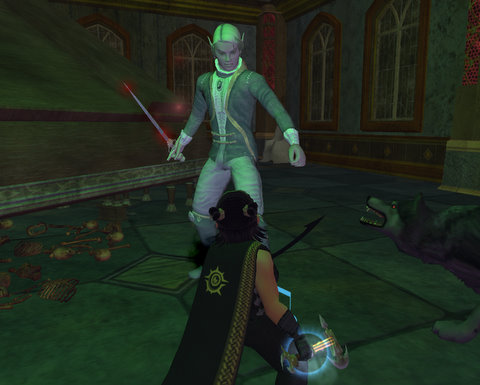
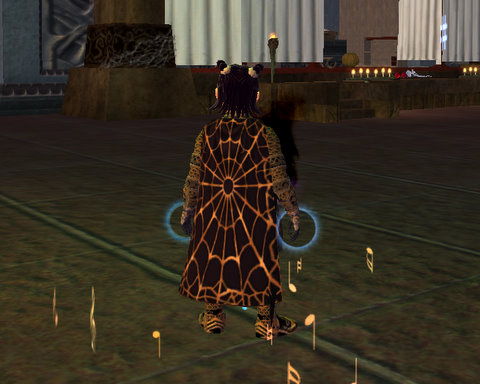

Back to: [West Karana](/posts/westkarana.md) > [2008](/posts/2008/westkarana.md) > [October](./westkarana.md)
# EQ2: The Loping Plains Haunted House. Scared yet?

*Posted by Tipa on 2008-10-24 08:31:11*

Loping Plains hasn't seen THIS much action since the Freethinkers threw that Christmas party and the Pumpkin-Headed Horseman barfed seeds and pulp all over Mayong Mistmoore. Everyone was talking about that for months.

So anyway, Ettie and I head over to Loping Plains to see what's up. Some goblin over in Freeport was talking up stuff about some "really cool" thing over there, "a lot of fun". So I asked the gobber if, like, I was going to die or something. "No, no, no, you no die," said the gobber. "Be fun, you. You just go graveyard there, fun time!"

"Well, fun is good. Nothing is going to come out and attack me, right?" I asked. The gobber looked kinda sly. "No, no no, it just fun. Candy maybe! Fat hobbit like candy, yes?"

Pffft. Of COURSE I like candy. But I wasn't going to say so to the gobber. "Maybe," I told the gobber. "Gotta go."

I sent a tell to Ettie. "Candy."

"OMW," she replied. And we were off.

We headed off to the Loping Plains, ran to Somborn and its cemetery, where we were attacked by -- SOMETHING -- that did 5000 points of damage to Ettie's wolf, and then everything went dark.

FRIGGIN *(&#*(&# GOBBERS! WHY did I pick HALLOWEEN to start trusting them?

Some merchant had found us -- get this -- CLEAR on the other side of town, and DRAGGED us to his shop on the OTHER side of town. Sure, someone dragging the bodies of two unconscious halflings may not be the most uncommon site in the Plains, but don't you think SOMEONE would have said something?

He tried to sell us some knick-knacks, but we weren't buying it. We hoofed back to the cemetery, ready for battle, where a smug looking Proctor informed us that what had attacked us had fled into this abandoned looking home. Obviously, he would go in himself and discover the source of the evil, but he'd stubbed his toe on the way over and it looked like rain and his arthritis was acting up, so maybe we could go in alone?

Norrath, dear readers, is a world of people who call in sick when the cat looks at them funny. So anyway, we were still hot to find out what tried to kill us, so in we went.

<!--more-->

The house was like one of those old time adventure games, where you have to click on everything you see because it might contain a clue. We stepped in and got attacked. The attackers dropped a key that opened a door. Enter room, get attacked, pick up a sheet of music and key that opens the door to the next room. Open the door, torch some coffins, notice the dumbwaiter on the wall that won't open (yet), fight some vamps, find a key, etc.

We eventually had enough bits of stuff left behind by the family that once lived there and now is still there, but not really doing much living any more. What to do with all this STUFF? Luckily, and just by some random WILD chance, the spell to cleanse the house of evil spirits was sitting on the coffee table in the music room. What were the chances? And it just happened to require all the stuff we'd been collecting.

We read the ritual, and this vampire appeared and tried to kill us. NO PROBLEM. We kill vampires for lunch. Not that we eat them. Just to work up an appetite. Anyway. We had to pursue him all through the house, until we met him and killed him forever in front of a giant, cloudy mirror.

So I looked into the mirror, and it started saying something about seeing the source of the evil in the mirror and it was ME, it was ME, but I dunno. Looked more like Ettie to me, actually. "Ettie," I called. "Were you the ultimate evil in this house, by any chance?"

She looked kinda embarrassed. "Yeah," she said. "It was a long time ago. I was younger, me and my friends were drunk, and so we kinda... you know... stuff happens."

So we fought and killed Ettie's giant doppleganger, and headed back outside.

The Proctor demanded to know if we had cleared out the ultimate evil. We said we had, and she gave us these cool looking cloaks. She asked what the source of it all was, and we kinda said not to worry about it, it was gone, that's all, leave us alone, why are you looking at us like that, we weren't to blame, stop LOOKING at us, stop staring, why are you all staring at us, what did we do, we didn't do anything, OKAY GODDAMMIT IT WAS ETTIE! ETTIE KILLED THEM ALL! HAPPY? HAPPY NOW?

I also got a mirror, which I placed above my tailoring station in the guild hall, and Ettie chose some glowing red skulls that circle around her head.

I headed out to the Commonlands to gather some Tier 2 harvests and some candy (candy!) from scary critters with which to make some special Halloween treats. Making a full set of gear was actually pretty easy. Weird thing about this gear is that it is NOT attunable. You can make it, wear it, take it off and give it to someone else! Second thing is, the recipes make two of everything. I ended up with two complete sets of gear. It's cloth type, so anybody can wear it.

Good stuff.

I also made some pillows and wall hangings; there's LOTS of stuff you can make.

Now you see it coming AND going :)

The new haunted house in Loping Plains? Classic. Decent xp, great loot... it kinda wanted you to do it solo, but the last fight against the doppelganger could be tough alone. I didn't have any of the lag other people were reporting, so it might be safe to try it now.

## Comments!

**[Cow Nose the 50 Pound Cat](http://cownosethe50poundcat.blogspot.com)** writes: Very cool post, you rock tipa!

---

**[Lars](http://mmomentofzen.blogspot.com/)** writes: I'll have to check that out soon!

---

**[Tipa](https://chasingdings.com)** writes: @Loredena -- can't comment on your blog :(

---

**[tenfoldhate](http://tenfoldhate.com)** writes: Your captioned first pic evoked a hearty, much needed, Friday morning ROFL. And the last pic has me humming the old Spider-man theme. So a good start to my morning overall.

---

**[Tipa](https://chasingdings.com)** writes: thanks :))

---

**[loredena](http://gnomedepot.net)** writes: It was a fun quest, did you get the mask upstairs after? 

@tipa -- hmm, I can't ever comment on Stargrace's blog from EI, just Firefox. Is it giving an error, or just refusing to let you type in anything?

---

**[loredena](http://gnomedepot.net)** writes: Hmm, looks like we were requiring registration to comment. I've turned that off, and now if not logged in it appears to require moderation, which I may also need to find out how to turn off. We'll see how this goes I guess.

---

**[MMORPG Info &raquo; Virtual Halloween Haunts](http://www.mmorpg-info.org/news/virtual-halloween-haunts/)** writes: [...] West Karana » EQ2: The Loping Plains Haunted House. Scared yet? Loping Plains hasn’t seen THIS much action since the Freethinkers threw that Christmas party and the Pumpkin-Headed Horseman barfed seeds and pulp all over Mayong Mistmoore. Everyone was talking about that for months. [...]

---

