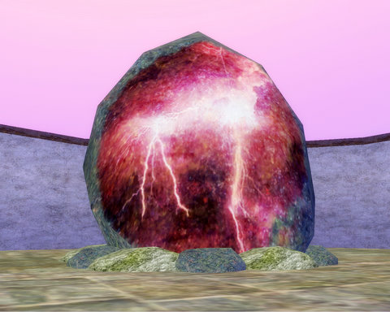

Back to: [West Karana](/posts/westkarana.md) > [2008](/posts/2008/westkarana.md) > [October](./westkarana.md)
# EQ: The Bastion of Thunder

*Posted by Tipa on 2008-10-25 08:48:27*

Because FRAPS conked out on me, and I didn't notice until after. there's no screen shots of our night in the Bastion of Thunder.

No screen shots of our first, tentative pulls of the giants of the lightning wing.

None of Niiko zipping around at bard speed, threading the monsters with song into beads of pwn.

None of Mantis, trying to keep his warrior mercenary from breaking his own mezzes :) That was fun!

Coldheat's just-in-time complete heals when we had three of them on us at once. Or Qutey's heals taking up the slack in between her massive DoTs and nukes...

Kasul down in the foyer, getting more xp than all of us as he single pulled giants to his own merc pet.

No screen shots of the time when we realized that despite being just 60-61, we could kill the wing bosses, and we did.

No screen shots of those stupid lame pauldrons nobody wanted, but kept dropping.

Grats "Rigged Dice" Coldheat on a spectral parchment and a glyphed rune word AND some PoP quest shoulders.

We got a few more specs that were randomed off. Grats Qutey on her BoT tower key. And grats everyone on their new levels.

And sorry about the lack of screen shots. I was SO ANGRY when I saw I had nothing but memories left from the night. But the memories were good memories, so I guess it's okay.

It's hard to explain just how much the mercenaries of the Seeds of Destruction have changed EverQuest. It's like a whole new game, now.

## Comments!

**[Stargrace](http://www.mmoquests.com)** writes: I managed to take 4 screen shots of the night, I'm emailing them your way. 
I had such great fun. 

A real tank would be nice (as we mentioned) but since we can't, these ones are amazing in keeping our small group going.

---

**[MmoQuests.com » Nostalgia Meets Again - BoT](http://mmoquests.com/2008/10/25/nostalgia-meets-again-bot/)** writes: [...] just so very happy that the adventures are not at a stand still when we can’t fill the group. As Tipa said “It’s hard to explain just how much the mercenaries of the Seeds of Destruction have [...]

---

