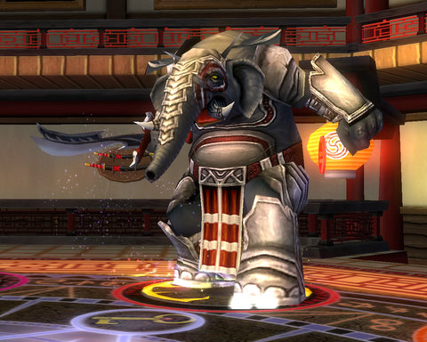
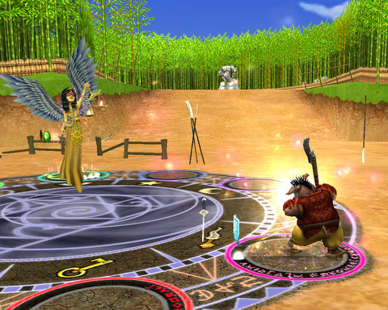
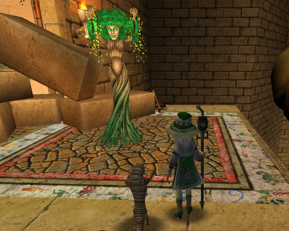
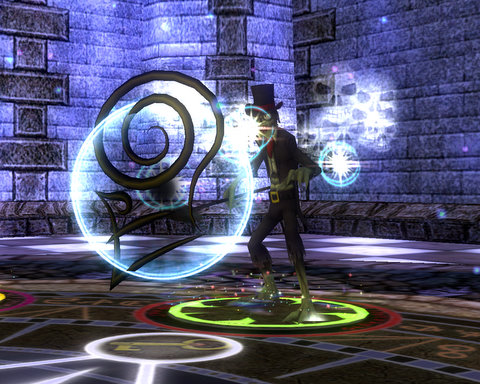
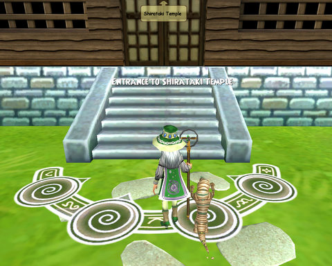
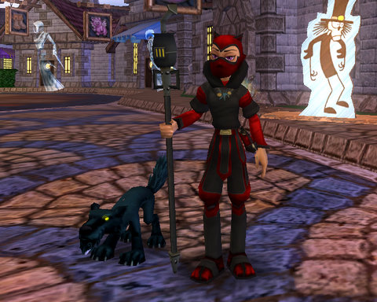

Back to: [West Karana](/posts/westkarana.md) > [2008](/posts/2008/westkarana.md) > [October](./westkarana.md)
# Wizard 101: Crimson Fields and Sunken City (again)

*Posted by Tipa on 2008-10-29 08:20:40*

Meet the War Oni, boss of Crimson Fields. I've been told Crimson Fields is the longest instance in Moo Shu, and so far it seems to be. Not like Sunken City or Kensington, though, it can be soloed... and for about two hours late one night, that's what I did.

I had no idea what I was getting in to!

It's not called Crimson Fields because it's a field of lovely red flowers. The crimson is blood, and the fields are a battle field. The Warlord, once one of the Emperor's closest advisors, betrayed Moo Shu and left a trail of death and destruction through Hametsu Village, Tatakai Outpost and the once peaceful dojo now come to be known by its bloody moniker.

It's just the remains of a battle that the good guys lost. My job was to pick up the pieces and take on the Warlord himself.

While running around the battlefield, strengthening the barricades and summoning earth golems to be the front line against any attack, I found four banners I could raise. I didn't have a quest for it or anything, didn't know what they were for, so I raised them. Why not?

After I'd sufficiently cut off any hopes of reinforcements for the Warlord, he sent out an army from the dojo -- and since I'd raised the banners, one of his generals decided to accept my challenge and come out as well. He was a 5,000 health testament to pain, but I was ready for a huge fight this time, so it went much easier than the 4,000 health Smogger fight in Katzenstein's Lab. I had plenty of centaurs in my hand, my sprite was healing her little heart out, and all went well.

Defeating the general and his army took the majority of my time in the instance. This would have been way easier with some friends to help, but none were online.

I went on and confronted the Warlord in his dojo, and wasn't all that surprised when, at defeat, he revealed that he wasn't the Warlord after all, but the dread War Oni, one of the many demons that have infiltrated Moo Shu. Back into battle, but aside from his bad habit of tossing Heckhounds at me, the outcome was never in doubt.

Somewhere in the madness I dinged level 38, and I got a message from the Life school teacher, Moolinda Wu, that I should stop by when I had a chance, because she had a new quest for me. These usually result in class-defining spells that people who choose Life as a secondary school never see, so I thought I should get over there as soon as possible.

She sent me first back to Krokotopia to get a key. This dryad showed up to help me find it. Could my new spell be this dryad? She wasn't saying, but I did find the key. Next up was to find the chest the key opened.

Moolinda said Grubb, the boss of Sunken City, Wizard City's heroic instance, had that chest.

This instance is somewhat easier solo at 38 than it was duoing at 14, but it's still a tedious slog by any measure. Eventually I finished it (this took me what time I had left over from playing LittleBigPlanet last night), opened the chest, got the book from inside, returned it to Moolinda and... she mentioned something about a Plague Oni.

The Plague Oni is apparently in Shirataki Temple, an instance off Shoshuni Village, but it's not lit up, so I guess I have to finish the quests in Shoshuni before I can defeat the Plague Oni. Not the worst news in the world; it was my next quest hub after Tatakai, anyway, so I was already heading here.

I did happen to finish my Halloween costume -- a ninja! (How original, I know :P )

Rumors are swirling in game about the next world, Dragonspyre. Some say it may be out as soon as next week, some say November, some say the new year. I have gotten some info on Dragonspyre, so watch this space for more about it soon.

