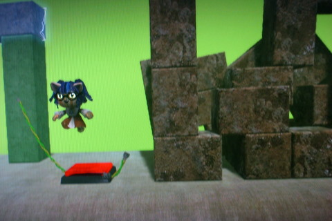
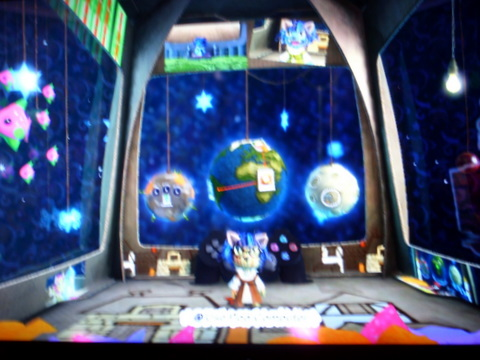

Back to: [West Karana](/posts/westkarana.md) > [2008](/posts/2008/westkarana.md) > [October](./westkarana.md)
# LBP: The Littlest, Biggest Planet in the galaxy.

*Posted by Tipa on 2008-10-30 12:26:15*

Last night was a LittleBigPlanet night. I didn't know that it was going to be a LBP night, but when I sat down to play, my cat pinned me to the couch and I wasn't able to leave for hours. Besides, when [Stargrace](http://mmoquests.com) and Sirhyl stopped by the Pod of Love, ready to play, how could I not?

Things went pretty well when it was just me and Sirhyl, but when Stargrace popped in, we ALL had problems. I dunno what the deal is, or if this morning's LBP patch fixed it, but with three, we just weren't in control. My character would be zipping around, or go in some mystery direction... it was very hard to complete anything.

The other issue is the camera. The camera is the hidden extra player in the game, and this is the player who wants you to die. Unless all three people stay really close, the camera struggles to show everyone -- and even a missed jump that leaves someone at the bottom while everyone else is at the top can do this -- it becomes so zoomed out you can't see or do anything and just have to eat a death and respawn.

We played solo after that, but even though we weren't playing together, the achievements we made and levels we finished got flashed to each other's screens, so it was nice. I followed them to some user-made levels which are designed to give you certain trophies, and those were kinda cool in a god-mode kind of way.

Afterward, I finished the creation tutorials and set to work on my first level, the EQ1 dungeon of Befallen as a platformer. It will be a level dominated by a huge well, and as you go down each dungeon level, there will be new puzzles to solve to cross it in different ways.

The mechanism in the picture above is a test of a swing that will get you over the top of the well, but can then be made to fall down to the bottom in a secret way that will simplify the second level well puzzle somewhat.

The picture at the very top is a rockfall trap, after it has been triggered. Watch the ceilings, all I'm gonna say.

The hard part is going to be figuring out how to make the boss battle at the end. Looking at other people's levels have given me some ideas, but it needs to be epic. The original dungeon of Befallen had bosses each level, but there's a complexity meter and I think, especially for my first try, best just try for one decent one.

The stuff you can do in LBP is amazing, especially given how simple all the individual bits are. The story levels are just astounding and are great examples of how to put these games together.

My "Pod", decorated with found items and pictures of me and my friends. I wish I could figure out how to get those pictures off the PS3 and on to a computer where I could do something with them -- Stargrace as Zombie Bride was particularly cool -- but I guess I better work on getting better at taking pictures off the television with my camera.

What with Rock Band 2 and LittleBigPlanet, my PS3 is finally getting used to play *games*. It must be pretty happy :)

## Comments!

**[Stargrace](http://www.mmoquests.com)** writes: I had *so much* fun playing last night, even after we split because of the lag. I loved being able to watch your guys' achievements, and I could even see what zones you guys were all in and stalk in true Stargrace form. I'm eagerly waiting for Befallen, and cursing the fact that I have NaNo in November or else I'd be trying my hand at my own level. Maybe I'll be able to squeeze something in. I have a few concepts I'm eager to try out.

---

**[Relmstein](http://relmstein.blogspot.com)** writes: I'm looking forward to lots of screenshots of your EQ dungeon. I think I might have to pick up a copy of Little Big Planet when I get Rock Band 2 tonight.

---

**[Tipa](https://chasingdings.com)** writes: Oh, no fears there. The entire thing will be documented here :P Still getting used to the tools and trying to figure out how to take my sketches and make them work like that in the game.

And really, everyone is a creator. You can even get achievements for getting a bunch of friends and creating a level together.

---

**[rob](http://www.lostaneighth.com)** writes: Befallen! Befallen is one of my favorite EQ dungeons. I spent SO much time there for some reason. Can't wait to see the level!

---

**TheRemedy** writes: Your sackgirl reminds me of a female Sonic the Hedgehog.

---

**Malfi** writes: I can NOT wait to get home tonight and finally hook my PS3 up again. I've been whittling my way through my Honey-Do list from the move all week long and FINALLY get to do stuff for ME! JUST ME! LBP and Lego Batman are sitting on my coffee table expectantly waiting the chance to leap into the PS3. LBP will be the first thing I fire up!

---

**[Tipa](https://chasingdings.com)** writes: @Malfi -- what's your PSN ID?

---

