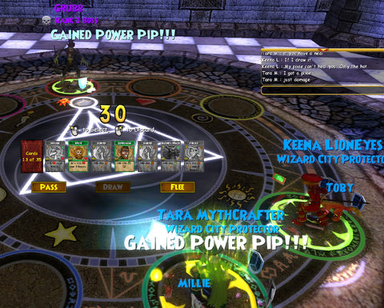

Back to: [West Karana](/posts/westkarana.md) > [2008](/posts/2008/westkarana.md) > [September](./westkarana.md)
# W101: The Sunken City

*Posted by Tipa on 2008-09-07 10:03:23*

It is SO difficult to hook up with your friends in Wizard 101. Even once I figured out where to enter the "True Friend" code, it didn't work. Meeting up with Gnewton and his wife in game took a frenzied batch of emails which ended with their "We are standing with Ambrose right now ... 11:40" and my "omw".

Once we were each others' friends, we could talk, and so we spent half an hour just talking ... and fighting the filter. It was a lot of fun, meeting them, though naturally Ellie, Gnewt's wife, was wearing the same outfit I was wearing. I guess at our level everyone is still wearing the clothing you get from the Olde Towne quests.

One thing we all agreed on: There should be ADULT-ONLY servers where people could talk freely, and where we wouldn't have to play with children. 

Valerian (Gnewt) and Ellie eventually left to finish up their Wizard City quests before heading off to Krokotopia. Even though I had opened up Krokotopia, I was far from finished with Wizard City, having most of Colossus Boulevard left to do, so I left to do some turn ins before turning in.

One of the quests I turned in opened up Nightside, the subterranean world that lies beneath Wizard City, and that in turn gave me the quest to explore Sunken City, a particularly hard instance I'd never found people willing to do while in beta.

When you walk in, you are immediately attacked by three Rank 3 Elite ghosts. That kind of thing happens again and again.

There was a Fire wizard looking like she was about to try it, so we stepped together onto the pads, and started 90 minutes of brilliant teamwork. We were mirror-specced, I as Life/Fire, she as Fire/Life. It was amazing how well that worked, in practice.

This was the first time I'd ever had to play the healer as opposed to just another wizard, but the kind who wears green. After we narrowly survived the first fight, we re-arranged our decks -- mine for as much healing and warding as possible, she for more damage and additional warding. I also swapped out my Myth wand for a Storm wand because almost every mob in Sunken City seemed to be from the Myth school. For some reason, I have found a bunch of wands in my travels. Well, this is why you need more than one.

The hardest encounter wasn't the last mob, Grubb, though he and his friends had more health than anything else we'd killed to that point. The hardest encounter was the tower we'd just cleared, six increasingly difficult battles in a row. With no way to get health or mana back, we had to not only defeat the monsters, but also end each battle at full health, or as close as we could come, since we could not heal between battles.

It was a good run, even though it didn't reward much besides a new title, "Sunken City Survivor". But it pointed out a couple of issues.

First, this game is VERY fun in a group. Knowing you can rely upon your teammates to do their job, and that they are counting upon you to do your job, is just a blast. That's the engine that drives all the best MMOs, learning to work as a team. 

Second, this is NOT a kid's game. W101 being what it is, I group with children a lot, since groups are open to all who want to join. (How can you tell they are children? There's an icon next to their name that shows they are too young to use open chat. It's a speech bubble with a slash through it, marking them as players you cannot talk to). A child in a group plays cards seemingly at random and tends to flee from the battle if things get too difficult. You can get through most random encounters like this, but I have never seen a child stick through an entire instance. Am I prejudiced against kids? Not at all. You just can't rely upon them to play correctly, and they become a real liability the further you go. In beta, most of the children had been weeded out by the time I got to Marleybone, and I never saw any in Moo Shu except the ones that high level players were summoning in to have a look around toward the end of beta. KingsIsle either needs to simplify the game so that randomly playing cards will win all battles, and lose adults and older teenagers, or make a server for adults where we can TALK.

Third, there desperately needs to be guilds in the game. Friends lists are inadequate, for me anyway. I accept all friend requests as a matter of course. And there's no way to share my list of good players with anyone else. A group of decent players who know each other and play together often would make the game so much more fun. There's no good reason NOT to. Make guilds part of the adults-only server if it's an issue with having kids around.

Wizard 101 is an MMO that makes it very difficult to play with other people in more than the most superficial way. You can join any group with room automatically, something I understand Warhammer Online does as well. But without going through the ritual of adding everyone you meet to your friends list, that's where interaction with other players begins and ends. People drift into the group and they drift out. You can't even talk with the other people in your group if it contains a child without going through a cumbersome menu system which prevents teamwork. Not being able to say, "I'm going to grab aggro with an AE, keep me warded and healed, we are killing from left to right, boss last. Joe, focus on DoTs, please" would be acceptable if there were no need for it. But there is.
## Comments!

**Andrew** writes: What this? Where website? This is a card based MMORPG? More info! more info! :-)

---

**[Tipa](https://chasingdings.com)** writes: omg... really? You haven't heard of Wizard 101 yet? I've been pimping it here for MONTHS :P

http://www.wizard101.com -- check it out :)

---

**[Noah Anderson](http://wizard101.com)** writes: I HATE SUNKEN CITY!

---

