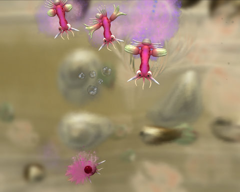
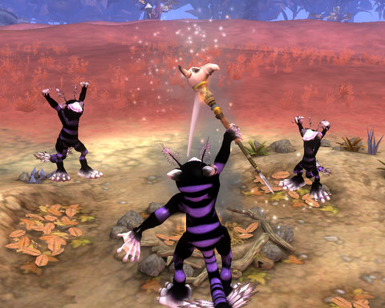
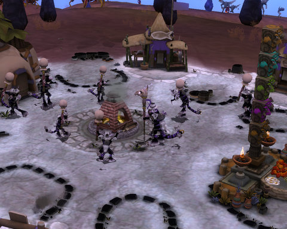

Back to: [West Karana](/posts/westkarana.md) > [2008](/posts/2008/westkarana.md) > [September](./westkarana.md)
# Spore: Final Thoughts

*Posted by Tipa on 2008-09-10 15:43:52*

  
*Baby Diver looks for food, flagella and true love in the primordial goo of Spore's Cell Phase.*

If there's one lesson to be learned from playing Spore, it's that you are unimportant, life will go on without you, and your only legacy left to an uncaring universe might be that some bit of you will live on afterward in something -- or someone -- else.

MMOs and other single player games try to reassure us that we're important, at the center of the universe. Spore has no such comforts. You're a faceless minion and you're gonna die. At some point you have to give up your false notion that you'll go on forever, and just enjoy being where you are, living in the moment.

Which is a pretty heady philosophy for a game, and not one I expected when I started playing. It took Spore's Space phase to teach me that.

  
*Finally achieving both hands and sentience, the Driver tribe discovers fire and war.*

Each phase, but the last, pulls the camera back a bit. In the beginning, you control a single celled animal, and you can't see much beyond your surroundings. You have no idea of the nature of the world, or your place in it. Even the jumps in scale as you eat, grow and evolve tell you little. You evolve because you have no choice, and invariably the world you grow into is more dangerous than the one you left.

Once you evolve enough to grow legs (skipping straight from 2D single-celled creature to 3D multicellular vertebrate in a giant evolutionary leap), you climb up on to the land as the first member of your species, but you soon find others. Here, you, Borg-like, kill or impress other creatures so that you can add their parts to your genome. As the other creatures you encounter become more difficult to kill or impress, you head back to the Creature Creator to upgrade your parts, and die to be reborn as something new. The UFOs that hover overhead occasionally, collecting your tribemates or just scanning them, are scary harbingers of doom from beyond the world.

Someday, that will be you up there.

  
*The Driver Tribe celebrates after killing every other living creature on the continent.*

After you have found enough parts and impressed or killed enough other creatures, those creatures who have advanced enough discover fire, tools, gathering, hunting and xenophobia. Naturally, your tribe has the plum spot in the center of the continent. Unluckily, though, the five other tribes soon notice the closest tribe to all of them -- is yours.

You're no longer controlling one creature; it's a tribe of up to twelve now, and a death just means ten food and a click on the hut. Your evolution has halted forever; now your advancement depends upon taking stuff from other tribes. Whether by friendship or war, their stuff is going to become YOUR stuff. And if there are any of them left when you're through with them, they better be out there gathering your food.

  
*"Flea Gun", the military land vehicle of my mech-obsessed Tabby civilization.*

Once you're conquered the continent, your tribes folk scampers to the four winds, start up cities, and immediately turn upon each other. Your job is to be the worst of them. Whether by crushing them through paupering them, killing them, or brainwashing them. The phase doesn't end until every other city is yours -- you can't advance to space hand-in-hand with allies. At harder difficulties, your enemies will almost instantly have advanced vehicles and be cutting you off from valuable spice, and most likely attacking you. To make things even harder, you always start in the center of the continent, so you don't get a port. This means for quite a long part of the civilization phase, you are unable to claim or defend the offshore spice platforms

It's really just a game of rock-paper-scissors done up nicely, and soon enough you get to be both the rock and paper and you have the scissors in your sights. BAM! You unite the world, civilization celebrates in a frenzy of non-diversity, and a very fallopian-looking tube pops out a starship, your civilization's egg to spread your DNA throughout the galaxy.

  
*The Driver civilization remembers its amphibious roots in the design of their first starship, "Bloviator One", based on the graceful model of a toad in mid-leap.*
  

  
*The Tabby civilization's starship, "The Long Haul", with its quantum-ball-of-yarn star drive. This ship is too complex for the Sporepedia to display, apparently...*

Once in space, your focus, once as wide as your entire civilization, narrows to just you. There's no second ship, no fleet, no aid, and soon, no fellow creatures. Having given birth to you, you are soon shoved out of the nest and sent alone into the night. (sings Babylon 5 theme).

The space game looks like a 4X (eXplore, eXploit, eXpand and eXterminate) game, but it's not. You can explore, but you'll come across enemies that will follow you home. You can exploit, but it will cost you. You can expand, but you won't be able to keep what you've claimed. And you can exterminate, but there's always going to be ten races that spring up for every one you kill.

Though, it's fun to pluck aliens from their cities and plop them down on distant planets. They immediately degenerate into savagery. It's funny how thin our veneer of civilization really is.

Space is vastly open. You can zoom out your view and see the whole galaxy, with thousands of stars, every one of them you can travel to. And for every one of the stars in the game, there are [one hundred MILLION stars in our own, real galaxy](http://curious.astro.cornell.edu/question.php?number=31). For every star in the game, there are [one hundred twenty-five MILLION GALAXIES](http://imagine.gsfc.nasa.gov/docs/ask_astro/answers/021127a.html) in our reality. For EVERY star in the game, there are TEN THOUSAND MILLION MILLION stars in our universe.

Kinda hard to believe we're at the center of everything, isn't it?

  
*Pursued into the dense core of the galaxy by the civilization that destroyed its homeworld, "The Long Haul LXVIII" delivers a final colony to a lonely, T-1 planet not far from the center of all things, and hides for awhile to gather strength and supplies for its last journey.*

Spore doesn't pull any punches. You can stay near your homeworld and trade with your neighbors, but you are just one ship, and eventually pirates or war-loving aliens will send fleets to destroy you. I would be off trading, running missions or exploring, get an emergency message from the home world or a colony, and run back at full speed to find that a city or a colony had been destroyed. I'd die seconds later to swarms of alien ships (though I did eventually learn how to kill several of them before my own destruction).

Every colony I planted was swiftly destroyed as my enemies caught up to me. My only hope was to get far enough away that they could never catch up. I'd find a nice T2 or T3 world, plant a colony, do some terraforming, contact the surrounding empires and set up trade routes and run some missions, start exploring, and then the panicked calls would come telling of invasion. I would fight off the enemy fleets, but rebuilding was bankrupting me and I realized I couldn't protect every colony AND my homeworld. Actually, I couldn't protect any of them.

I bought the best interstellar drive I could find and headed corewards down the spiral arm, leaving bits of the Tabby civilization in my wake. I'd stop at each place for awhile to relax and play and earn achievements, which is the Space phase progression -- everything you do adds to your progression.

When the closer colonies would eventually in their turn be attacked, I'd pack up and move on.

Now I'm at my last colony on an inhospitable world, two jumps away from the nearest starfaring civilization, and still only halfway down the spiral arm. I'm out of money, and am going to start begging for work. Part of me wants to travel back up the arm and help the colonies I left behind, or at least gather whatever spice they may have collected before their demise. But traveling to the bones of my own civilization is depressing.

Soon I'll hear rumors of my enemies catching up to me and will have to go. It's my hope that I'll fill up my achievement bar just as I hit the core. And then we'll see what happens.

## Comments!

**[Relmstein](http://relmstein.blogspot.com)** writes: I bet everyone is making aggressive creatures since it seems easier. That's probably why the space phase is filled with randomly attacking aliens.

---

**[Tipa](https://chasingdings.com)** writes: That's a possibility. Unfortunately, I entered the Space phase as a Trader, and even though I was fairly wealthy until continual rebuilding erased my profits -- often being attacked AGAIN while I was still rebuilding my cities -- it became clear this was not going to be a game where you eventually conquer the galaxy. Sooner or later everyone is going to have to pull up and move out.

I have read on the forums that some galaxies are more peaceful than others, and those in violent galaxies, like I'm in, often have better luck restarting.

Some people's galaxies are far worse than mine, though.

---

**Graktar** writes: That seems like a gigantic design flaw. You only get one ship? Ever? While the enemy has bunches of them? How is that even supposed to be feasible to win? Do colonies get defenses or are they just sitting there, ripe for the plucking? I haven't gotten to the space phase yet (virtually no play time this week), and what you're describing sounds very discouraging.

---

**Neil** writes: You make it sound like what President Roslin must have felt when the Cylons were chasing humanity after invading New Caprica D:

---

**[Tipa](https://chasingdings.com)** writes: @Graktar -- conquering the galaxy is not the goal. The goal is to (currently for me, as assigned by my homeworld) to settle seven colonies and journey to the center of the galaxy.

Everyone is calling this a space conquest sim -- even me when I'd just barely gotten to it. It looks like one, but it's not. The odds are impossible. I can't even fight off ONE invasion, let alone 3-4 simultaneous ones on different worlds. Just one ship is all I get, though I can have allies come along to die beside me.

@Neil -- yeah, actually. It's JUST like that. Hadn't thought of that, but it's true!

---

**[Relmstein](http://relmstein.blogspot.com)** writes: Two bad they can't update the game so people could actually ally their races and pool their resources together in a real time universe.

---

**Graktar** writes: Well, I'm pretty disappointed with Spore right now. I finally had time to get to the tribal stage, outfitted my creatures that I've nurtured up from a cell and . . . they just stand there. If I give a command they'll eventually respond to it . . . sometimes. Maybe. They gather food and then just stand there, never unloading it. I can't find any reason for it, just terrible. I tried with a fresh creature right at the start of the tribal age, and despite two bad starts where it dumped my village in the middle of the ocean, once I got a start actually on land it worked fine. But all the time I invested in my other creature is apparently wasted as they cannot progress. Great.

---

**[Tipa](https://chasingdings.com)** writes: Tribal creatures can get stuck in the landscape, or two critters can stand around waiting for the other to move.

You can import your other creature into a new game. Just use the Sporepedia in the design screen and load it in.

---

**Gump** writes: I went into space as a religious world..... for some reason it was easy. I made allies fast and the occasional SPOD freaks that didn't like me got destroyed (I killed their cities instead of taking them over). I don't know what the hell happens at the end of the game.... i went to the center of the galaxy and through the little worm hole thing and they give you a staff of life (instantly terraform a planet) but i got nothing as to what would be the end of the game? 

ps the grox are dicks

---

**[Tipa](https://chasingdings.com)** writes: In my latest game, I am playing as religious, and it has definitely been way easier. I have two enemies on my door step, but one is also warring against an ally and was getting his butt kicked, and the other will at least talk to me, so trying to do enough missions to get it to ally. I picked a star system closer to the core in which to start. I haven't developed ANY of my colonies, and won't until I get things squared away with the enemies. I paid one empire's 600K bribe for peace and it just laughed and kept attacking.

That's the one my ally is taking out.

The little bonus that makes races more friendly to start is really helping. So is the one where I can return to my home planet instantly from any other planet.

The ability to terraform any planet instantly is cool, but I don't dare start heading to the core with enemies so close. That constant picking up stakes and moving on whenever enemies found me didn't really work out.

PPS yes they are.

---

**Torraan** writes: I have a completely military empire and I found it quite easy. I have a bonus that decreases the rate of raids. I also have a bonus that decreases weapon prices making the super powerful weapons easy to get. At the beginning I had 3 enemies right next to me and when i had only 5 colonies i took out all 3 of them. I now have about 40 systems and am at war with 4 large empires. 

By the way, most of the enemy empires that I've defeated were Maxis creations, and the religious and trader ones were often player created.

---

