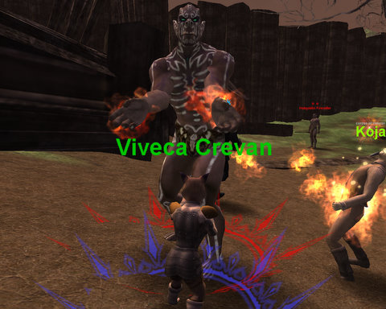
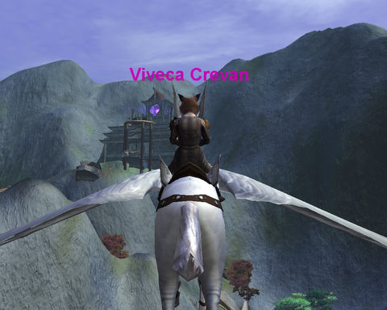
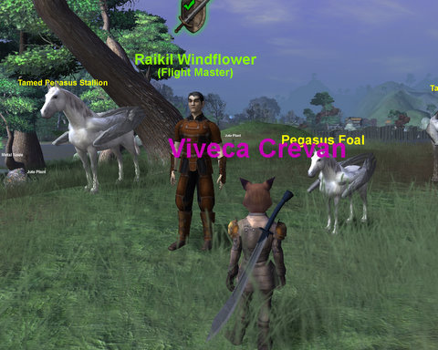

Back to: [West Karana](/posts/westkarana.md) > [2008](/posts/2008/westkarana.md) > [September](./westkarana.md)
# Vanguard noob experience: The Isle of Dawn

*Posted by Tipa on 2008-09-15 08:29:50*

I've played Vanguard before -- but only up to 18. I still consider myself a Vanguad "noobie". I felt more like a noob than ever after running through the new player experience, "The Isle of Dawn". Almost everyone I met there had at least one max level character, and for those Vanguard experts, the noob island was easy and fun. To someone still fairly new to Vanguard, it was a somewhat frustrating experience. I crashed to desktop four times, got stuck in an elevator three times (being warned each time I typed /stuck yes that my usage was being logged and I could be banned), and drowned in the middle of an open room with no water in sight.

On the other hand, I learned more about Vanguard than I knew before, was spared the "plopped down in the middle of nowhere" feel of the original starting areas, got outfitted in decent gear and had an opportunity to group with some nice people.

I wanted to try out the disciple class -- I'd picked that for my Stout Henry guy and I found I really liked the idea of a melee healer. Because I was just playing around, I chose the silliest race (a fox person) and name (Viveca Crevan). The entire night, little Viveca did high kicks to monster's crotches. It was like being in the Will Ferrell version of Vanguard.

The Isle of Dawn puts you down right in front of a quest giver, who is in such a panic, she can't bring herself to go on. It is up to you, the Hero of Dawn, to take those brave ten steps to talk to the next quest giver -- if you dare.

The next trainer, dismissive of your skills (I don't believe he actually SAYS "l2p, noob, u ned 2 kil n00b mobs yo", but he strongly implies it), sends you off to kill some lizards who don't fight back. They do, however, drop little bits of newbie gear, so I spent a fair amount making Gatora Podlings as extinct as pigs made dodos.

Having proved my prowess against defenseless creatures, I was sent to spray gatora repellent in the eyes of Mature Gatora, and to wipe out some marsh hunters, fishy looking guys who, significantly, were nowhere to be found in the actual marsh.

After that, it was into the swamp to take care of the hobgoblin problem.

This is where the Isle of Dawn very nearly lost me. I was REALLY UNCOMFORTABLE that the major enemy on the island was a race of often-naked black guys (with pointy ears). Couldn't they have made the hobgoblins look like monsters? Judge for yourself.

"But mearly naked WHITE guys would have been okay?" you might ask. Well, actually, I dislike killing mobs that look like people in general. Monsters are fine. People is uncomfortable. But black guys dressed in nearly nothing, covered with tribal war paint (in later zones, they do wear clothing), with all attempts to talk to them met with violence, I mean, come on. Who thought that was a good idea?

I got random group invites every now and then. First group mate was an 11 year old who demanded to know my name, and told me right off about his level 38 death knight. A little later he admitted to having a level 50 paladin, except that he forgot the password to it. I asked him why he didn't just call SOE to get the password reset, and he just laughed.

Together, we cleared out a village of hobgoblins who were being coerced from beyond to open up portals to the Fire Dimension and summon imps to come do their terrible bidding. The imps were most notable for being one-hit kills. If I were running the Fire Dimension, and I was looking to invade a world, I would pull out the big guns.

Later villages of hobgoblins, these that called forth elementals from the Rock Dimension, fared no better. I found a ring that makes an annoying sound in the Rock Dimension when you use it on a rock critter. I just kept using it until it annoyed a rock critter so much that he popped into the Isle of Dawn to make me stop. I just kept using the ring on him until he exploded. I guess he didn't like the ring tone.

Like, from a cellphone. Never mind.

Turns out the hobgoblins are being riled up by some invaders from the Uvula Dimension, the Ulvari. Who are basically even blacker guys. After wiping out a village of them, we were sent (different group by this time; the 11 year old had to spend time with his cousin) to the Temple of Ancients! Which you get to via pegasus.

Stargrace took me on a griffon flight once, but I'd forgotten how to fly them, since after that one time, I could never find the flight masters again so just ran everywhere. (Use the map? HAHAHAHAHAAHAHAHAHAHAHAHAHA yeah right). Anyway, for those who, like me, are fairly new to flying, here's how you fly: Click on the flight master, choose your destination by clicking on a useful, clearly marked map, and you're off. Oh wait, that's World of Warcraft. I meant, click on the flight master, and choose your destination from a list. Oh damn sorry, that's EverQuest 2. What I really meant was: Click on the flight master, buy a pegasus leash from him, find it in your inventory, open up your character window, choose the last tab, equip the leash, right click it to summon the pegasus, close the window, while moving forward hit the space button twice, line up the red mark in your compass, point upward while flapping with the space bar, and you're off!

It's as if the Vanguard devs went into a closed room and challenged themselves to come up with a game more annoying than EverQuest. "We want a game that is unforgiving and cruel," they said, "because our players are HARDCORE. Clicking on a mount bridle like in EQ, EQ2 or WoW is too easy. We can do better."

"I know!" exclaimed a brilliant dev. "We can make a tab for RIDING CLOTHES, and make you equip even temporary mounts THERE, and also make you collect special clothes... for RIDING!"

The room fell silent. And then someone clapped. And then another. And then the whole room was on its feet, cheering.

Anyway, off I eventually went to the Temple of the Ancients.

I don't actually have any screen shots from the Temple. So you can't see the rock elevator which slams you against some bars from which you are unable to move or escape. That had me and my group mate risking the ban hammer by typing /stuck yes a couple of times. Or the room right before the dungeon boss where you suddenly find yourself drowning while your groupmate yells at you to "use your protection". My what? gurglegurle gaaaaaaah.... I crashed right after that and my groupmate was gone when I got back.

I went back and soloed the boss, but it was pretty tough. I couldn't get any of the other people there to group. It was pretty close, but disciples are healers so it wasn't that bad.

Afterward, I helped a rogue do it, and it went a whole lot better.

Then I got stuck in the elevator again. I decided not to bother with the quest to farm nameds for Death Poems because any more time spent in Temple of the Ancients and that stupid elevator would drive me mad, so I did the "find the pegasus master" quest for the fourth time (oh, isn't he on the map? HAHAHAHAHAHA!), turned in the quest at ToA, finished up the quests I had back at the village, dinged ten, talked to the rift master about leaving the island, clicked on the rift and crashed.

As an intro to Vanguard, the Isle of Dawn is more focused and puts you together with a large number of other players, most of whom are Vanguard experts with a lot of experience in the game. It is far better to start with other people than to be dropped in the middle of nowhere with no other players in sight.

It also has more crashes and bugs than I ever experienced in the normal game. These will undoubtedly be fixed in the future.

Vanguard's core philosophy has always seemed to be to take something other games have done, but to make it more tedious and less intuitive. In the spectrum of MMOs where World of Warcraft is at the casual, gamey end and EverQuest is at the hardcore end, Vanguard is proudly right near EQ, where it was always meant to be. But for those people who really want the EQ experience, I would recommend just playing the original game. Vanguard's over-the-top system requirements and general instability don't make for better gameplay, just prettier gameplay.

Make no mistake, Vanguard is a pretty game, and the new character models mean you can look at your fellow players without bursting into laughter. But with both EverQuest and EverQuest 2 in their game roster, I still don't know what Vanguard brings to SOE's table not served by the other games.

I was determined to get all the way through the Isle of Dawn, but in the end, I never was able to relax and just have fun and enjoy the experience. If Vanguard had managed to make the Isle as easy and fun and bulletproof as Blizzard did with all of their newbie experiences, they could have had a hit on their hands. As it is, it is as tedious and unforgiving as the game itself. Current Vanguard players will love it, but I can't see new players coming out of this with a hot desire to buy the full game.

## Comments!

**jsquirrel** writes: I dunno, the naked black guys look better than the [naked white guys](http://www.foxchange.com/tom/vgsoh/ScreenShot_00099.JPG) Varanjar noobs have to fight. =)

...

If this game really wanted to be like EQ they would've let the kitty race be Bards. (Though in my view the Raki would do it better. =))

---

**[Tipa](https://chasingdings.com)** writes: The Raki would be excellent bards :) 

My favorite quest was one I didn't mention, where this lady gave me a chicken prod and wanted me to poke the chickens back to their corral.

Wait -- you're having the FOX guard the HENHOUSE!?

---

**[Openedge1](http://simple-n-complex.blogspot.com)** writes: So, you had fun?

NOT

Argh, talk about an exasperating game. 
It really does not offer a storylike experience. The game is such a mish mash.
EQ2 has been blamed for being all over the map in the way the zones are set up. Yet, each ZONE had a purpose at least. You felt you were doing something specific for that zone.
Here, they just throw the kitchen sink and hope when it falls apart, that someone finds it amusing or likable.

I will stick to my guns on my opinion that a game either needs to be focused on PvE and give us a story and a reason to live in that world or go PvP where you are there to fight!

Vanguard has no clue what it is.

Well, they got 10 bucks from me for the box. That is the best I can offer them.

Thanks for this write up.

---

**[Scott](http://pumpingirony.net/)** writes: I liked the couple bits of humor in IOD such as the chicken quest. Among many other things, VG is often called too serious. My favorite was finding Slappy the Cool dancing to some actual blues-rock dance music in a hobgoblin camp.

I did a [writeup](http://pumpingirony.net/2008/09/12/first-impressions-isle-of-dawn/) of my IOD time and marked off a few issues with the GU6 game overall the other day.

I wish I could put into words why I like VG (though I only play part-time). I guess it provides just enough of an old-school "feel" or "flavor" without having to actually go old-school and put up with EQ and its primitive systems and mechanics. I enjoy reading your EQ Nostalgia guild adventures, but it stops there; I am absolutely unwilling and unable to tolerate actually playing EQ. Same for EQ2 unfortunately. While it has more modern mechanics, every one of them I've been exposed to the several times I've tried to get interested has turned me off and pushed me away, and at this point I'm unwilling to punish myself with EQ2 in order to eventually play through the cool content that must be in there somewhere. So I just enjoy reading about others' adventures there.

---

**Beau** writes: This is a good review, very truthful. The stuck thing is annoying, and I just talked about it on my podcast.

 I gotta' post this over there on the official forums, because so many players are arguing over there about if VG should be more like EQ, or more like something else. So many players (just on the forums that I have seen) say that Vanguard is as easy as Kindergarten. 

 Also, you are playing with mostly vets because the newbie island is not being publicly (at the time of this writing) talked about as available to anyone save players with a established account. But now I am hearing that a player can make a new Station account, and download the trial. I wish I knew the truth. How did you get it going?

 Anyway, some of those guys will get a kick outta' this. The game Vanguard is by far my favorite, but there are still annoying little issues. Stuff'll get fixed, I'm sure. The game has gotten steadily better over the last 10 months. 

 It's kind of funny to because there are players over there that make fun of EQ2 especially, talking about it's lack of challenge. They say that VG should have much more challenge than that. I argued that EQ2 has plenty of challenge, but they seemed to think that EQ2 was only popular because it was "EZ mode."

 And by the way, when you get the reins, drag em to your hotbar. Click on them. Just like in WoW! :)

---

**[Tipa](https://chasingdings.com)** writes: Heh... well when you get to the pegasus guy, what he tells you to do is equip them on the mount tab. And then doesn't explain how to move once on the thing. I am an existing subscriber to Vanguard, I just never got beyond the newbie stuff with it. So I guess that's how I got the trial automatically :)

I wouldn't say VG was as hard as EQ -- try playing EQ from scratch without knowing anyone. Much less soloing. I wouldn't call it easy, either. More like, the game was intended to be really complex, but in a way that doesn't (for me) make it also more *fun*. I get the impression that VG was never meant to be fun, just really complicated. As if complexity enough was reason to play.

Naturally, the fact it runs so poorly on my system might have something to do with it as well.

Thanks for the linkage )

---

**[MmoQuests.com » A Peek at Vanguard Changes](http://mmoquests.com/2008/09/15/a-peek-at-vanguard-changes/)** writes: [...] reading other people’s impressions and ideas on the new changes in Vanguard after the latest game update, I decided it [...]

---

**[Beau](http://voyagesofvanguard.com)** writes: Yeh the mounts can be confusing at first. I mean, I know that you know your way around an MMO layout, but the first few times can always be a lil wierd.

 The mount tab is not for clothes though, but for different saddlebags (more room, less room ) horseshoes and bardings (to make for more stability or speed) and the bottom mount slot is for the abnormal ones..flying and stuff.

 Anyway, this'll be a good read to see what new players (that aren't new to MMO's) might see.

---

**Da BigCaucAsian** writes: Did you find the combat challenging at all?

---

**[Tipa](https://chasingdings.com)** writes: Not really, but then I didn't expect to on the newbie isle.

---

**[Hudson](http://hudshideout.blogspot.com/)** writes: This post was awesome. I was so ready for this when it came out to be MY NEXT EQ1. Argh. Do you have more updated shots of the new character models, close ups?

---

**[Tipa](https://chasingdings.com)** writes: Well, my previous Vanguard post had closeups of my two (now three) Vanguard characters. They look pretty decent. I don't have any issues with how the characters look, or how the landscape looks, but mostly the poor performance on my system and issues with some design choices.

---

**Maraek** writes: Quick question - you mentioned in the write up that there were lots of people around with previous Vanguard experience (through alts). Other than grouping with some, did you ask any of them (whether in your group, or via /tell, /shout or even /say) for input on any of your issues? I've found the IoD community to be generally quite helpful.

For example, I think the main problem with the elevators in the Temple is that after you dismount from your pegasus you automatically get a "parachute" buff (which works like feather fall). This is coded in so that if your mount timer runs out while you're in mid-flight you don't go splat on the ground hundreds of meters below. Anyway, with the parachute buff on, your vertical movement (both up AND down) is slowed... and if something is trying to push you vertically faster than the buff wants you to go... (whether an elevator floor/ceiling, or even a staircase, for example) you will get shoved to one side or the other. The easiest way to avoid this in the Temple is to turn off the parachute buff as soon as you land and go inside.

Some/many of your other issues may also have solutions like this, as well. Anyway, I liked the writeup and hope you (and/or others) give VG another chance some day.

---

**[Tipa](https://chasingdings.com)** writes: The person I was grouped with tried to use the /rope command to free me from the elevator, but that didn't work, and when he got stuck in turn, the stuck command was the only thing he could think of. I did ask, through /ooc, questions about how to do things quite often, and it was always answered quickly and there wasn't the sort of childish spam you see in a lot of other games.

The VG *players* are fantastic, I would never say differently.

The problem with the elevator was while going up, I would get stuck in some bars, and the constant up force of the elevator would prevent me from moving in any direction. Also, I was having some lag, so it would appear that I was hardly moving at all, then suddenly be trapped in the bars again. Going down wasn't usually a problem.

I'm not familiar with the parachute buff, but that character has left the island now and hopefully won't encounter the problem in the wider game.

---

**Maraek** writes: I've never run into the problem as drastically as the elevator out in greater Telon... but sometimes trying to run up a narrow stairway (some outpost buildings have narrow stairways that wind their way up to a second floor entrance, for example) while you have the parachute buff can be tricky - because the code keeps sliding you to the side (and you promptly fall off the stairway). So it's more of an issue to be aware of - remembering to turn off the parachute buff (and/or similar buffs like levitation).

In any case, I'm glad you found the people to be friendly - I agree with you there for the most part (and I always try to be helpful myself in game, when I can). There are always griefers in any game, but I've seen very few while playing VG - generally the worst I get from people is being ignored (and there are lots of potential reasons for that... so I don't take it personally). I'm also sorry that you're having crash problems. I can't remember having had any crash problems in the game itself for quite some time. For a while I did crash whenever I was trying to /camp back to the character selection screen - but that seems to be related to another software program I had installed - namely OpenOffice (because once I uninstalled it that recurring crash disappeared).

---

**Tom** writes: The "stuck" thing is because you had the "Parachute" spell on from when the Flying mount wore off. Simply click it off and you will be on your way.

---

**[Tipa](https://chasingdings.com)** writes: Yeah, I feel like such a maroon, now. But I had no idea what it was at the time, it was incredibly frustrating, and nobody seemed to know what to do to make it stop.

---

**Joe** writes: Just started my free trial and I have to say I don't like it already. My biggest problem was right from the beginning with the controls. I have the turn control down to 50% but it still turns way too far whenever I press left or right on my keyboard. I'm using a laptop, so mouse control is not the most convenient means of moving around for me. It makes following the direction indicator and hunting for quest mobs more difficult when turning always overshoots your target direction. Getting the character lined up to cross the bridges in the swamp was particularly tiresome. Is there a way to turn it down below 50% so it doesn't turn in such large increments? This issue alone is really turning me off to this game to the point where I likely won't be signing up once the trial ends.

---

**Winterdragon** writes: To me the only times i use the direction keys for movement control is when using a ship and it is the only option and it doesn't work too bad there, the other time you have to use the direction arrows is in fishing, other than that i perfer to use the mouse to move, but you might try slowing down the key repeat speed on your laptop just a little and see if that helps.

I had been away from the game for over a year do to things outside the game getting in the way but since i have been back i have made 2 characters on the Isle of dawn, out of all the start areas in the game the isle is set up with everything you need to get to 10th in all 3 spheres, and the changes to the death penalty LOL it used to start at 6th lvl and low level characters didn't start seeing soulbound items till after 10th lvl so trying to get your corpse back without equipment is now a thing of the past. 

The elevator problem mentioned i didn't experience but did ride it up and down several times to help someone that couldn't figure the elevator out or had the parachutte effect on them , not sure as we did get her down eventually, but did notice what happened when i took the hit me express from the mission to tentrees (the guy standing on the roof of the mission) i landed in the middle of the river once because i had the parachutte effect active it really slows down movement.

As far as a there not being a story line, most the quest are story lines, you have a world made up of many races and cultures all story lines are going to be localized for the most part in the form of quest.

the use of /ooc hmmm didn't think there was a RP server so use of /ooc is a personal choice rather than a server requirement as far as i know they are open game format or normal format.

My main is a bard goes around high speed invisible with cloud walk on most the time when solo, stairs can be a trip, you slip side to side on stairs, ramps no pproblem stairs pretty much force you to turn that type of effect off lol and the tree city of cael brae is a hazzard to speedy people lol

I love the complexity of the game, easy games get boring too fast, went back on WoW to get my guy there from 70th to 80th had it in less than a week got bored pretty soon after that got a new video card and came back to vanguard. Plus all the inane chatter on the general channels in wow is enough to turn a person off to that game.

---

