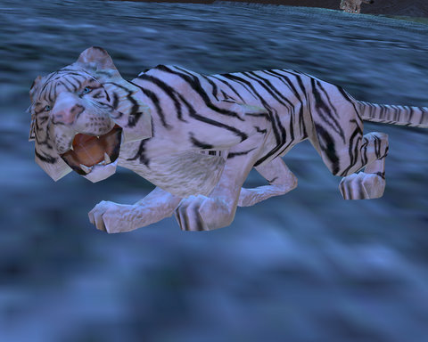

Back to: [West Karana](/posts/westkarana.md) > [2008](/posts/2008/westkarana.md) > [September](./westkarana.md)
# Straight Talk Warhammer: The White Lion profession.

*Posted by Tipa on 2008-09-16 01:18:53*

Warhammer Online. Warhammer. WAR. WAAAAGH. All ways to describe the game sweeping our interwebs in ways Google can easily find. More? Public quests? This game has public quests. Tome of Knowledge? This is the ONLY GAME with a Tome of Knowledge. World of Warcraft: Wrath of the Lich King, coming this November, does not have public quests OR a Tome of Knowledge. Order. Destruction. War everywhere becomes WAR everywhere.

Public quests and the Tome of Knowledge and Order and Destruction and Realm vs Realm -- things every game, such as Blizzard's World of Warcraft, and its upcoming Wrath of the Lich King expansion, will soon have in abundance. Soon, EA Mythic's Warhammer Online: Age of Reckoning will no longer be able to call public quests, and the Tome of Knowledge, something exclusive only to WAR.

But we come here tonight not to talk about such things as public quests and the Tome of Knowledge, things exclusive to Warhammer Online, but about things you won't find on many other blogs. Like information about the White Lion profession, a profession you won't find in World of Warcraft, or Lord of the Rings Online's Mines of Moria expansion, or in Star Wars: Galaxies' Hoth expansion.

Well, maybe there. But Hoth won't have Greenskins. WAAAAAGH! So that will be another thing not found in other games, except for World of Warcraft.

  
*Simulated Warhammer Online screenshot.*

Well, the White Lions are high elves, and they are so incredibly ferocious, that they hunt with white lions, and wear white lion clothes, and probably sleep with the damn things, I don't know. Actually, let's just get some things about them out in the open.

These are bad muthas. I mean it. The other high elves, they don't want to be around White Lions that much. Because there's this imaginary line, and the other high elves are on THIS side of it, and the White Lions are so far on the OTHER side of it, that they don't even know there IS a line. While the other High Elves are sipping blood wine from crystal goblets in their high marble towers, the White Lion guys are running howling naked through the forest.

These are scary guys.

When a high elf kid says, "Ma, they had a White Lion guy come by Elf School and I kinda liked what he had to say," there is no discussion. High Elf law is really clear on this. Once your kid starts talking about the White Lions, you have to drop them off at a big bin in front of the White Lion union hall, and some guy in a parka comes by and collects them each night just after sundown, and then if you ever see your kid again, you won't recognize him. 'Cause they'll have that scary, wild look in their eyes, and you might want to say, "Honey? Is that you?" but you don't, because you don't want your throat ripped out by your own demon spawn.

  
*Thinking about becoming a White Lion? Say hello to your girlfriend.*

In battle, everyone just kinda backs away from the White Lion, and nobody dares look into his eye, because that will be the first one they come for. But while the White Lion is feeding on your buddy, that's your chance to circle around back and take him down with a swift stroke. But save one for his lion girlfriend.

We hope you have enjoyed this exclusive peak at one of Warhammer Online: Age of Reckoning's most exciting new classes, and that you'll come back every day this week for more exclusive coverage of EA Mythic's groundbreakingly innovative new MMO sensation.

## Comments!

**[Cow Nose the 50 Pound Cat](http://cownosethe50poundcat.blogspot.com)** writes: OMG. O.O OK first I laughed, then I was like wow, thats actually really cool. OK tottaly dunno what your going on about, but it sure was a good read! O.O (Tipa's lost it!)

---

**Joe Fred** writes: I am a white lion and I have impregnated many other white lions. I don't feel sorry for my actions.

---

**Joe Fred** writes: @cow nose Tipa is going crazy because she is bitter that she doesn't have time to join the bandwagon.

@Tipa Just playing :)

---

**[Openedge1](http://simple-n-complex.blogspot.com/)** writes: Thank you, you have answered all my questions.
By the way, great screenshots also. I see they have turned on some type of textures..

Weird, but awesome.

I am glad I found your blog. It is both informative and enlightening.
You have helped me make my gaming decisions.

RAWR!

---

**redheadedtim** writes: Wow, and I thought the Hello Kitty Online Founder's Beta announcement was big (we'll see if I get in :p ). You had me at "they don't even know there IS a line." I just bought a hat so that I may take it off to you.

---

**[syncaine](http://syncaine.wordpress.com)** writes: Dear Tipa,

Please go and buy WAR, join CoW, and end the misery.

Your friend in MMO land,

Syncaine

---

**[Hudson](http://hudshideout.blogspot.com/)** writes: Ok ok I wont take this shot laying down :)

---

**[Thules](http://wiimoteaoc.wordpress.com/)** writes: What?! No coverage of the Black Lions??!?

Oooh, I'm callin Oprah...

---

**[Tipa](https://chasingdings.com)** writes: @syncaine -- Wow... your comment wasn't kicked to the spam queue. Looks like you finally made your peace with Akismet. Well done!

@Thules -- my coverage of that went up yesterday :P

---

**[JoBildo](http://bildos.blogspot.com)** writes: I am a White Lion myself... and I've not yet received this impregnating ability... how do I go about getting it? Is it a Tome unlock? I'm going home, getting my WL nekkid and seeing what happens. Word is that's how you start the quest.

Seriously, Tip. Either you're quite bored, or quite bitter. Maybe a mix of both?

---

**[Tipa](https://chasingdings.com)** writes: @Bildo -- neither :) I just want to be part of the excitement of launch without actually having to commit to playing a single game for 4-6 hours a night.

---

**[Openedge1](http://simple-n-complex.blogspot.com)** writes: @Tipa

Average play times of X-Fire players in WAR was 5.5 hours per player. 

This could be skewed, with the CoW guild averaging 10-12 hours. May have to re-evaluate.

That's a lotta hours though.

Wild.

---

**[JoBildo](http://bildos.blogspot.com)** writes: To be fair, only Hudson had the 10-12 hour play session... I heard he now has hemorrhoids and has named them Gork and Mork.

@Tip: The beauty of WAR is that like so many other games lately you don't NEED that many hours to have fun and get a lot done.

---

**[Tipa](https://chasingdings.com)** writes: @Bildo -- with EQ2's expansion imminent, I can't commit to another MMO until I've been through that. That's the real reason I can't play WAR yet. I'd just have to drop it in a month. So I'll just grab it early next year, it's always been my plan.

I hope you don't mind, though, if I have a little fun with the hype for a few days...!

---

**Andrew** writes: LOL! Great write up! :-)

---

**Joe Fred** writes: @JoBildo I've been contracted by various MMOs to impregnate things in their games in order to increase the population of dying servers. WAR was just thinking ahead and decided to give me the Impregnate combat art right off the bat. They descreased the max framerates while that combat art is in effect in order to maintain their 'Teen' rating. If you see my avatar executing Impregnate, it just looks like a blur. The casting speed is 10 minutes, the range is 5 inches and the recast is 45 minutes. The CRR is reduced in PvP to Instant, 5 inches and 1 minute.

---

**[Lucifrank](http://tenfoldhate.com)** writes: Hilarious--love your simulated screenshots. I can almost hear Paul Barnett narrating your post from behind a pair of Elton John sunglasses.

---

**[Openedge1](http://simple-n-complex.blogspot.com)** writes: lol

Tipa, why does it look like you are apologizing to JoBildo for making fun of WAR...

lol

---

**[Tipa](https://chasingdings.com)** writes: Because, someday, I want to join his guild :)

---

**[JoBildo](http://bildos.blogspot.com)** writes: @Openedge: Because, while opinions differ (which often happens with Tipa and I) we still try to keep things civil. There's enough mudslinging around our upcoming election that I don't think we need to resort to it over our favored MMOGs.

That, and because CoW rules. Moo.

---

**[Openedge1](http://simple-n-complex.blogspot.com)** writes: @JoBildo

OMG! you played the "Politics" card.

(*covers ears and imagines lollipops, kittens and WAR rainbow colors of muddy love and happiness all wrapped in slow mo combat and gentle sheets of cotton*)

LALALA

---

**[Tipa](https://chasingdings.com)** writes: Someone has seen too many fabric softener commercials.

---

**[Openedge1](http://simple-n-complex.blogspot.com)** writes: *Feels much happier now. Drank the same Kool Aid as the other players!

---

**[JoBildo](http://bildos.blogspot.com)** writes: Edge... come on, man. Just accept the fact that because you don't like something doesn't mean it's bad and move on. By the way, it's not Kool-Aid we're drinking, it's Smithwick's.

---

**[Openedge1](http://simple-n-complex.blogspot.com/)** writes: But, but, but,,,,

Wait...where did I say it was bad...? I like Kool Aid

/goes back to re-read

I need to filter the data and see where I went wrong man..
I am sOoooo sorry if I said *Bad*

Really!

(Wonders if he can get away with it like Tipa)

---

**[JoBildo](http://bildos.blogspot.com)** writes: Dude... Kool-Aid, in my mind maybe I'm wrong, implies that you think we're all "*drinking from the same cup and enjoying something like a cult and are therefoe insane*" a la the 90s Nike Sweatsuit Cult whose name is escaping me. Correct me if I'm wrong in my cultural reference check.

The fact is Tipa didn't "get away with anything". I respect her opinions because she often intelligently stands up for them, even if we disagree that she's always wrong and I'm always right. And I'm not the kind to go into an e-shouting match over something as silly as the held opinion of a particular videogame.

I know, I know... you're "playing the devil's advocate". Sure, I get it. But right now, it seems you just really desperately want to be a voice of dissent among other peoples' fun. 

Why am I here then? Why do I keep checking back... I guess I'm bored. 25 minutes until I get to leave work, and there's not an ounce left of will in me to do any more report editing and compiling.

---

**[syncaine](http://syncaine.wordpress.com)** writes: Actually Tipa, I changed jobs, and the network here lets comments through. But yea, no more spam filter for me!

About WAR, I would say pick it up anyway, and play it when you can. With how alt-friendly WAR is, and the fact that people can still group through varying levels (1-11, 12-20, ect) for RvR, PQs, scenarios, means you won't 'fall behind' or anything like that. Travel is also super easy.

Plus missing a major games launch is never cool. You at least want SOME perspective on the first few months, even if it's only 1-2 hours per week. Oh and we want to hang out with you in game :)

---

**TheRemedy** writes: @JoBildo

WAR players have to drink from the same cup? EW! At least Jim Jones was nice enough to give everyone their own.

---

**[Tipa](https://chasingdings.com)** writes: I probably will buy the box, actually. I dunno, you might see me in this weekend, but I Really. Don't. Want. to have another MMO addiction until I shake a few of the current monkeys off my back.

There are so many good ones out at the moment :P

I guess it could replace Vanguard. I like parts of the game but realistically, it isn't compelling enough to play through except for the fact that I have maxed my EQ2 bard with levels and AA and doing anything more on her until the expansion would be wasting achievement xp I could be spending toward the next 60 AAs.

However, Vanguard has a couple of things to recommend it -- I'm already paying for it, via the Station Pass, and I'm using one of the characters in a fan fic :)

---

**[Hudson](http://hudshideout.blogspot.com/)** writes: I just wanted to say I do NOT in fact have hemorrhoids.

Ok continue

---

**[Openedge1](http://simple-n-complex.blogspot.com/)** writes: @JoBildo
And here I thought we were all having fun, and you had to get all serious..AGAIN.
Sad really.

@Hudson
Thank God dude, that woulda sucked. Now, you gotta tell me, did you use Bacardi 151 or Jim Beam to burn them off...hehe.
Later

---

**[almagill](http://almagill.livejournal.com)** writes: @redheadedtim That was my hat and you only borrowed it. Bought a hat indeed.. ;) 

@tipa OK,so where do I join these white lions? Psychotic furries ftw. (But, are you sure they can't find the white line because they snorted it already?)

---

**[JoBildo](http://ramblings.rebelutionstudios.com)** writes: Edge, my man... I'm never sure when you're trying to be "fun" and when you're trying to be an ass. You're an enigma for me, congratulations.

How'd the recent VG path go actually, Tip? I've not heard much about it.

---

**[JoBildo](http://ramblings.rebelutionstudios.com)** writes: Er, patch not path.

---

**[Openedge1](http://simple-n-complex.blogspot.com/)** writes: @JoBildo

The beauty of the Internet...all full of ass-y-ness
WooT

Seems everyone was being a smart alec in this thread, but, you seemed to target my posts as the only "serious" ones.

Tell me how wrong that was...

Now....can we get back to Politics? Guess we need something less serious here.

---

**[Sean](http://dadsbattleground.blogspot.com)** writes: I spent 5 bucks on a pre order for War, played open beta for a few days, and now i'm playing it tonight for free cuz of the "head start" woot!

I figured out a major cause of my FPS woes (I have a pretty decent comp), it was once again because of Vista!

Under Compatability modes in properties of the WAR.exe, i disabled 3 things that weren't needed (something about visual themes and DPi), and set it to XP sp2 just in case. Loaded up and it was much smoother.

I play a dorf engi on the Iron Rock server, and I'm having a blast. (ha ha ha)

---

**[Jason](http:/www.channelmassive.com)** writes: @Tipa

They're also the one of the lamest 80's hair bands ever.

http://www.youtube.com/watch?v=jIhhGVFKXoM

Jason (resident drunken idiot of Channel Massive)

---

**[Tipa](https://chasingdings.com)** writes: Ooooh, that's better than the Siegfried and Roy thing I almost went with :)

---

**[Openedge1](http://simple-n-complex.blogspot.com)** writes: I keep wondering when we will see...
\_\_\_\_\_\_\_\_\_\_\_\_\_\_\_\_\_\_

WAR...UH..

What is it good for?

Absolutely NOTHING@

---

**[Tipa](https://chasingdings.com)** writes: And how many people would even GET that reference?

It's a good one, though :)

---

**redheadedtim** writes: I think that would work great as a Straight Talk Exclusive Announcement - "WAR's official themesong".

Ideally someone could whip up a youtube video that cuts the trailer in w/ that song, possibly including some white lions. I however, am not that someone. I used all my skillz borrowing Almagill's hat.

---

**yunk** writes: *WAR players have to drink from the same cup?*

No only us CoW members. It shows your commitment to the guild. There is no I in team, and no I in cup either. We fedex the cup around to each other. But technically it's not kool aid it's rasberry lambic.

---

