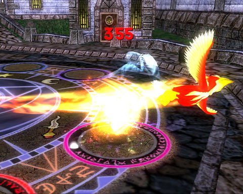

Back to: [West Karana](/posts/westkarana.md) > [2008](/posts/2008/westkarana.md) > [September](./westkarana.md)
# Wizard 101 slices repeat instance XP

*Posted by Tipa on 2008-09-17 07:34:09*

What with open grouping and a broad kid appeal, Wizard 101 is a pretty friendly game. Jumping in to an instance to help a friend is just a click away. This is a GOOD thing. But the devs saw 'exploit' with players repeating instances over and over (something explicitly encouraged in the very first instance on Unicorn Way, Rattlebones' Tower), and so have sliced the experience you get by repeating certain tougher instances -- the ones you would most appreciate the help of friends.

> Instanced quests have a new dynamic that decreases the amount of experience rewarded after repeating the entire instanced quest. Instanced quests such as Sunken City, Throne Room of Fire, Crimson Fields and other similar instanced quests will be worth 100%XP the first time you complete the quest, 50%XP the second time you complete the quest and 0XP the third time you complete the quest. You will still receive the full experience rewards for the individual duels, and you will still be able to earn badges and items. 

You get the quest automatically for the instance when you zone in, if you didn't already have it. (Open groups and public quests, what other game claims to be the only one with those? Hmm...) But now, given half experience the second time you do it and no experience thereafter, will it be as easy to gather some friends to do an instance which might easily take an hour of their time?

Apparently there is an instance in Moo Shu which gave thousands of xp quickly without requiring any killing. I can't possibly imagine anyone repeating Sunken City purely for the xp.

They also fixed the feature where the first person in to the dueling circle starts off with the most aggro.

> 
The first position in a duel will no longer be targeted at a higher rate than the other positions. Target is now random but can still be affected by any spells that are cast on you to draw or deflect aggression. 

Groups had been sending in the member with the most health first to draw initial aggro. There are taunt (and de-taunt) cards you can get for your deck, but most people won't use them for regular battles. This is almost certainly to prevent power leveling, where a high level character steps into the circle first, then followed by lower level wizards. It does make it harder to set aggro order right off the bat, though.

I hope I can take credit for this next one.

> You may notice that there is now a delay between changing Realms of one minute.
You will see a countdown timer on your Realms panel.
This lets you still meet up with your friends on a different realm, however it prevents people from "Realm Hopping" to exploit chests and boss encounters. 

I wrote about this in a previous post :) It was obviously an exploit then and I'm glad they addressed it.

