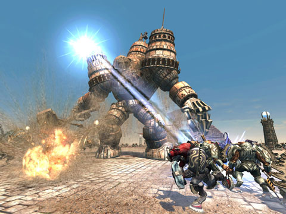

Back to: [West Karana](/posts/westkarana.md) > [2008](/posts/2008/westkarana.md) > [September](./westkarana.md)
# Demigod beta opened to pre-orders

*Posted by Tipa on 2008-09-18 10:00:57*

Gas Powered Games, creators of Dungeon Siege, Dungeon Siege II, Space Siege, and Supreme Commander, is bringing the Warcraft III "Defense of the Ancients" mod to your computer in an entirely new game. Raise a demigod, crush the enemy, it looks like a cross between DotA and [Shadow of the Colossus](http://en.wikipedia.org/wiki/Shadow_of_the_Colossus).

If you're at all interested in multiplayer tactical PvP, they're letting people who pre-order by September 19th into the beta.

Plus, it's distributed by Stardock, and they're good people.

> Pre-order Demigod, Test it Today!

Gas Powered Games and Stardock are happy to announce the limited beta test of Demigod. If you pre-order Demigod from Stardock's Impulse digital download platform, you can start testing the exclusive beta right now.

To pre-order Demigod, [simply follow this link](http://www.demigodthegame.com/purchase.asp).

This is a limited time offer. Signups for this cycle of the beta test close on Friday, September 19th, though the beta itself is ongoing. If you miss the beta this time, check the official Demigod website to find out when the next cycle begins. While you're there, please join our growing community of enthusiasts and testers.

Set in an awesome future-fantasy world, Demigod is a mix of real-time strategy, tactics, and role-playing. There's an opening in the pantheon of the gods, and players pick a Demigod to wage war against others who are also trying to ascend to true godhood. Each Demigod
goes into battle with its own set of unique abilities and powers, and players "level up" to unlock even more.

For additional information on Demigod, [check out its official site](http://www.demigodthegame.com).

## Comments!

**[JoBildo](http://bildos.blogspot.com)** writes: That's one nice looking DemiGod... I am intrigued.

/goes to read more on it...

---

**[Jason](http:/www.channelmassive.com)** writes: I'm not a huge fan of RTS titles, but wow...

I may have to check this out.

Jason (resident drunken idiot of Channel Massive)

---

