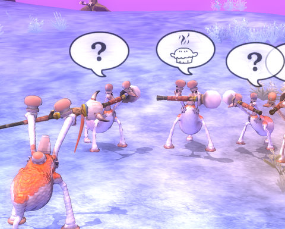

Back to: [West Karana](/posts/westkarana.md) > [2008](/posts/2008/westkarana.md) > [September](./westkarana.md)
# Spore: a tiny planet circling an unassuming star

*Posted by Tipa on 2008-09-18 14:00:58*

I was exploring further up the galactic arm that is home to my main system, when after a small gap in the arm (easily bridged by Interstellar Drive 5), I came across a small T1 planet circling a yellow star...

There was no animal life on Earth, but Mercury and Titan both were harboring nests of pirates. All I can think is that pirates wiped out life on Earth.

Would the vanished inhabitants of Earth -- the Earthians -- really want their planet colonized by two-headed, three-legged aliens with a tendency toward cowardice, bribery and pie? 

It was hard to tell what the Earthians had been like. Had they been warlike? A race of peace? Traders? The races in the local star systems venerated the Sol system, and insisted it had always been a dead world, not worth the time to visit or exploit.

We didn't accept that, and hung in orbit for days while we analyzed the trace elements in the atmosphere, and took jaunts to the other planets in the system, most of which were singularly uninhabitable, unusual for a system of this size. We finally found a signal disk buried deep in the crust of Earth's moon... it was just a recording of a faint signal playing back on the carrier wave of an almost extinguished warning beacon. We knew what had happened. The Earthians must have been a great civilization and explored the galaxy... but went one parsec too deep into the core.

This wasn't a planet. It was a tomb.

## Comments!

**[Hudson](http://hudshideout.blogspot.com)** writes: Thats great! If only the Star Trek MMO had HAALF of what this post was like I would be all over it. 

My god I need more time for gaming

---

**[JoBildo](http://bildos.blogspot.com)** writes: Did you make that last little guy, Tip?

I am in awe of your creations, milady.

---

**[Tipa](https://chasingdings.com)** writes: No, that last guy is the Grox, the cyborg, life-hating race that owns the center of the galaxy. Once you meet with them, your life in Spore will change. Wiping out the Grox is the ultimate end game of Spore. I don't think players can adorn creatures like that, but it would definitely be cool.

The puppeteers and their spacecraft are mine, though.

---

**[Ogrebears](http://www.ogrebear.com)** writes: OOO that pretty cool.

---

**[Bohica Gaming Community &raquo; Blog Archive &raquo; Game Review: Spore](http://bohicagaming.com/game-review-spore/)** writes: [...] Spore: a tiny planet circling an unassuming star [...]

---

**[Tipa](https://chasingdings.com)** writes: @Hudson -- Cryptic's version of the Star Trek MMO is said to include full starship and alien design. So, you might be getting your wish :)

---

**[JoBildo](http://bildos.blogspot.com)** writes: Hmm... my Grox look different I think. Gonna check on that this weekend.

---

**[Tipa](https://chasingdings.com)** writes: Since it looks so unique, I just assumed this was the Grox for everyone. Hmm!

---

**JADabandon** writes: I wish the Grox would look different!
But each time I made it to the space stage, and ventured towards the center, they looked and sounded the same. :(
I am still searching for the Sol star system thought.. I hope when I find it, that Earth won't be so barren and lonely! I hope its a T3 planet!

---

**[Tipa](https://chasingdings.com)** writes: Earth was a T1 planet for me, and Sol system was inhabited by pirates. I hope you have better luck with it! From what I understand, Sol is in the same place in every galaxy, and it corresponds to its real location in the Milky Way, if that helps at all. I was just lucky, I think, that it was in my arm of the galaxy.

---

