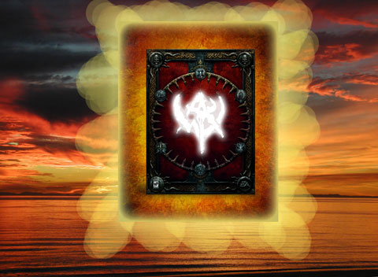
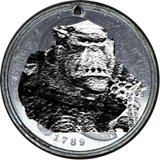

Back to: [West Karana](/posts/westkarana.md) > [2008](/posts/2008/westkarana.md) > [September](./westkarana.md)
# Straight Talk Warhammer: Believe in WAR

*Posted by Tipa on 2008-09-19 08:00:28*

***Producer's note:** Hey folks, just a head's up. I know a lot of you were looking forward to a full set of 100 editions of "Straight Talk Warhammer", our exclusive look at the amazing World of Warhammer. And we did our best, but as we were running STW past our beta-readers, we noticed that some of the posts needed some tweaking. There were spelling errors, run-on sentences, and, frankly, some pretty gnarly grammar mistakes here and there. So we've decided to cut the series down to just four posts, to give you the best reading experience possible. We will release STWs covering the other nineteen classes, the second city, and every public quest and scenario, at some point in the future -- if they aren't good enough, we won't make ya read them! We promise!
*

On a related note, we here at the West Karana Network want to acknowledge the accomplishments of the current leader in MMO blogging, Tobold, whose success has brought credibility to the non-commercial MMO blogging space. Is West Karana a leader in MMO blogs? We believe that when most people think of non-commercial MMO blogs, they already tend to think of Tobold's and West Karana. And as for getting a certain mass-market critical mass, we think this is the blog that has the best likelihood of being second to do that.

---

You remember when you were little, and your best buddy dog that you called Woofwoof was dying of a liver condition, and you went to church and stayed there all night, and then just at midnight, there was a blinding light and a voice inside your head asked what wish was in your heart, and you said, a MMO that you could solo in and had no death penalty and low system requirements and looked like a Saturday morning cartoon? And then when you woke up in the morning, safe in bed, there was a copy of Blizzard's World of Warcraft laying there in the doggie bed?

Well, now your kitty, who has sat on your lap through every disappointing raid and traumatic pickup group and lonely night grinding out daily quests for some reason long forgotten, is losing her fur and getting thin, and there is a hole in your heart that can only be filled by a game... a game of wonder... a game it's not useful to solo in, and has moderately high system requirements and looks like the kind of nightmare that would send Hieronymous Bosch screaming?

It's the Second Coming of Warcraft.

  
*Simulated screenshot of the Second Coming*

It's the friggin' Nerd Bible and it has incited a religious fervor not seen in these here parts since Moses first carried WoW down from Mount Hyjal and knocked over EverQuest's golden calf. It's got an old testament (WoW) and a new one (WAR), messiahs, prophets and fanatical converts. It even has an all new moneylender's temple, which it will build right next to the old one.

  
*WAR is Everywhere.*
  
  

  
*WAR is Everywhere.*
  
  

  
*WAR is Everywhere.*

Even though Warhammer is clearly going to be a hit, nerd fanaticism always gives way eventually to nerd backlash, and it's unclear if the parents, children, grandparents and co-workers who flocked to World of Warcraft and made it the phenomenon it is will decide to abandon the characters they have spent so much time on to flock in turn to a game which is not a tenth as cute and cuddly.

Bloggers are enthused, but bloggers always like the game they aren't playing better than the game they are. What's to be said about Warhammer that hasn't yet been said? What's to write about it except -- "Me too!"? Wrath of the Lich King beckons, and who will be able to resist logging in, seeing the new lands, leveling their characters to 80 and falling in love with the game all over again?

It's hard to believe anything in election season. Everyone is lying. Everyone wants you to believe in them. All they want is power over you, whether politician or publisher. They want to control your life, and all you have to do is believe.

---

Kind of a serious note to leave this series on. I'm not a hater, really. Well, not of WAR. I am a hater of hype. The more hype I see, the less I trust the message.

Thanks for reading the fourth -- and last, for now -- Straight Talk Warhammer! As a cheap ploy to draw hapless people to my blog, it was a miserable failure. I got far more new readers from my Vanguard article -- from Vanguard! -- than from any of these. The people who came to this blog via keyword searches this week (and weren't looking specifically for this blog) largely got here looking for information about Wizard 101, the new EQ2 expansion, and, oddly, for the list of EQ hot zones.

On the other hand, as a cheap ploy to have great conversations with friends, it was a fantastic success! There's nothing I like better than to have conversations about gaming with my fellow geeks and freaks :) This has been a week like few others, and I'll remember it for a very long time.

See you in game!

## Comments!

**[Hudson](http://hudshideout.blogspot.com)** writes: Interesting. But Im not sure how tons of journals and posts of people's experiences in game and how much fun they are having with the mechanics and proven RVR is "hype". Hype time is over, that is where I think you are dead wrong. The proof is in the pudding so to speak, and people are now having fun as the game is LIVE. Hype existed a week ago, or exists for people that dont understand the game or have not tried it, much like yourself. I am not playing hype, neither are the countless members and bloggers in our guild.

I think you are just being stubborn now :)

---

**[Amatheon](http://http://nextgenmmo.blogspot.com/)** writes: Very enjoyable article. Thank you for posting.

---

**[JoBildo](http://bildos.blogspot.com)** writes: There was a lot of hype for WoW, right? It also turned out, that for a lot of people, the game lived up to the hype or very nearly, right?

The same thing's happening here. It's not "hype", though of course there was an epic amount of it across the hardcore channels for WAR. However, as Hud's said, that time's over. People are playing, having a crap-ton of fun, and it's not longer hype. It's actual "buzz" and there is a difference between the two. It may not be everyone's game, just as even the anomaly WoW was/is not. But for a great many, it can and will be.

---

**[Cow Nose the 50 Pound Cat](http://cownosethe50poundcat.blogspot.com)** writes: OMGOMGOMGOMG SOOOOO FUNNNY!

---

**[Cow Nose the 50 Pound Cat](http://cownosethe50poundcat.blogspot.com)** writes: U rock Tipa!

---

**[JoBildo](http://bildos.blogspot.com)** writes: Oh, and on a side note... I really want that coin.

---

**Azy** writes: I laughed at all of these WAR "articles", but this one most of all. I'm usually more of a lurker (here and at Tobold's blog!) but I had to pipe up and say thanks for the chuckle, Tipa! 

While I am trying out WAR and still playing WoW, I've also been feeling inspired lately to re-visit my first MMO love, and actually logged in to EQ2 last night. Almost to 73 now, and I ran into a few old friends, had a good time questing. They were kind enough to mentor and run around with me in Fens. Nice to make some new memories in that game.

---

**[Tipa](https://chasingdings.com)** writes: @Bildo & Hudson -- I am not hating on WAR. I am just hating on hype. And every game -- every single one of them, that I have tried, anyway -- is fun at launch, when everyone is around the same level and every place you go, something is happening. And after awhile the real game starts and the hype vanishes. It's still too early to tell how many people will want to do PvP and RvR all the time. It was pretty popular in DAoC, but not nearly as popular as PvE-focused games were (and are).

@Azy -- thanks :)

---

**redheadedtim** writes: I've loved these articles, although it's hard to top White Lions. You peaked too early :p Anyways, I tend to come to WK before any other blogs. No one blogs about SWG so next in line is EQ2, and here you are. Not too interested in WAR, somewhat interested in AoC but unable to play due to hw. Interested in Vanguard as well and may give the trial a go this weekend. Depends on if it will fit on my MBP's bootcamp partition and if I'm willing to tank EQ2 and SWG's installs and go through the massive downloads again next week. We'll see. And many fistbumps of agreement as regards to hype.

Also, I have this hat I'd like to give you as thanks for the fun reads. It's quite nice, but some Scottish fellow may come 'round claiming it's his. Declaring "BEGONE ALMAGILL!" may help if that happens. Or offer him some sort of sausage.

---

**[Tipa](https://chasingdings.com)** writes: @redheadedtim -- I do like me some White lions, that's for sure :) Thanks for the kudos!

---

**[JoBildo](http://bildos.blogspot.com)** writes: See then we disagree on what hype is... hype is usually marketing created and bought into by players/potential players for sure.

But this is not hype anymore, "IMO", as it's coming from folks actually playing and enjoying the game.

/shrug

---

**[Amatheon](http://nextgenmmo.blogspot.com/)** writes: These articles have been very funny.
But, when you stated that these games (PvP based games) are not nearly as popular as PvE-focused games, what do you mean?
I am not a fan of PvP even though I have played them in the past, but, do you honestly believe PvE games have a larger following?
If so, why is PvP not as popular in your opinion?

Thank you

---

**[Hudson](http://hudshideout.blogspot.com/)** writes: "is fun at launch, when everyone is around the same level and every place you go, something is happening"

Ill give you that. BUT, the mechanics in this game make grouping MUCH MUCH easier than WoW. WoW avoided what you stated there by having so MANY FREAKING PEOPLE. In WAR, open grouping is a god send. Im not hyping it, just saying that from my experiences, I have found groups so fast, no matter where I was. 

However you have a good point in what you stated.

---

**[Tipa](https://chasingdings.com)** writes: Wizard 101 has open grouping. Doesn't do me a bit of good if there's nobody around to open group with. Sure, it's great when you're where everyone else is. W101 has the problem of not having server-wide or even zone-wide chat channels which makes that particularly difficult, of course. When there's lots of people everywhere, though, I agree that open groups are great.

But this is precisely the problem that I see people talking about now and then -- people tend to clump up, so there will be really popular places but increasingly, empty places where few people come, or they come and then leave because there aren't many other people there. In these places, you probably will end up having to be more proactive and make your own groups, but eventually they will just become dead areas as attention inevitably shifts to the high level game.

WAR seems like it will be really susceptible to this sort of thing.

---

**[syncaine](http://syncaine.wordpress.com)** writes: Just a quick correction, at the time, DAoC was the 2nd biggest MMO, behind EQ. Also, Darktide (the PvP server for Asheron's Call) was by far the most popular server for that game at it's time, so PvP does indeed have a history of keeping people interested.

But anyway, I have to agree slightly with Hudson and Jobildo that currently, the stuff about WAR is reaction rather than hype. In particular, you use the 'War is Everywhere' tag line that Mythic used, but now that people are playing the game, they can see that indeed, in WAR, combat is all over the place, and not just at the cap like it is in other games. The conflict pulls you in at all times, be it PvE style with PQs, or PvP style with RvR areas and scenarios.

All that said, these last few posts have been great fun, and I fully understand your take on the whole thing. And like I said before, I would highly recommend you get a box and at least mess around with WAR for an hour or whatever a week. It's very, very interesting to see the social changes happening to people early on in the game, and just watching groups form and carry people from one PQ to another, or an RvR group slowly growing into a warband (raid group) as people get more and more caught up in the fight. Just seeing the whole WoW mentality slowly melt away has been really interesting for me. People learn to stop spamming 'LFG' and instead just auto-join. It might seem like a silly thing to write here, but when you see it in-game, and see how common it is for lvl 1-4 characters, and how different people act even at level 5-10, its an amazing change.

---

**[Tipa](https://chasingdings.com)** writes: I will likely pick up the box this weekend :)

DAoC picked up lots of bored or just pissed-off EQ players -- I was one of them -- the bored ones. As a high level druid at that time, I had very little options in EQ except to solo, and soloing is boring. No raid guilds were taking druids. I REALLY liked DAoC, but I didn't stay more than a year. The PvE just wasn't up to the standard of the PvP, and the PvP was absolutely dominated by griefers. I kept hearing about the changes coming to EQ with Luclin and the lure of a superior PvE game brought me back (yes, I guess I am a carebear). I rerolled as a rogue and enjoyed EQ a lot more. I returned to DAoC twice more to try out different classes (Minstrel, Cleric, Friar, that one with the golem pets; Bard on the Hib side, Shaman as a Middie), but the PvP, when it wasn't being picked off by a stealther, were confused lagfests at Emain Mecha. I leveled up a Hib Lurikeen Enchanter and had some fun in the battlegrounds once they implemented all the new BGs with the central keep. That was pretty much the best fun I had in DAoC, but EQ just wouldn't stop pulling me back with raiding (as a rogue) and its superior PvE and grouping.

So while DAoC had the numbers for awhile, it couldn't keep them. Even while I was in DAoC, most of the people were wishing for a slightly more open sort of PvP, and almost everyone was looking forward to Shadowbane.

---

**[syncaine](http://syncaine.wordpress.com)** writes: Just to add to the above post (I wrote 90% of it before most of the other replies here, then got distracted and finished it later), while all MMOs suffer from dead areas eventually, the ease of grouping and travel might help WAR in that regard. 

Just a quick example, I logged on two nights ago and asked in guild chat if any RvR was happening. Jobildo let me know he had a group, and without any further hassle, i type /join Jobildo, get into the warband, and in a few minutes of travel, I'm with the warband and in RvR, despite it being in a different teir/pairing. 

Same type of situation happened last night with Aria and I in the Dark Elf area. We were happily questing along in our two person open group, ran into a fresh and empty PQ, and starting killing the regular mobs to finish our influence for the chapter, knowing we could not finish the PQ as we can't duo a hero class mob. Randomly two people join us, and now it becomes possible to actually finish the PQ and get some bag loot in addition to influence. As we continue the PQ, two CoW members also join up as they saw Aria and I in the area through the guild tab (again using /join, making it instant). Now with 6 people, instead of one PQ and back to questing, Aria and I traveled with our group, and ended up going to chap 3 and doing two more PQs start to finish in about a half hour, ending our game night. So rather than our plan of finishing all the quests in chapter 2, the mechanics in WAR made it so we spent some time with guild members and two others working as a group on some PQs, all without any real effort or 'LFG' spam.

---

**[syncaine](http://syncaine.wordpress.com)** writes: Yea looking forward to Shadowbane really worked out for all of us... :)

But more on your point, you do prefer PvE, so it's only natural you returned to EQ when more PvE content was available. The reverse probably happened for more PvP-minded people, who liked to try the PvE of EQ, but ultimately would come back to DAoC for the better PvP.

---

**coppertopper** writes: I am totally with you on the griefing in DAOC Tipa - bgs were owned by stealthers because they were invisible. Not so much in war. In 8 scenarios I was backstabbed 2x and that took some doing since stealth is a 30sec ability with a 10 sex cast time. Much better better class balance in war, and combat takes a longer time so no 2 shots here. RvR is much more enjoyable then DAOC, and starting at level 1 you can contribute.

---

**[Journeys with Jaye &raquo; We&#8217;re Not Press, but WAR *is* Everywhere!](http://www.journeyswithjaye.com/?p=1365)** writes: [...] references to Kool-Aid, Communist Russia, and the Bible.  I don’t necessarily endorse the beehive-prodding strategy of Tipa (although her recent entries are hilarious and have become the only sparkling gem [...]

---

**[Oakstout](http://oakstout.blogspot.com)** writes: The problem is we are discussing Buzz not Hype. Hype is a paid advertisement to promote a thing, Buzz is word of mouth.

True, the nerd fanatics are out in full force for this one, but they are loyal to the brand, not paid advertisers. But, they just want people to see the same shining light that they see when they play WAR. This does tend to put the normal people off from trying the game and it does more of a disservice than not. 

I don't think this will ever change. As you stated, it happened with EQ, WoW and now WAR, people are just rabid about their games. If your not playing our preferred game, your a heretic and should be burned at the stake. The fact is, you have to decide for yourself and stop reading all the nerd fanatic's websites. 

Trying out the game for yourself is the only true way to see if you will like it and sometimes you just have to take that chance. I've tried several different MMO's till I found WoW, Which I still like, and now I have found WAR. In another year who is to say what will be on the horizon, maybe DC online.

---

**[Tipa](https://chasingdings.com)** writes: At least one blogger has gone on record as being paid to play WAR. There are almost certainly many others which are being paid, but choose not to disclose it.

When I worked at Massively, I was being paid to play SOE games -- but I posted my articles about it on Massively, so it was clear they were paid for.

I don't have the time to play every MMO that comes out -- to really play an MMO, you have to devote a significant amount of time to it, you can't just dabble and hope to get the full experience. Pretty much all I can do is sit on the outside and marvel at the enthusiasm, sit in my carebear EQ2 and group and raid and decorate my home and collect titles and make new and interesting outfits to wear and write stories about my characters and wonder when the next game will come out that could ever compete with it?

But even though I don't play WAR, I don't think that should disqualify me from talking about it :)

---

