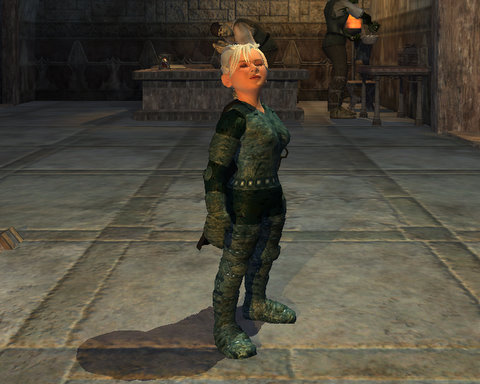
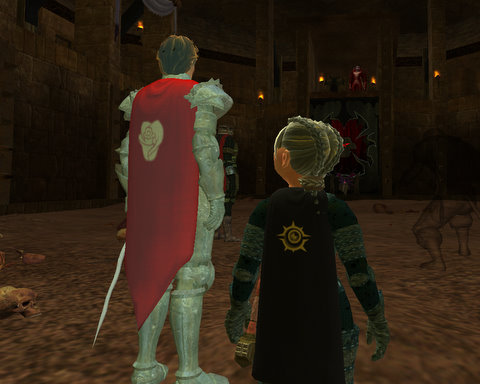

Back to: [West Karana](/posts/westkarana.md) > [2008](/posts/2008/westkarana.md) > [September](./westkarana.md)
# EQ2: The Return of the Alchemist

*Posted by Tipa on 2008-09-20 22:07:14*

I'd taken all the rare dusts I'd accumulated as by-products of making scout spells with my jeweler, and put them on the market because, since Dorah had changed servers and my defiler/alchemist, Etha, had not, I had no use for them any longer.

Which kind of made me sad. Etha was my first serious character in EQ, though she was a druid there. Still, I had a lot of attachment to the character. I'd named her after a wonderful lady at church, and it always felt good to be a druid, able to travel instantly anywhere in the world, explore the strange corners of Norrath, to be free... In a game where most everyone had to slog from place to place and wait on boats, the world was mine.

So when I made Etha on Faydark to be a two box partner to Dina, it was with a certain sense of history :)

And I missed her!

  
Defiant but alone, Etha considers emigrating.

She looks kind of like my mom. So after playing Dorah for awhile on Najena last night, I snuck over to Befallen and checked up on Etha.

And then thought, she'd be a lot happier over on Najena.

So that's where she is now :) With minutes of transferring, I had a Deathfist Citadel group as the main healer.

  
In the Deathfist Arena, about to fight Emperor Fyst's champion

I could tell exactly when I abandoned Etha (except as my alchemist), because she was getting discovery dings all through Zek. By the end of the run she'd made six achievement points and dinged 42 (and was pretty close to 43).

After that, I went back to Dorah and did a Hall of Fate group (I had really just logged on her to craft some jewelry for Etha), and currently am raiding with Nocturnal Wrath again. It's Pawbuster, and it is not going well.

