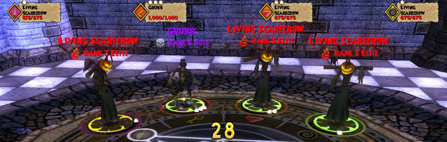
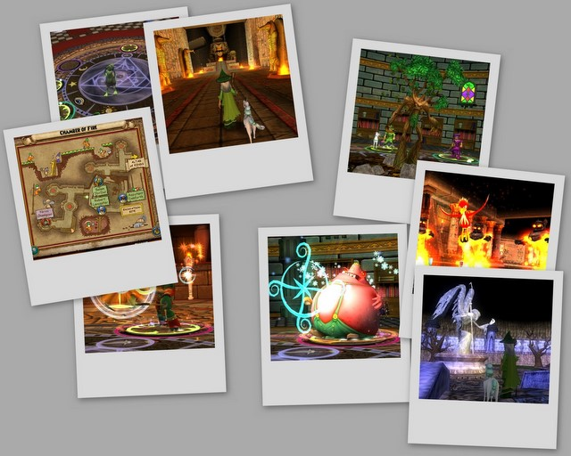

Back to: [West Karana](/posts/westkarana.md) > [2008](/posts/2008/westkarana.md) > [September](./westkarana.md)
# W101: The Chamber of Fire, the Royal Hall and Sunken City

*Posted by Tipa on 2008-09-21 20:34:27*

A friend was having trouble in the Sunken City and asked for some help. I was in a battle of my own and was low on potions, so I told him I'd be there in a few. Finished the battle, played a few rounds of my potion-filling minigames of choice, and the teleported to him.

If you want to talk about innovative gameplay mechanics, you have to understand how being able to teleport to friends and instantly be part of the battle and also get the quest for the instance automatically changes the game. The parts you don't need a group for, you can do yourself. When you need help, you look at your friends list, see whose free, and there's no travel time -- they're right there.

Given that everyone in the game is a wizard of some sort, it doesn't break any rules -- teleportation is one of a wizard's traditional powers. The open group system means that even if nobody has asked for your help -- you can see what they're up to anyway, and almost always the help is appreciated.

if you're level 5 and your friend is lever 40 and my teleporting in you made another monster join the fight, a monster your friend is going to have to handle, maybe you'll want to send your friend a tell before you pop over.

I spent the day helping out friends and working my way through the Pyramid of the Sun quests in Krokotopia. For a game where it doesn't make a huge difference what class you are -- what school of magic you learn -- the choice to take a support school like Life as my primary school was kind of questionable. Since everyone can heal themselves to some extent, why choose Life?

As I get higher level, I appreciate being able to absolutely keep someone alive even when they're being punished by three elite mobs and a boss, more and more. And I could never trust anyone else to heal me if I chose, say, the storm school, the highest damage school of them all, and kept drawing aggro.

Given that you can buy taunt and detaunt cards, the potential is always there to make groups with more traditional classes. But given that my secondary school, Fire, is at the exact same level as my primary school, Life, I can ditch the heals and just be a fire wizard (though without any benefit from power pips). It's all in which cards you put in your deck.

While we were in Sunken City today, someone said they had THREE schools of magic, and another person said they were thinking about taking FOUR. Which is, bluntly, insane. If you have extra points to spend, get those optional cards you can buy in Nightside and in the secret card store in Krokotopia.

Wizard 101 is still fun to play. Yeah, it's just doing card battles again and again, but I don't feel all tense like I do when playing Vanguard, where I think my computer is going to crash any second. It's just fun and relaxing and strategic; the kind of game where you're always learning, and where skill matters.

I just would like the game to explain the concept and benefits of 'focus fire' in some tutorial or something, so I wouldn't have to.

## Comments!

**[Capn John](http://capnjohnsblog.blogspot.com/)** writes: I actually let my WoW sub expire and picked up two 12-month W101 subs for my son and I. It's been fun playing the game alongside him. The game is much slower paced than WoW, and I'm a casual, farmer kind of player, so I know slow ;)

Although last night I did have to squash the urge to grind Honor on my Rogue. Pointless urge, anyway. Can't log into WoW if your account has expired. Then I had to squash the urge to renew it. I'm not paying $40-$50 for Wrath...I'll wait until after Christmas and pick it up for $20 THEN renew my WoW account :D

---

**[Tipa](https://chasingdings.com)** writes: Now and then, I get the urge to resub to WoW. Even though what I mostly did the last few weeks of WoW was log into an alt, stand around, and try to think of anything to do that sounded fun or interesting, and that was not grinding faction.

When I realized I couldn't even think of one thing I wanted to do that I hadn't already done a hundred times, I logged off and unsubscribed.

Since then, I have made it a rule that I will only play an MMO as long as it's fun. When it becomes work, or just tedium, I quit. I refuse to take on a game as a second job.

W101 is casual and is always there for me :) WoW was like, okay, now you need to start farming purples so you can afford your epic mount. Or if you want a cross faction mount, you need to grind faction, too :) I only have a couple of hours in a night to play. I'm not spending it grinding :P

---

**carson** writes: Hey I'm having trouble with the sunken city.I'm a level 39 and I still haven't finished it.I go in with my friends,but I still get caught in battles even when I'm on the sidewalk.It makes it even more challenging because my primary school is Death and my secondary school is ice.Please give me some kind of tip.Thanks.

---

