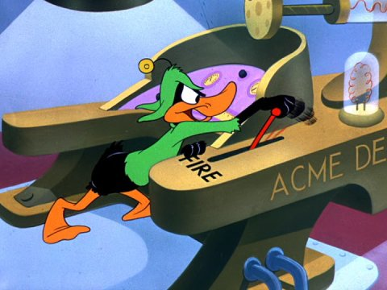

Back to: [West Karana](/posts/westkarana.md) > [2008](/posts/2008/westkarana.md) > [September](./westkarana.md)
# Straight Talk Warhammer: The Bright Wizard

*Posted by Tipa on 2008-09-22 07:16:47*

We're baaaaaaaack.....!

Warhammer Online: The Age of Reckoning, brought public quests to a public quest-less world, Tomes of Knowledge to the forgetful, open groups to the friendless, and in all ways has transformed the world.

Warhammer Online has twenty unique classes or 'careers', and each one plays like no other class in any other MMO, proving once again that WAR's innovative and unique game play will have every other MMO dev yelling to their computer, "Why didn't WE have something like that!"

It's because it took until now before someone got the idea for a robe-clad magic user who summons fire from the skies, something called, "Bright Wizard". Now that WAR has blazed the trail (sorry), [every](http://everquest.allakhazam.com/db/classes.html?class=11) [other](http://wow.stratics.com/content/features/guides/mage/) [MMO](http://camelot.allakhazam.com/db/class.html?realm=Albion;cclass=12) [is](http://eq2.tentonhammer.com/modules.php?op=modload&name=News&file=article&sid=1249) [sure](http://wizard101.com) [to](http://www.wizard-wars.com/game/) [implement](http://uo.stratics.com/content/contests/autobiographies/afirewizard.shtml) [something](http://boards.dungeonrunners.com/showthread.php?s=a7898bbf89d9fa6034615212093cdc21&p=137545) [similar](http://www.ehow.com/how_4457538_become-wizard-shadowbane.html).

  
*Simulated Warhammer screenshot*

The Transportation Safety Authority has a special wing in Guatanamo for Bright Wizards. See, they set up in a major airport, like Chicago or Atlanta, and they get on the PA and ask Blaze McCharmander or Ash Daboominator to pick up the white courtesy phone, and then when they do, they're like, we heard Bright Wizards couldn't set a match on fire if it had been soaked in gasoline and gunpowder for a week and was dangling over a pool of lava. And then Cinder Blastitall will start shouting about "Gonna burn that! Burn! Boom! Hahahaha! Light 'em up! BURN! KILL! BUUUURN!!!!!"

And that's when they take them away.

When Bright Wizards watch Lord of the Rings, they're cheering for the Balrog and wondering why Mount Doom didn't get more screen time. Pompeii? Early Bright Wizard convention.

Get one of these in a strategy meeting and when the Bright Wizard raises his hand, the guy at the head of the table sighs a little inside and tries to change the subject, but the Bright is always going, "oh me me me pick me oh me me" and then the head guy says, "Okay, WHAT. And you better not just be suggesting we set the whole thing on fire." And the Bright kinda lowers his hand and looks away, muttering, "well I didn't want to come to Susie's surprise birthday party ANYWAY." And then he's all pouty until you promise him a puppy for Christmas. And THEN he's all like, "Ooooh! A PUPPY! I'll hug him and love him and name him George!" And then you give him a long look until he promises not to feed the puppy anything that will make him explode.

These guys are always asking the DJ to play Disco Inferno and writing to Stephen King asking when the sequel to Firestarter is coming out. These are the guys who dream about being stuck in a burning building and wake up smiling. These are the guys who eat nothing BUT chile con carne because they heard about this heartburn thing and it sounded like a good idea to them.

Need to find a Bright Wizard? Just follow the flaming trees.

---

*Looking for information about Warhammer Online: Age of Reckoning careers, cities, public quests, Tome of Knowledge, open groups, and how you can make concrete burn? Well, then, you've come to the right place! Straight Talk Warhammer is the only blog series that gives you the Straight Talk... about WARHAMMER! Online. Age of Reckoning.*

## Comments!

**redheadedtim** writes: Man, this update has me sold. Definitely going to get WAR now. I've always liked starting things on fire, and it sounds like maybe I won't get arrested when I do it in WAR. Thanks for bringin us the straight talk Tipa! Once again proving to have the guts to tell it like it is.

---

**[Tipa](https://chasingdings.com)** writes: Burn, baby, burn :)

I had a better picture in mind if I could have found my DVD of the original Rollerball in time... oh well.

---

**[Sean](http://dadsbattleground.blogspot.com)** writes: Wow, and while I was playing Warhammer I just thought bright wizards were just humans with strange tatoos, funky hair and an affinity to dying as soon as an Orc shook their hand.

I'm requesting you review the Warrior Priest! Currently my favorite class, as the engineer isn't the class I thought it would be, and not the class Mythic said it would be.

Warrior priests aint no sissy wow paladins neither! We don't bubble and hearth, cuz we would rather die in the thick of our enemies, healing our group as we smash little Goblin Shaman heads in.

---

**[Toldain](http://toldaintalks.blogspot.com)** writes: Tipa, you are (dare I say it?) *en fuego*

---

**[Tipa](https://chasingdings.com)** writes: @Sean -- Warrior Priest is next for sure :) I already have it half written in my head.

@Toldain -- muchas gracias, amigo!

---

**[Crookshankz](http://thegaminggoob.wordpress.com)** writes: Pompeii she says!!! Bright wizard convention she says!!!! HA!! Thanks for the smile Tipa :-)

---

**[Openedge1](http://simple-n-complex.blogspot.com)** writes: /clears throat

*In his best Beavis and Butthead voice...
*Arms shaking profusely

"Fire...heh, heh...Fire!!!!!"

/bow

Thank you

---

**[Lars](http://mmomentofzen.blogspot.com/)** writes: That's hilarious. I love my Bright Wizard. When I first starting playing him, I found that setting things on fire was so fun, that I sometimes forgot the other game mechanic: explosions - which occur when your spells backfire. After seeing the message "Brendis has been killed by Brendis" pop up a few too many times, I have since learned to more properly manage my combustion.... sometimes... :)

---

**[Sean](http://dadsbattleground.blogspot.com)** writes: I am rather annoyed eager to see more strike out sarcasm on the Warrior Priest post. Keep me chuckling.

---

**[Tipa](https://chasingdings.com)** writes: Sarcasm is such a mean-sounding word.

I prefer "snark", thanks :)

---

**Zygwen** writes: I though it was Dr. Who that caused Pompeii. Though it might have to do with disrupting said convention.

---

**[Tipa](https://chasingdings.com)** writes: Dr. Who let Mt. Vesuvius erupt. Pompeii is/was the city. Worshiping the volcano predates its eruption. No conflict! It all works out!

---

**[Openedge1](http://simple-n-complex.blogspot.com)** writes: But, then I do not understand why Dr. Who did not fix a few choice games we play. 
I can think of it now.

"No, no...you will NOT copy that mechanic. It breaks all Universal laws. Plus, they did it better, and yours is reaching!"

"What makes you think they will continue to play a game when the rewards ALL LOOK THE SAME? Do you not understand "Carrot on a stick?"

"Make those hands smaller, and those waists larger please. And do not say #2 ever again!"

I think I need a Sonic Screwdriver!!

---

**[Tipa](https://chasingdings.com)** writes: As the good Doctor explained in that episode, some things in time are fixed, and some are fluid. Most everything is fixed, and if you try to change them, they either instantly fix themselves, or the branch universe thus created is destroyed, as happened in Series 1 with Eccleston, when Rose tried to save her dad from being hit by a car.

So likely he can't go back in time and rewrite Lord of the Rings Online, sorry :P

---

**[Openedge1](http://simple-n-complex.blogspot.com)** writes: Logic.....bah!

I want to MESS with time....hehe

Lets see what strange quark of experience may come from such a tampering...Ahahahaha!!!! (/maniacal)

We could get an original MMO sometime...maybe?

---

**[Lars](http://mmomentofzen.blogspot.com/)** writes: Right, as the good Doctor explained, some things in time are fixed, except when convenient for the episode's writer. 

/wishes there was a Doctor Who/Torchwood-based MMORPG...

---

**Fuan** writes: I know you meant this as satire, but I still think you're giving WAR too much credit. Just mentioning public quests is sure to generate some sort of positive publicity. As much as I tried to avoid the hype surrounded WAR, and I thought I did a good job doing it, I'm still severely disappointed having purchased such a shallow, linear, tedious and contrived world. I was looking forward to it based on the few blog posts I couldn't avoid that extolled the virtues of open groups, public quests, etc. 

In truth, PQs are a joke -- they sound good on paper and fail in practice. I have to wait in a queue to log into my server but find that the only PQ that's possible to complete is the one nearest to the largest city. The server is full but there's not enough chars to complete the content?? The other PQs remain empty and I had to wait in line to join the server! The singular, popular PQ is fun for 10 minutes. After you max out your area influence you're given a reward. Being clever, thinking I can head to a different realm and do that chapter's public quest, I find the same situation, empty PQs save one and the same exact item reward (possibly with a different name) for the same slot with the same stats. How shallow. And don't even think about doing a public quest if it isn't between the hours of 6-11 PM. 

I rolled a dwarf eng and I nearly quit him five minutes after realizing his first two abilities were near exact copies of my elven healer's abilities. One melee attack and one short ranged dmg attacked. The first quest was a direct copy of the elf quest in the other realm -- instant quit. How contrived.

Battleground scenarios? Fun for 30 minutes, and then you get tired of doing the same exact map over and over again. I am not a fan of warcraft, but the warcraft battlegrounds are much more fun than any PVP I've experienced in WAR so far. Plus there's that whole other PVE thing that, frankly, WAR just manages to make completely boring, tedious and irrelevant. I didn't know a game could become more boring than WoW, but Mythic pulled it off. God help you if you want to join a scenario and it's not during prime time hours too.

Sorry if I sound bitter, but it's hard to avoid the hype and not get excited when everyone is calling WAR a WoW killer. At best, it's a feeble attempt to capitalize on a very, very small part of WoW's success while adding in some theoretically great additions that end up being mediocre at best. I'm going to resub my EQ2 sub tonight which I just started playing. Tipa, I should have taken your advice months ago and started playing but I was too proud to leave EQ. EQ2 is really fun so far!

---

**Fuan** writes: Ouch, my post was longer than Tipa's! Sorry, needed to vent. My wasted /played of 21 hours in WAR is making me bitter.

---

**[Tipa](https://chasingdings.com)** writes: lol... you just won my prestigous Comment of the Year award :) 

To be honest, I don't think anyone is calling WAR a WoW killer. Even Mythic is just trying to be a solid #2, though they'll have to mud-wrestle Lord of the Rings Online for that. Even though Age of Conan still has more subsribers than LotRO, clouding the whole thing.

I think WAR was never intended to be more than a WoW *alternative*. There doesn't seem to be much in the game for those already happily enjoying an MMO -- aside from being one of the cool WAR kids, I have no desire to try WAR, since I am already playing a similar game -- EverQuest 2 -- and am happy with it. Plus, I never played Warhammer miniatures or read the books, don't particularly want to participate in PvP, and no longer play WoW, so I'm definitely not the target market. If WAR becomes the game WoW players play when they're bored of WoW, I believe Mythic will be extremely happy. I doubt they even care about the small fraction of people who play MMOs besides WoW, so we can fly under the radar.

And you needn't worry that my snarky posts about Warhammer are in any way promoting the game. I am watching it (just for fun) and it's been completely ignored by the larger WAR community. I'll just keep writing them and someday, some unlucky player who was just looking for some information about WAR will stumble on them through Google and get really, really angry with me :P

I love EQ2, but I've stopped trying to explain that love to anyone else. Everyone says I love it only because I loved EQ1. Which is probably the reason. I'm glad you're enjoying it :)

---

**[almagill](http://almagill.livejournal.com)** writes: You mean... these aren't serious reviews???

But WAR is, well, just.. it's WAAAGH!!! that's what!

And Bright Wizards make my gfx card smell of fried bacon. Which is wrong in so many ways.

and, inleaving, a WAR joke...

Q- Why do Bright Wizards walk funny?

A- Cos they've got fireballs!!

---

**[Tipa](https://chasingdings.com)** writes: Nice attempt, but do you know any Warrior Priest jokes?

---

**[Openedge1](http://simple-n-complex.blogspot.com/)** writes: I think we need to find out if Fuan has a blog. 

Enjoyable AND controversial.

I want to make babies with him! (or is it a her, then I would be even more enamored. But, seeing I cannot tell the difference lately...does it matter?)

---

**Fuan** writes: Way back when on EMarr, Fuan leveled a (unbeknownst to him) Female Troll to level 15 before his friends informed him that his character had breasts. Sometimes Fuan doesn't even know his own sex.

---

**[Tipa](https://chasingdings.com)** writes: Hey! Egat and I both come from Erollisi Marr. So does Sejal, another poster. I was Etha, Nina, Tipa and Brita, depending when you saw me :)

One of our monks restarted as a wizard frog named Denwo. I think he was 70 before he realized he had made a girl frog.

---

**Hudson** writes: Ah this game had so much promise. The blogger wars it spawned were epic. Is fun till level 10 now. Then you better have a guild and be prepared to meet a lot of players on alts....

---

