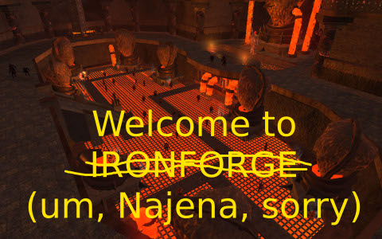
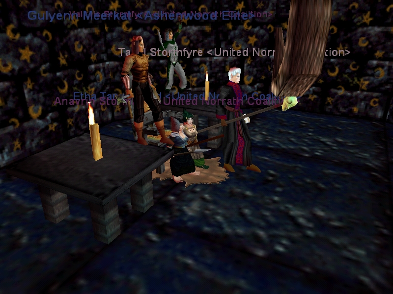

Back to: [West Karana](/posts/westkarana.md) > [2008](/posts/2008/westkarana.md) > [September](./westkarana.md)
# EQ2: Najena preview

*Posted by Tipa on 2008-09-22 21:29:54*

SOE has [a great preview](http://eq2players.station.sony.com/news_archive_content.vm?id=1898§ion=News&locale=en_US) of their re-imagining of the dungeon of Najena on their web site.

I loved the original Najena -- it was the first raid I ever did with the guild I'd just joined, United Norrath Coalition, and I must have been all of level 19, and Drelzna hated druids so much, she harm touched me to death every time she popped.

Good times. I don't expect it to be the sort of casual fun Najena was in EQ1 (which, despite what people say, was pretty much the ultimate casual, social MMO), but it will be nice to see what it has become.

Ironforge, looks like...

But without the dancing naked night elves.

I don't think Najena dances.

## Comments!

**Egat** writes: Whoa, I recognize a couple of names in that old screen shot!

---

**[Relmstein](http://relmstein.blogspot.com)** writes: I remember Najena well since it was also the first dungeon I actually went into. I was all excited about visiting a special dungeon zone. I had earlier tried visiting Befallen, but I had problems finding the entrance. Luckily Najena was pretty much in the corner of lavastorm and there was almost always a group hanging around the entrance. I think I eventually stockpiled a large supply of flowing black robes from that place

I soooo disagree with you on EQ1 being casual though. I'll admit there are things I miss. For some reason the game seemed to have a much larger selection of dungeons then modern games. I guess because before instancing developers had to make more dungeons to meet demand. However, EQ1 required huge commitments of time to really accomplish anything. It was filled with random AI abilities designed to cause corpse runs and the zones were filled with a lot of empty space.

---

**[Tipa](https://chasingdings.com)** writes: Killing EQ1 was slow, and you could only do maybe half a dozen battles before you had to med, which took a substantial amount of time. So, either you would be in combat, which at that time was very simplified, or you'd be chatting with your group.

Befallen was pretty tough for its level, but still, the secret was to find a spot to set up camp and pull.

Later dungeons like Temple of Cazic-Thule and Lower Guk could still throw more mobs at you than you could handle, and then it became a little stressful. But mostly, playing EQ was a time for chatting and relaxing.

---

