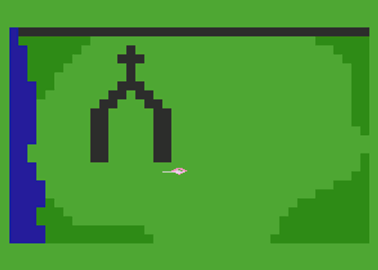

Back to: [West Karana](/posts/westkarana.md) > [2008](/posts/2008/westkarana.md) > [September](./westkarana.md)
# Straight Talk Warhammer: The Warrior Priest

*Posted by Tipa on 2008-09-23 08:00:48*

Do you remember what life was like before Warhammer Online: The Age of Reckoning? I sure can't. Well, sometimes it comes in little bits and pieces... a world where to do a raid or join a group, you had to talk to people, and sometimes, make friends. Brrr. We're all pretty glad THOSE days are over! The exciting new Public Quests and Open Groups and Scenarios keep things nice and anonymous -- just like watching porn in a movie theater! And that is the mastery AND mystery of Mythic's groundbreakingly innovative new MMO that will forever change what we think of, when we think of MMOs -- Warhammer Online: Age of Reckoning.

The is the AGE where we will be RECKONED. And who will perform the Reckoning?

None other than the Empire's shining light, the Warrior Priest.

  
*Simulated Warhammer screenshot*

Take your hands off the character creator. You're not GOOD enough to be a Warrior Priest. Just go ahead and log in with your dwarf engineer or whatever and go about your business. When you join a group with a Warrior Priest in it, don't think you're getting any heals, 'cuz you're not. The whopping you take will be ATONEMENT. And you should thank him for not letting you suffer life as the insignificant worm you are.

Life for a Warrior Priest is simple. You are either a SMOTER or a SMOTEE. And you know the WP heals might as well be self only.

Okay, now you went and did it, you didn't listen and you rolled up a Warrior Priest. Fine. If you're gonna be one, start shouting "FOR SIGNA!" at appropriate times. Like, on a bus. In the bathroom. While stapling papers. It's okay. "FOR SIGNA!" <staple><staple> "LET THE PURIFYING LIGHT" <staple> "CLEANSE THIS FAX" <fold>.

Sit up. Actually, stand up. Chin up in the air, 45 degrees (pi/4 radians if you're Canadian). Eyes forward. Take your sword and start swinging it wildly, with great force. It doesn't matter if you can't see what you're swinging at with your chin up like that. Friends would know to get out of the way. Enemies will either run or perish. Because you're one bad priest, and the complete loss of peripheral vision is a small price to pay for being RIGHT. All the time.

"The enemy approaches!" whispers the forward scout. The hunting party looks to the Warrior Priest, who silently, but with great strength, shakes his head. "No enemies," he rumbles.

"No, it's a whole bunch of orcs and goblins and even a Dark Elf Witch!"

"You lie," grumbles the Warrior Priest. "I think you are the enemy. I think it time you die." The WP stands up, lifts his mighty hammer, sticks his chin up in the air at a 45 degree angle, and begins to smite the scout. Except the black-feathered arrow from a Chaos bow kills the scout first. The WP quickly kills the rest of his team to build up healing power, gets some good heals going on himself, and runs off, once again, the lone survivor.

Warrior Priests are the lone survivors of battles with disturbing frequency.

---

*OMG! Six issues of Straight Talk Warhammer, and you're still here! We hope you have enjoyed this latest entry in the only Warhammer guide that dares tell the truth about life and adventure in the Lord of the World of Warhammer Online: The Age of Reckoning. Come back tomorrow, when we reveal what the Dwarf Engineers are building in that locked room they never let you into. The astonishing truth will shock you.
*
## Comments!

**redheadedtim** writes: Oh merciful Tipa, thank you for bringing forward such great light in our time of despair. If only the mighty Servers of Waagh could withstand a multi-class being. Think of it. White Lion Warrior Priest. Love me my Lion, though my head is tilted to high to look upon you.

---

**[Tipa](https://chasingdings.com)** writes: Yes, in just two professions you have every kind of illicit sex there is!

---

**[Sean](http://dadsbattleground.blogspot.com)** writes: It's Sigmar not Signa isn't it? And you forgot to make fun of the WP's who tattoo their faces with burn marks saying sigmar (like on the forhead!)!

Heh heh, makes me want to go play my warrior priest... but you portrayed them as selfish blood thirstey team killing maniacs. I must be playing the class wrong, because I'm a team healing, goblin smashing MARTYR!!!

---

**[Tipa](https://chasingdings.com)** writes: Southern Warrior Priests pronounce Sigmar "Signa". Thanks for making fun of their accent.

And yes, it does sound like you're playing the class wrong. Healing the team? WTF is all that about?

---

**Sirhyl** writes: Keep them coming tipa. Great distraction from work =)

---

**[Openedge1](http://simple-n-complex.blogspot.com)** writes: @Tipa
Y'all making fun of us southeners? I bed your pardon ma'am, but I do say ...it is "Signa", like when we make right turns, we use the "Signa" (we don't use no "Signa" on left turns here in Western North Carolina though...we may fall off of a mountain doing that...).

So, uh, where were we?

Yes, we pronounce it "Signa" , kinda like we will "Signa" ya when we's gonna kills ya too!

HA!

---

**[Tipa](https://chasingdings.com)** writes: Southerners always have the best puns.

---

**Reverence** writes: Tipa should be sent back to the cloisters to reread the Tome of Knowledge. Any warrior priest in my guild lacking even the knowledge of our holy lord Sigmar's name, would be given to the bright wizards to roast. Southern accent? nice try, but Sigmar knows and sees through all deceptions. Furhermore, as for warrior priests who will not share the healing power of our great lord with others in need, Sigmar has this to say, 'RE-ROLL'.

---

**[Tipa](https://chasingdings.com)** writes: Or just bubble up and hearth :)

---

