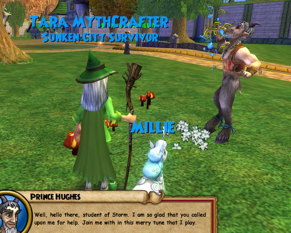

Back to: [West Karana](/posts/westkarana.md) > [2008](/posts/2008/westkarana.md) > [September](./westkarana.md)
# W101: Entering the Palace of Fire

*Posted by Tipa on 2008-09-25 12:00:57*

  
*Dragon Mouth Cave*

The Pyramid of the Sun doesn't look that large, but somehow it contains miles and miles of corridors, archaeological digs, and monsters who spend their entire existences slowly pacing back and forth, hoping for an unwary wizard to accidentally step off the sidewalks.

Always kind of cool to have an MMO that emphasizes such traditionally-ignored skills like staying on the sidewalk and looking both ways before you cross the street. It's almost sad to note that the Marleybone rooftops don't work the same way.

  
*Hand this dog a deck and make him do his OWN fighting.*

Given the problems the dog-folk of Marleybone are having at home, it's odd they are spending so much time dealing with problems abroad, specifically in Krokotopia. They have soldiers stationed everywhere, and these are the least effective soldiers known in all the Spiral. They lose their weapons. They lose their ammo. They lose their food. They lose their water. They find themselves entirely unable to deal with Rank 2 trash, much less the bosses. The only ones who can haul their butts from the flames, are novice wizards such as yours truly.

Last night, I cleared the Chamber of Flames and the Royal Halls portion of the Pyramid; I also helped a few random people with boss fights. I'm always happy to help with these -- the more bosses I kill, the better the chance of getting a rare pet or staff. I haven't gotten any pets yet, but I do have a nice staff waiting for me at level 20.

  
*The Dig Site in the Royal Halls.*

I posted a couple of suggestions to the forums, asking for a way to respec our secondary magic school, because this seems like a choice you should be able to do over if you find it doesn't work for you. I also asked if there could be a way to save specific decks. Mobs in the Pyramid are typically fire based, but a significant number go with Ice, Myth and Balance. Each one requires I rebuild my deck.

Since my secondary school is Fire, I pretty much have to build my deck solely around Life when facing these. Versus Ice, it's the opposite -- emphasize Fire, their opposite element. The others require a more balanced deck, one with plenty of Life heals but also not forgetting Fire dps.

I got a great reply from someone who pointed out you could have multiple decks -- one built one way, one another -- and just equip the one with the spells I needed. One person even has a deck built around Treasure cards. I imagine that one is tuned for boss fights where you really need to bring out the big guns.

  
*I dunno, do I really look like a Storm wizard?*

In between all this, I was working on my Level 17 spell quest. My new spell summons a Sprite Guardian minion, a companion that joins the group and casts heals. During one fight, I died, and I figured the fight was over and I would be sent, in defeat, back to Wizard City. But she cast a major heal and followed it up with a Heal Over Time the next round. I won the battle and ended the fight pretty much at full health.

I love my little Sprite Guardian.

Another evening should see me done with the Pyramid of the Sun and moving on to the Krokosphinx. That's the shortest of the three quest hubs in Krokotopia. I'll probably be level 20 by the time I get there; I'm level 19 now. I don't have many problems staying alive, but I might look into the RMT gear after I ding and see if there's anything really nice.
