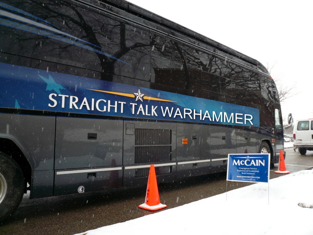

Back to: [West Karana](/posts/westkarana.md) > [2008](/posts/2008/westkarana.md) > [September](./westkarana.md)
# STW: Off the bus.

*Posted by Tipa on 2008-09-26 08:14:16*

Due to being sick, I don't have a Straight Talk Warhammer today. Look for all the facts you never knew about the Witch Hunter, Monday.

Have a good weekend :)

## Comments!

**[Stargrace](http://www.mmoquests.com)** writes: Aww you're sick? You need a bowl of chicken noodle soup! *hugs* and hope you're feeling better soon.. Hopefully I'll see you around in EQ2 this weekend with our double exp bonus in full swing!

---

**[Tipa](https://chasingdings.com)** writes: It's just allergies, they ramp up every so often and the last couple nights have been impossible to sleep through, so... I'll try different meds this weekend.

Thanks for the soup :)

---

**[Openedge1](http://simple-n-complex.blogspot.com)** writes: We REALLY know it is because you must get back to Washington. No one will hold that against you..(ok, maybe Letterman)..

But, honestly. If you can save the world first, then we can have our WAR after...oh wait, isn't it "WAR" then Peace?
I am so confused.
You know a good WAR is all we need to save our economy, so I am of the opinion you need to rethink today's post. 

Save the Witch Hunter, Save the World should be the new Tipa motto!!!!

---

**Gronk** writes: Feel better Tip :) !

---

**[Sean](http://dadsbattleground.blogspot.com)** writes: There was a good war recently. I think it was under a "Bush" or something. 
Maybe some sort of ant hill war underneath some foliage? The details are sketchy at best.

Last I heard the big ant hill was closing all it's banks and the ant citizens were losing their homes, while the little ant hill was wondering what to do with over $175 billion from oil profits. Maybe that little ant hill should send some to the big ant hill that freed them from that evil ant.
Enough ant analogies!

Nice photoshop skills btw!

---

**[Tipa](https://chasingdings.com)** writes: lol... if I'd had more time, I would have at least used the perspective tool to make it fit in a LITTLE better :P

---

**[almagill](http://almagill.livejournal.com)** writes: It's photoshopped???

;)

Get well soon / get over it, Tipa.

---

