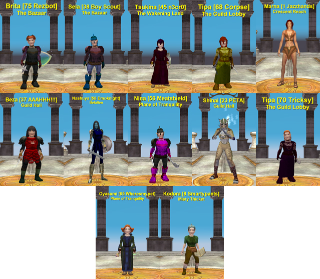

Back to: [West Karana](/posts/westkarana.md) > [2009](/posts/2009/westkarana.md) > [April](./westkarana.md)
# EverQuest: How I soloed Veeshan

*Posted by Tipa on 2009-04-01 07:13:20*

If you go to the Plane of Time and enter the time rift that takes you to the Void, you probably have already seen Veeshan, the Queen of All Dragons and the discoverer of Norrath itself, hovering just out of reach, LAUGHING at you because we mere mortals are JUST THAT FUNNY.

You can plink arrows at her all day and her grin is just gonna keep on getting bigger because she is carefully hovering just out of arrow's reach.

Joke's on her, though. I found this barbarian warrior who was just as pissed off about her taunting everyone who came through the Void as I was, and so he tied a rope around my waist, tied the other end to a firmly-set pillar, and hurled me off into the Void, where'd I'd just barely be in range and have time for a couple quick shots before the rope would swing back, and he'd have to hurl me out again.

Heck, even old Zeb had a couple goes, and when he hurled, I got close enough for a couple good backstabs, too.

Sure, she has like ten to the power of infinity hit points, but time has no meaning in the Void, so we got 'er done.

She dropped 35 silver, a cloth cap and a cracked wooden staff. I went back to the Plane of Knowledge, marched straight into the Nexus wearing cap and wielding staff, and I'm gonna stand right there so that everyone who comes through will see that I, Tipa Tanglewood, 70 Tricksy of Erollisi Marr, was the one that killed the dragon.

And if that weren't news enough, the folks at SOE FINALLY got around to figuring out what the EverQuest classes DO, and changed the class names and level titles accordingly. So if you will excuse me, I have to log in my Rezbot and go rez my Corpse's corpse.

## Comments!

**Egat** writes: Haha! This is a superior post!

---

**Egat** writes: Er... I thought you made this up. Then I remembered it's April 1st!

---

**[Tipa](https://chasingdings.com)** writes: lol... log into EQ today and Egat will be a Meatshield.

If only I'd thought of it first!

---

**[The Friendly Necromancer](http://thefriendlynecromancer.blogspot.com)** writes: Emoknight . . . LOL

---

