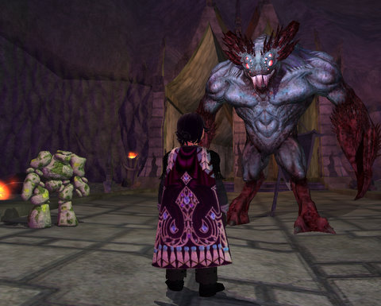

Back to: [West Karana](/posts/westkarana.md) > [2009](/posts/2009/westkarana.md) > [April](./westkarana.md)
# EverQuest 2: Lavastorm revamp

*Posted by Tipa on 2009-04-01 08:05:34*

Flying over the newly redesigned Lavastorm on my elemental horse, I kinda feel a little like Santa, except if instead of riding Rudolph, Santa was riding a demon steed, and instead of flying over the North Pole, Santa was flying over the pits of Hell. And instead of presents, Santa dropped lava bombs. And instead of making little children happy, Santa was trying to make the Sootfoot goblins angry with him.

Because that's the plan with the level 45-55 quests. You have two factions, the Far Seas Trading Company in the Temple of Thunder near the docks, and the Sootfoot goblins set up just over the first bridge -- Fennin's Pass -- in some tents.

The Sootfoots don't want you to grind faction, in fact they just love you so much, you're their ally, you couldn't be more their friend if they tried.

But they don't trade with friends. Because "friends" are always making them DO stuff. Friends make them chip away at wall! Friends make them carry stuff! Friends make them go die against magma worm! Friends make them breathe awful goo!

So they don't trust friends. What if YOU go do all those things, and then the Sootfoots will be the masters and you will be the slave, and then they can talk with ya and trade?

Truly. Your faction with the Sootfoots has to be between -50000 and -10000 for them to trade with you, each quest subtracts 2500 points from your faction, and completing all their quests brings you right to the magic -10K mark.

First two things I got were a tinfoil hat and a molten cow. The tinfoil hat makes you relatively impervious to mind control abilities. In fact, it has a 75% chance of working all the time. The molten cow is just a fun mount :) 45% run speed with the usual boosts to regen.

The tinfoil hat was actually somewhat of an upgrade for my 70 necro!

Most of the quest lines came with house rewards. The Sootfoot forge, which lets you make Sootfoot armor from the comfort of your own home instead of having to run off to Lavastorm every time, was the reward for the Lavastorm red shiny collection (epic crafters: wear your epic earring). The glowing ring, lava drake plushie, lava crab plushie, and glowing bag of soot were all quest rewards.

Two AAs but no xp to speak of for the unmentoring 70 necro. Couple of hints: Gray rocks, sooty rocks, ashen rocks, dark gray rocks, light gray rocks -- they are all just GRAY ROCKS. Harvesting any gray rock will do. Gobbers can't tell the difference. And: For the ghost killing in the Temple of Solusek Ro, the goblin is very specific about what kind of ghost he wants you to kill, but actually, any ghost will do. And: Apparently your ore harvesting skill must be sufficient to gather in Lavastorm or the gobbers won't talk to you.

The Far Seas questline asks you to gain the trust of the Sootfoot smith until he hands over the recipes for the Sootfoot armor. This is the crafting questline, but it dovetails with the Sootfoot quests in that the molds for the Sootfoot armor are sold by the Sootfoot lack-of-faction vendor. So you'll need to do both quest lines in order to craft Sootfoot armor. I haven't finished that quest line yet, but when I do, I'll post the pics here.

There's also the level 80 quest line to gain access to the new raid zone, and a new crafting mission -- but I haven't done those yet.

## Comments!

**[Green Armadillo](http://playervsdeveloper.blogspot.com)** writes: I'm very pleased with the service at SOE... I just dinged 41 yesterday and was wondering whether I was going to need to wait for the revamp to go live. :)

---

**[Anjin](http://bulletpointsblog.blogspot.com)** writes: How can you have a tinfoil hat in this post and not expect me to think this in another April Fools prank?

---

**[Tipa](https://chasingdings.com)** writes: Your doubts cannot affect me, as I am protected from your negativity by my tinfoil hat.

---

