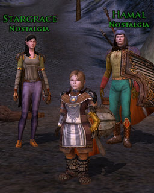

Back to: [West Karana](/posts/westkarana.md) > [2009](/posts/2009/westkarana.md) > [April](./westkarana.md)
# Lord of the Rings Online: Champion of the World

*Posted by Tipa on 2009-04-03 08:08:39*

Yeah, it's a Jimmy Buffet song. Did you REALLY want me to...? Really? Okay, just for you, because you're a friend, the real title of this post is "We are the Champions".

And, we will, we will rock you.

Last night, I joined Stargrace and Kasul in LotRO for a little Nostalgia action. Gozad peeked in for awhile, and if we can get some other Nostalgians -- looking at you, Sirhyl and Malfi -- to return, we will have a pretty amazing group. 

I started off on my 22 Guardian, whom I love because she is just so SERIOUS looking, but in a cute way. It took quite a long time to get from where she was, in the Bree area, to the goblin area in the elf lands; by the time I finally arrived, Star and Kasul had finished up, and I played in the group long enough to realize that two tanks (Kasul is a warden) just wasn't going to work.

I logged in first ever character from beta, Eraindiel. In beta, we were capped to level 15, so after I got Eraindiel, my champion, to 15 and completed Book 1, I made and played a minstrel, a guardian and finally a captain, who became my main when the game went live.

Eraindiel, being of the elf persuasion, had all the horsie stations in elf land (see, I am carefully and deliberately avoiding place names I'd probably get totally wrong).

Since I haven't played her for anything other than her abilities as a weaponsmith and woodworker since before the XP change, her very first kill leveled her from 18 to 21.

Right through 20, the Hell Level.

Cost of new skills from level 18 through 21: about 400 silver.

Money on hand: About 50 silver.

Plus she switched from medium to heavy armor at 20, and went to the next weapon tier at 21. As soon as Stargrace headed out and our group broke up, I headed to the crafting table.

Or rather, Dera, Lysistra, and Eraindiel headed to their respective crafting tables. It took two hours to gather enough resources to make a full set of Heavy armor (and I had to borrow some resources from Kasul as well). Making two bright steel swords and a bright steel two hander took yet more resources, plus some sturdy hides from the captain. Then to spend yet more money slotting traits and -- it took forever, but I got it done, and celebrated by logging in my 23 Warden and doing a quick Book 1.11 run to finish her Book 1.

I'll have to go back and make some more weapons for Kasul and Stargrace. I dread the resource gathering required. I have no idea why Turbine limits the tradeskills you can do. Just requires making so many alts because the prices for the goods of other crafters on the auction house is just out of control, unaffordable. When everyone is just trying to gouge everyone else, you have to go it alone.

Champions get so many cool attacks, but many are so similar it's hard to judge between them. I'll have to do the math and see which give the most benefit at some point, because I don't want four hotbars of largely similar abilities. I just want the best ones.

Still, I think I'll enjoy being the DPS for our crew -- unless Sirhyl and Malfi come back with their champ and hunter, in which case I will likely swap to Burglar. She's holding on to the Tipa name at the moment :)

Dera just looks so INTENT on something. "What is my purpose? Why am I here? Do those elves think my butt's too big?"

## Comments!

**[Stargrace](http://www.mmoquests.com)** writes: I had a blast last night, was great to be back grouping with everyone!

---

**[mbp](http://mindbendingpuzzles.blogspot.com)** writes: Lotro Champion skills pared down to the bare minimum:

Your basic one on one combat routine:
Generally favour dual wield unless you are having power problems. 
In Fervour Stance for max damage 
Swift Strike, Wild Attack, Brutal strikes, Repeat
Once you health has fallen a bit Use Bracing Attack (your self heal) every time is it up.

Tip for the medium term:
Spam Blade wall (frontal aoe attack) and you will eventually get the flashing blades deed which allows you to slot "stalwart blade". This trait makes blade wall generate fervor and you can then replace swift strike with blade wall for a lower power cost, higher damage fervour generator. It will become your most important skill.

There's lots of other cool stuff like interrupt, combat speed buffs and on defeat buffs but at level 20 the basics laid out above are enough to keep you alive. Just remember that a Champion in fervour mode is not a tank.

---

**[chadmango](http://chadmango.blogspot.com/)** writes: The Champ skill set is pretty small, even at 60. In a group, I'll probably rely on 5 or 6 skills. There are other useful ones but in all honesty if your group knows what it's doing a champ is all about unlocking the big hitter skills, by hitting stuff... and that's about it. It came as a bit of a shock when I looked at my wife's Loremaster hotbars... sooo many buttons!! Brought me out in a cold sweat.

---

**[Malfi](http://mattexl.blogspot.com)** writes: I will be back, with a VENGEANCE, tomorrow! So much to catch up on after three weeks offline! Damn you Comcast for coming early and making me miss you appointment last weekend! I have W101 things to do! EQ2 revamps to explore! People to play WITH in LOTRO! I WILL BE THERE!!!

---

**[Toldain](http://toldaintalks.blogspot.com)** writes: You know, a fast horse from Bree to Celondim (that IS the elf area you were talking about, right) is 1 silver. I'm just saying.

---

**[Toldain](http://toldaintalks.blogspot.com)** writes: By the way, I like the seriousness with which characters are portrayed in LOTRO, too. Well, I like pretty much all of the art choices, particularly terrain. Between art, animation, and sound, LOTRO projects as powerful a mood and mise-en-scene as any MMO out there.

---

**[Green Armadillo](http://playervsdeveloper.blogspot.com)** writes: Tipa, have you tried mining to sell? Back when I played LOTRO, the cost of crafted goods on the AH was out of control relative to what questing would give you at the appropriate level, but the price of ore was equally out of control. Effectively, I could use the AH as a crafting device that takes my ore and produces my gear some amount of time later. Note that this really only worked for ore, as it was the only one of the resources that was required in large quantities by multiple professions. (As a Jeweler, I even got to keep the precious metals for leveling, while selling the regular metals to buy gear and other goodies.) 

I have no idea whether this still holds true in LOTRO, but I'm observing largely the same effect in EQ2. I just discovered that a T4-5 mining rare can be transmuted into multiple Redwood strongboxes through the miracle of currency - yay massive amounts of storage! :)

---

**[The Friendly Necromancer](http://thefriendlynecromancer.blogspot.com)** writes: Well . . . I got a new computer . . . and I started downloading LOTRO files . . .

---

**[Tipa](https://chasingdings.com)** writes: @Friendly -- grats on the new cpu! Hope to see you in game :)

@Green -- I dunno, I really *like* crafting stuff, but I do know that it is a huge time and money sink. I harvest lots of ore; maybe it is time to start thinking about selling it instead of using it. I have a horse to buy, kinship house to invest in.....

@Toldain -- Dera had never been to the elf lands. Would she have had the horse route to Celendorn? Anyway, I didn't see anything like that on the horse I tried, but perhaps another would have had it.

@mbp -- geez, that's invaluable. I've started working on blade wall, but it looks like the deed you mentioned only lets you level it 50 a day. Still, ten days, not too bad, I guess. Thanks for the suggestions!!!

---

