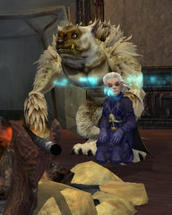

Back to: [West Karana](/posts/westkarana.md) > [2009](/posts/2009/westkarana.md) > [April](./westkarana.md)
# EQ2: Epic encounter in my bedroom

*Posted by Tipa on 2009-04-05 22:19:44*

It was really cool! See, Kasul and I were kinda bored, and we were alone in the guild hall, and we got to thinking about what we could do and so we ...

HEY! STOP SNIGGERING!

OMG! You people... I swear. I'm gonna stop writing this post unless you stop laughing.

It wasn't THAT kind of encounter.

A couple of weeks ago, SOE put an Orc Centurion into their Station Marketplace thingy RMT thing. And I've been wracking my brains trying to think of what you could DO with it.

And then, hey, we have that Kobold just sitting around in my guild room, eating any rats that get too close... what if we could make, oh, like a grouped encounter? Kasul logged in his carpenter and made a bunch of tents to choose from, the campfire, some decorative skull poles and a treasure box, and I pulled together some stuff from my room and invited an orc and a second kobold to join the first, and set them up in the crafting room.

Perfect!

We couldn't leave it there, but there was a corner of the theater that was fairly unused, and there they stand. One of them even brought a snack for later.

I'll be back a little later with "A Mysterious Stranger Rips My Clothes Off."

HEY! WHY ARE YOU LAUGHING?

It's about this weird girl who totally copied my outfit!

Sheesh. Getting so you can't even BLOG in peace, these days.

## Comments!

**[Anjin](http://bulletpointsblog.blogspot.com)** writes: I really need to stop reading your blog at work. People are wondering why I'm laughing.

Great work on the encounter room. Thanks for putting up only Safe For Work screenshots. :)

---

**[Saylah](http://notadiary.typepad.com/mysticworlds)** writes: This is the type of stuff I loved about EQ2.

---

**[Stargrace](http://www.mmoquests.com)** writes: .... 
.....

I logged in to the guild hall with halfling sized clothes strewn about the room, the campfire burned down to ashes, and one kobold looking quite satisfied. 

Sounds like it was quite the evening!

---

**[Tipa](https://chasingdings.com)** writes: Geez. The maturity level of you guys is just so disappointing.

I suppose you're totally going to misinterpret the nude skydiving, too.

---

**[Stargrace](http://www.mmoquests.com)** writes: Hey, don't try to fool me there missy, I saw what the town crier said about you on EQ2players! It's can't ALL be for publicity!

---

