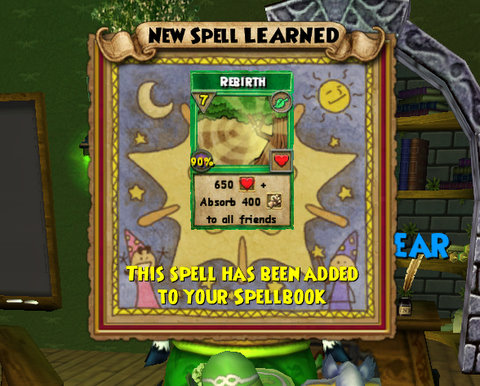

Back to: [West Karana](/posts/westkarana.md) > [2009](/posts/2009/westkarana.md) > [April](./westkarana.md)
# Wizard 101: To lose oneself in Rebirth

*Posted by Tipa on 2009-04-06 00:44:34*

*To lose oneself in reverb, in all that is and all that seems. So, ladies, fish and gentlemen, here's my angled dream. To see me in the blue sky bag, and meet me by the sea.* -- *Blue Oyster Cult*

C'mon, I *know* someone at KingsIsle is a BÖC fan.

Anyway, I dived deep into the Test server this week end, and swam out with a new spell card pasted into my spellbook. And here it is.

It's a PvP-only spell called Rebirth. For seven pips, it heals everyone in the group for 650 points, and then tops it off with a 400 point damage shield. Pretty slick, right?

I know what you're wondering -- you're wondering where on the card it says this is a PvP-only spell.

It's where it says it heals all friends. Let's look at a standard fight.

I have done every fight in the game, many times. In the vast majority of those fights, one person took all the damage. And since I soloed most of the game (as does most everyone past Marleybone), most of the time, that one person was me, alone in the group.

Times when I needed a group heal: 0. I stopped putting Unicorn, the previous group heal, in my deck.

That's not to say I haven't needed healing, or someone in my group hasn't needed it. But almost always, it's one person who needs a heal, even if we're facing a monster who casts Storm AOEs. And my Dryad spell -- the only heal I keep in my deck, and I have only two and have never needed more than one in a fight -- is a 200 point/pip heal, so that gives 1400 points vs an effective 1050 points, or since my Moo Shu boots have a 250 point/pip ratio, 1750 points for seven pips, well... I'm not giving up my Dryad for this. When I'm soloing, my Sprite Guardian keeps me alive, and she can handle another person at the same time, usually.

In PvP, though, it's all about AEs. A group heal/shield would be amazingly useful, and you can be sure the Life wizard on the other team will be using theirs. So: PvP only.

I was REALLY hoping we would get another damage spell. Our last damage spell was from the mid twenties somewhere, Centaur, which requires a life trap, a life blade, and a push from a strong wind to break a thousand. Add a prism to that when facing Life mobs, because it's all about the Life mobs in this quest.

The spell quest took me all over the Spiral, but mostly in Dragonspyre, where I met some old friends, like The Hoarder, who was pretty unhappy to see me wielding her Shockblade. My journey ended in the Labyrinth, as I suspected it might.

Because the Labyrinth, an instance off the Necropolis in Dragonspyre, is filled with Life mobs. To gain access to the wizard who held the second half of the crystal that contained the mystic Rota of Reading, I would have to kill a Life boss for the key to the second area, kill Life, Storm and Myth bosses for the key to the third area, and finally -- Scarrik Gallowgaunt himself. Who was only an Elite mob with around 1400 points. I got lucky with the prisms and he and his inevitable add (timed carefully so the prowling Gallium Paladin wouldn't join the battle) soon fell to the power of Centaur.

Threaded my way back out of the tangled web of quests to find myself in front of the Life school professor, Moolinda Wu, who granted me the Rebirth spell and my prancy friend, here.

And here is the absolute best part of the whole quest. Equipping the satyr as your pet gives you a super-powered version of the Unicorn, the previous group heal, AND a 5% boost to chance of power pips. So the pet given as an extra gift, actually provides a cheap group heal AND an effective improvement in dps (approximately 15 points additional damage per pip spent in a fight due to the increased chance of power pips).

So: Satyr is a GOOD thing, but I would have liked to have had a group damage spell. Life has NO AE damage spells, and though we can heal, just like everyone else we mostly solo, and we already have lots of heals we never, ever, use. This just adds another to that list (except in PvP).

## Comments!

**[The Friendly Necromancer](http://thefriendlynecromancer.blogspot.com)** writes: Lord Bentley is a total stud . . . well worth the price of admission.

---

**[cass dawnflame](http://wizard101.com)** writes: In wizard101 i wanna have a sword that is for lower levels and i want a jade oni amethuny amulet and i wanna be a grandmaster and i can go to all the worlds

---

**[Tipa](https://chasingdings.com)** writes: They might have a lower level sword sometime -- they already have things like harps, which are very cool.

---

**[an experienecd pyromancer](http://msn.com)** writes: That sounds pretty complicated! A satyr for a pet sounds like a good deal! I'm embarrassed to say this, but Iv'e been playing for at least a year and I'm only a lv.13... anyaway lord bentley is something you won't get for a small price!

---

**[Scarlet RainBright (magus)](http://wizard101.com)** writes: Hey i am only a 31 magus and even though i am compared as a noob to the awesome thurgerist that says she does not need healing cards all the time, i think that those healing cards she got is totally awesome i acually need them, but dont think that i always need healing cards

---

**Dylan Giant** writes: Life doesn't have much does it? no DoTs, no AE's, nothing that gives you pips, nothing that makes enemy weaker, just the accuracy boost helas and guiding lights.

---

**[Tipa](https://chasingdings.com)** writes: Has the healing pet :)

---

