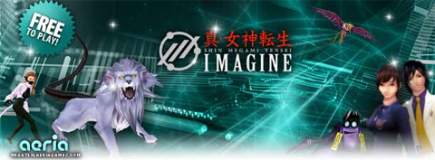

Back to: [West Karana](/posts/westkarana.md) > [2009](/posts/2009/westkarana.md) > [April](./westkarana.md)
# Shin Megami Tensei: New mounts and cool stuff!

*Posted by Tipa on 2009-04-11 06:43:43*

I was really looking forward to Shin Megami Tensei, I really loved the RPGs upon which the MMO is based, the MMO absolutely nailed the look and feel of the RPGs, the action was smooth and the frame rates high, worked great on my computer. Well, except for the crashing, but it was early beta and they have doubtlessly fixed all that now.

I can't explain why I am not playing it. It's a good game!

They sent out an email detailing all the new coolities they've added to the game, and I'm feeling a little like maybe this is a game I'd like to come back to.

Their letter of goodies is after the break.

Shin Megami Tensei: Imagine Online - Now better than ever!

Did you know there are some very special mounts in the game?

Maybe you also did not know about crafting items by using the compounding skill or the bonuses you will get from being in a strong Clan?

You can even modify existing items and upgrade your weapons to make them stronger!

Not only can you modify equipment but also your demons. One way to make them better is triangle fusion!

Be sure to visit our new tutorial to level up faster and find out about cool features! You can find it HERE!

Even more demons, mounts and special items will be available in the UPCOMING ADDON!

The addon will also introduce battlegrounds and competitive team battle arenas!

As an Easter special, a Nimble Fenrir will be given away as a prize to players above level 20.

To make it fair for everyone we are going to give you some time to level up. So be sure to reach level 20 soon and check back often for the special event!

Maybe you will be lucky owner of a very special mount soon!

Interesting stuff to know about mounts: You need a ring called an 'Intaglio' to use them, also some demons can be used as mounts if you train them in a certain way.

More information and pictures of the game can be found HERE!

**Special feature - Suginami Tunnel (Bronze)**

Suginami Tunnels are one of the first places you will go to as a new player.

It can be hard to be on your own in a new dungeon for the first time so this is what you need to know:

Bronze means it is the entry Level (Beginner) Demon Buster difficulty for that Dungeon!

You will need a Bronze Plate to access the Dungeon. Make sure you take enough Ointment and Chakra Gums with you!

The recommended level for this dungeon is 12-15. You can try with level 10 if you are in a group.

Usually nice items can be aquired by going into dungeons. Some of those are for modifications and weapons used for combat. Be careful, powerful boss demons await!
 
**Clans - The easiest way to be successful quickly!**

Some of you might have noticed different colors above players heads already.

Those actually mean something: Its the very powerful Clan system MegaTen has to offer you.

Not only will you get much stronger by joining a Clan - it is also useful to help each other out. Experienced players can train new players to become a vital part of making their Clan more powerful!

Here are some things you might not have know about Clans yet:

Clans get a members only private chat channel!

You can get up to 15% experience boost for Clan party members!

All Clan members can get additional bonus points to various stats!

We will also have a special event for Clans, so be sure to be part of a nice Clan!

## Comments!

**[openedge1](http://simple-n-complex.blogspot.com)** writes: Because it eventually became like all the other games. The in depth storyline and unique characters of the Single Player games became the "Kill 10 x" of the MMO genre, with a little Asian Grind to boot.

Other games just did it better.

---

**[The Friendly Necromancer](http://thefriendlynecromancer.blogspot.com)** writes: Thanks Tipa, looks interesting!

---

**[Sente](http://adingworld.wordpress.com)** writes: Being a bit jaded/pessimistic/realistic/insert\_something\_else, Edge? ;)

Never seens or played the original games, but certainly interested in seeing new themes in MMOs, so might have a look at some point. Thanks for the update Tipa!

---

