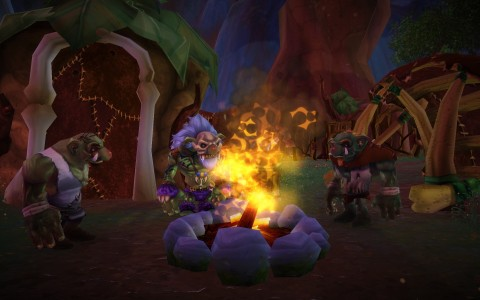

Back to: [West Karana](/posts/westkarana.md) > [2009](/posts/2009/westkarana.md) > [April](./westkarana.md)
# Very little about Free Realms closed beta

*Posted by Tipa on 2009-04-13 06:50:46*

The NDA prevents me from going into any detail at all about Free Realms, but [Massively](http://www.massively.com/) has more [Free Realms info](http://www.massively.com/category/free-realms) than you can read, so I don't really have to provide detail. I do have lots of screenies and reactions saved up, though.

My highest level job is five, so I can't claim to have seen much of the game, but what I have seen is amazingly high quality. The minigames are integrated well into the world (in much the same way I expect they will be in Gatheryn), and the adventure instances are funny and a lot of fun.

I've recently decided that what I like most in MMOs is exploring new places and dressing up my character to look cool. Free Realms scratches both those itches.

More details when I can :)

PS -- I do love the shoutouts to EQ2.

## Comments!

**[Hudson](http://hudshideout.com/blog)** writes: I am in the beta also. There I admit it. I am letting my girlfriend play it. I am too hooked on Guild Wars now and still waiting for word on my Champions invite

---

**[Tipa](https://chasingdings.com)** writes: Oh yeah, if I were in Champions beta... well, you wouldn't be hearing much from me for awhile.

---

**Mallika** writes: Arrghh!! I am so envious. I want a beta invite, too. *sniffles* Been obsessively checking my email every day hoping I'd have an email from them. :P

---

**[Malekith (Caffo)](http://caffo.chaosnet.org/)** writes: Didn't got mine yet too :(

---

**[James Taylor](http://iwinbutton.com)** writes: Just got into the beta earlier today - oh how I wish we could openly talk/blog about it. I guess the most I can say is, I can't wait for it to go live.

---

**[Keen](http://www.keenandgraev.com)** writes: Add me to the list of "in beta and can't wait for launch". ;)

---

