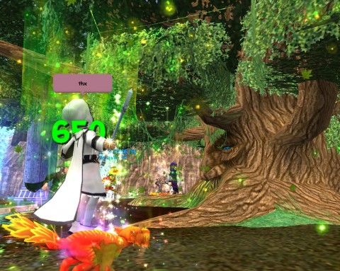

Back to: [West Karana](/posts/westkarana.md) > [2009](/posts/2009/westkarana.md) > [April](./westkarana.md)
# Wizard 101: Training Points, Easter Wands, & Rebirth

*Posted by Tipa on 2009-04-15 00:29:57*

After the thrilling adventure that gaining the Life power of Rebirth held for me on the Test realm, nothing could stop me from invading the Labyrinth with thoughts of crushing Life bosses to dust once again, or maybe for the first time, at least with the crushing.

Seriously! Because I'd taken the opportunity to lose my useless Fire spells, bought, and learned some useful ones. Well, I'd learned Feint, and a night of 2500 to 3500 point nukes awaited.

You'd think that with almost two million student wizards roaming through the Spiral, that Mr. Lincoln, Ravenwood's Registrar, would have enough in his wings without having to drop everything to go through the records of all the spells learned when a student wizard decides that maybe that really cool looking spell they bought wasn't worth the seven rounds necessary to play it, after all, and could they please have their training points back?

And yet, that's exactly the job given Mr. Lincoln, and I flocked to him (sorry) as soon as I logged in. "Mr. Lincoln?" I asked.

Mr. Lincoln looked down his long beak at me through his thick glasses. Mr. Lincoln was really BUILT for looking down on people -- very long legs, quite tall, extremely long beak, and I think he just uses the glasses to add to the affect.

"Yes?" he hissed.

"Do birds hiss?" I asked.

"This is what you came to ask me? When it's quite apparent I do, in fact, hiss, as I have just demonstrated. You see, news has recently come to Ravenwood that those of us of the avian persuasion, which is to say, the feathered folk, which you might call 'birds', but certainly, we are far more than common pigeons, that is, and regardless, the news was thus: that far back in a time before there were such things as birds, which is to say, us, or even snakes, back to a time when Bartleby himself was young, we did, as it were, share a common ancestor! It is a surprising fact that we, that is to say, people who look shockingly fine in a feathered way, and those whose beauty lies more toward scales, are, it is said, cousins! And so I am learning to hiss like a snake, you see, in order to strengthen our kinship, our shared antediluvian heritage, and perhaps we might see snakes begin to fly! Now child, for what have you come to see me? Because certainly, you were not here to ask about people with feathers and those with scales?"

"Um," said I, "I can't remember." And then I left.

When I came back, having remembered about the training points and marveling at Mr. Lincoln's skill at distracting students, Mr. Lincoln was surrounded by confused looking novice wizards, all yelling about this and that and trying to keep their wands from exploding so much.

"Training points!" I shouted above the din. "I want to buy mine back!"

"Ah," said Mr. Lincoln. "Well, then. You have to fill out this form, you see, and that one, and if you could, answer these essay questions and mind, you WILL be graded on neatness and originality. And oh yes, there is a fee. It will cost 4550 Crowns to let you have your points back."

"But I have only 4700 Crowns!" I said.

"Then," he said, "you have more than enough."

He was right, of course, so I paid him the crowns, and he handed me a voucher good for 16 training points. I teleported immediately to Nightside and bought Death school spells up to Feint. Then I stopped by the Ice and Storm schools and bought the Fire/Storm shield at the first and the Fire/Ice shield at the second. A jaunt to Colossus Boulevard for Reshuffle and I was done, with two points to spare.

Then I headed to my school, the Life school, to talk to Moolinda Wu. And she told me what I'd have to do to learn Rebirth, eerily similar to the quest I had to do it on the Test server. But I'm not complaining!

I visited trees in Ravenwood, the Jade Palace and Krokosphinx. Fought the Hoarder in the Drake Hatchery and many, many bosses in the Labyrinth. Sang a Cuckoo song for everyone in Cyclops Lane (I suspected Mr. Lincoln was responsible!), talked to Bartleby and saw Ms. Wu for my spell, Rebirth, and my new pet.

Since Rebirth is best experienced in a full group -- it heals everyone and puts a damage absorbing shield on everyone -- I went to the one place in all the Spiral where I knew there would be full groups: The Kraken in Triton Avenue.

I desperately tried to slow things down while I saved up the 7 pips needed to cast the thing, but it was worth it. Bartleby himself appeared to cast the spell. so that was very cool. The Kraken felt kind of overwhelmed, and also crushed beneath Bartleby. He soon ran from the fight in tears.

It's a nice spell. I probably won't use it that much, but I'll probably have it in my deck the next time we fight Malistaire.

|  |  |  |
| --- | --- | --- |
|
 wizardgraphicalclient-2009-04-14-22-37-20-08 |

 wizardgraphicalclient-2009-04-14-22-37-12-90 |

 wizardgraphicalclient-2009-04-14-22-37-09-08 |

Eggbert sells Easter-themed wands in the Shopping District now. No outfits and no pets, just the wands, which this time cast Balance magic. The wands all look generally like those above, some of them are more staffs than wands, but you get the idea. None dropped for me during the Rebirth quest, but if you're interested in obtaining one of these wands without paying Crowns for them, Lord Nightshade in Haunted Cave usually drops a couple if you kill him enough.

Enjoy, and see you in the Spiral!

## Comments!

**[The Friendly Necromancer](http://thefriendlynecromancer.blogspot.com)** writes: I kind of feel bad now . . . I liked casting feint for you and thinking I was giving you a special treat because you had been a good girl. meh.

---

**[Tipa](https://chasingdings.com)** writes: And I enjoyed it! But sometimes, when you're not around, I want to kill things, too!

---

**AmberStargem** writes: Hey! Do you want to meet sometime? I am level 38 and I would love to help with Dragonspyre, Mooshu what ever you need! Reply back and we can work out the time/date/realm/ place! 
So thanks for this awsome website and info!
-Amber Stargem Level 38 Myth

---

**[West Karana » Web Log 4/21](https://chasingdings.com/index.php/2009/04/21/web-log-421/)** writes: [...] with Death as a secondary school and Ice as tertiary… which is pretty much exactly what I did when I respecced. Are we approaching the perfect killer training point build? We might [...]

---

**KevinSilversmith** writes: Sorry, just can't help myself... a wonderful little narrative, but, as a fellow Life student who has recently acquired Rebirth, it usually only takes 3 rounds - possibly 4 - at such a high level, right? I'd die if i had to wait 7...

---

**[Tipa](https://chasingdings.com)** writes: Try convincing people to let Kraken live three or four rounds :) Not so easy!

---

**josiah** writes: i want to learn magic

---

**[chris](http://yahoo)** writes: i love magi c i do magic my self and i am pretty good

---

