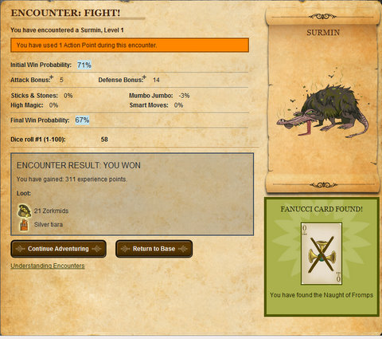

Back to: [West Karana](/posts/westkarana.md) > [2009](/posts/2009/westkarana.md) > [April](./westkarana.md)
# Legends of Zork goes live! (UPDATED!)

*Posted by Tipa on 2009-04-15 06:54:33*

Ready to return to the last days of the Great Underground Empire and carve bloody Zorkmids from the flesh of every goblin you find? Are you prepared to match wits with a troll? And if not, why not? They aren't very bright and let's face it, if YOU think the stench is bad, think of how THEY feel. They have to live with it ALL THE TIME. Killing them would be doing them a FAVOR. Especially those holding shiny treasures; those are the ones who need your help the MOST, because the shiny treasure only continually reminds them of how wretched they are compared to you, the best the Frobozz Magic Company has to offer. You just might be one of the [Legends of Zork](http://legendsofzork.com)!

Legends of Zork owes a huge debt to [Kingdom of Loathing](http://www.kingdomofloathing.com/). Like KoL, LoZ is a browser based adventure game where you are given a limited number of ~~adventures~~ action points each day, with which you can explore nasty dungeons or fight monsters without lifting a finger. You buy the spells, armor, weapons and skills for your character and set their attack and defense options, then watch as battle after battle takes place.

Just watch your health and come back at times to your base, A White House with a mailbox in the front and an slightly opened window around toward the back, to sell your loot, store your treasure, and rest up for another trip into the wilderness.

The full announcement is after the break.

Hi Folks 

Okay, deep breath. It looks like our little casual adventure game is ready. That would be Legends of Zork, for those dozing at the back. 

Now, we know that some of you are expecting one thing, and others are expecting another. Our aims are modest: we’re simply hoping to distract you for a few minutes each day. So we hope that you’ll like it but remember that we have constant development going on behind the scenes, so you’ll see more and more features added over time.  Please don’t hit us! 

One more thing, this being the Internet, it’s entirely possible that quite a lot of you might arrive at the same time. We use Amazon’s rather magical infrastructure so hopefully you won’t see much of a performance drop, but it might happen, so bear with us. People are standing by with monkey wrenches just in case. The Internet surviving a nuclear war indeed… 

Okay, enough disclaimers, go have fun. [www.legendsofzork.com](http://legendsofzork.com)

The LoZ Team 

Oh, and no, it’s not an April Fool’s gag :)

---

And tonight, their new newsletter, which you can read right ... about .... NOW.

Hi folks,

This is the first of many Legends of Zork newsletters you’ll be receiving (and possibly ignoring, but please don’t, we send these out because there’s stuff you guys need to know!), and while they will all of course be very important, we can’t promise they’ll all be filled with as much raw wit and humour as this one.

To begin, we want to thank you for joining Legends of Zork, and for making the game the success that it’s been so far. At time of writing we have well over 30,000 people playing the game, but who knows how many more will have joined while I’m running a spell-check on this?

We’ve been pleasantly surprised by the response to the game. There has been the occasional dissenting voice (and by dissenting we mean calling for our offices to be burned to the ground and the ground to be salted so that no other browser game can ever again grow here again), which we can understand, given the nature of Zork. For such a radical change to a much-loved franchise there will always be those who disagree with the route you take. But it seems the vast majority of you seem to like it. So we’re working hard to keep you folks happy. Read on.

For those of you ignore in-game messages, blogs *and* forums (you’d be amazed), the main updates which went out last week are listed here: http://blog.legendsofzork.com/2009/04/09/latest-game-update/

Short version: No more sneaky AP stealing (our bad), a new player search and better placement of buttons (makes life much happier, trust us).

So, what’s coming next? Let me sneak a look at our Basecamp list:

-making stuff go faster. Optimizing graphics in particular.
-a collection of fixes/updates for Groups. More control. Less confusion. More/better individual loot.
-more information shown on Inventory page (Potions/Charms/Skills/etc.)
-invite friends.
-Zorkpedia.
-overhaul of public profile page
-overhaul of inventory page
-actual Internet Explorer 8 support. A bit like going to the dentist. But it must be done.
-improved Fanucci page
-new PVP features
-Clans. Did someone say Clans?
-maps for Groups
-Level 50+ content

You’ll start to see these (roughly in order from top to bottom) start to appear this week. Please bear in mind these are only the major things. We have a vault of minor tweaks (ranging from tick-boxes on in-boxes to adding levels to friend lists) which are also being done. I just didn’t want to bore you with the details.

Also, you’ll be seeing the newly written serialised History of Zork appearing shortly. Mostly for the role-players, but anyone else might like it too.

Oh yeah. We’ve got a competition about ready to go. Give us a few days to get everything else ready but it involves extremely limited edition signed things. Won’t say any more just yet.

Finally, and for many, *far* more important. We’ve an interview with Dave Lebling, creator of Zork and founder of Infocom. For all the older folks, read it and remember the good ol’ days. For the newer peeps, read it and respect your history! It’s live now at http://blog.legendsofzork.com/

In the meantime, please keep the suggestions and criticisms coming. More ideas equals more features.

All the best,

-The LoZ Team.
## Comments!

**[Sente](http://adingworld.wordpress.com)** writes: Will probably pop by at some point to see what it is all about, just because it has Zork in the name.

---

**[West Karana » Legends of Zork: Post-mortem](https://chasingdings.com/index.php/2009/10/25/legends-of-zork-post-mortem/)** writes: [...] I found that the much-anticipated browser sequel to the Zork series was more akin to a Facebook app than an adventure game, I was willing to take the game as it was and not how I wanted it to [...]

---

