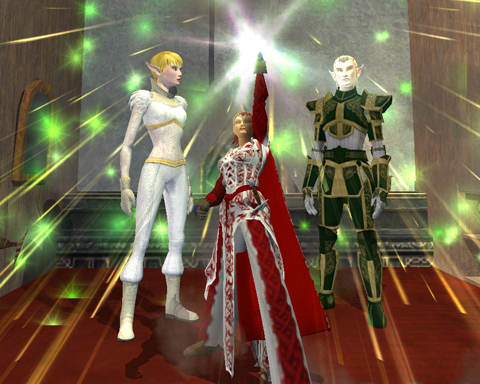

Back to: [West Karana](/posts/westkarana.md) > [2009](/posts/2009/westkarana.md) > [April](./westkarana.md)
# Happy 10th Birthday, EverQuest!

*Posted by Tipa on 2009-04-17 00:04:36*

To celebrate EverQuest's tenth anniversary, guides, GMs and the gods themselves are running through the servers getting down and giving treats. Nostalgia the Guild, EQ2 division, was there in force. Because, if you're gonna talk Classic EverQuest, nostalgia is gonna happen.

Plus, all this Shards of Dalaya stuff has me thinking about those good old, old days, where we used to group up to kill fire beetles and run screaming when Queen Klaknak showed.

Really. Pathetic, right?

When you log in, instead of trying to catch the Guild and Server Messages of the Day as they scroll past, you now get this lovely window which gives you those tidbits, plus new stuff at the marketplace, plus latest news, plus... I really like it.

I admit, I *am* a marketplace customer, so I go there all the time to see if they have anything new.

The Norrath Witness Protection plan -- which changes your name, gender and appearance -- is probably the best-named item I've ever seen.

Brightknife, still in costume from the Flavor of the Month session, scored a cool robe and stacks upon stacks of fireworks at the celebration, so -- Happy Birthday, EverQuest, from those of us at Nostalgia the Guild. You changed our lives and brought happiness, and how many games can claim that?

## Comments!

**[Stargrace](http://www.mmoquests.com)** writes: They brought happiness?! Quick kill it kill it!

True story.

---

