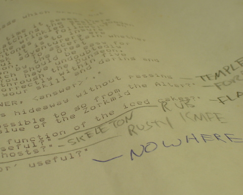
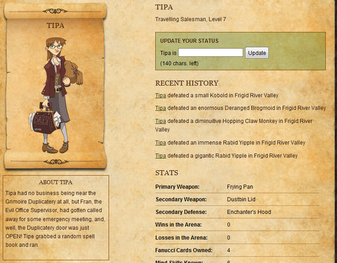
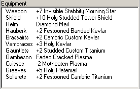

Back to: [West Karana](/posts/westkarana.md) > [2009](/posts/2009/westkarana.md) > [April](./westkarana.md)
# Achiever games: Legends of Zork and Progress Quest

*Posted by Tipa on 2009-04-17 07:33:50*

On February 17th, 1980, around 10PM, I was so frustrated with some puzzles in Dungeon (which would later become Infocom's flagship game, Zork), that I found out where on the University of New Hampshire's engineering school's VAX-11/780 the game was installed, and printed out all the text in the game, hoping that would give me some CLUE to the devilish puzzles. I still have that printout, covered with my scrawled notations and maps. Why I've kept that printout over twenty-nine years -- longer than many of my friends have been alive -- I don't really know, but there it is. I look at those words and remember nights spent in the lab learning about programming sound, graphics, user interfaces and compilers, but late at night after all the homework was done, trying to solve yet another puzzle in Dungeon.

So Activision/Jolt's "Legends of Zork" browser game stands in the shadow of a mountain of history with me. 

Zork comes from an earlier time. The popular computers of the day -- the Apple II, the Radio Shack TRS-80 and the Commodore PET -- barely had graphics at all, and there was no way a poorly drawn picture could come close to the richness (or humor) of a well-written paragraph. Zork's wit and fiendish difficulty were legendary.

None of that is present in [Legends of Zork](http://legendsofzork.com). In LoZ, you make a character and then send it out for twenty or so adventures (you are limited in how many adventures you can have per day). You get a short report detailing the monsters your character faced and what they looted after each battle, and that's pretty much it. It wouldn't even be all that much trouble to write a script that would run the game automatically so you would only need to check in every few days to see how your character was getting on.

Legends of Zork is just the latest example of what I call an "Achiever" game. The famous [Bartle Test](http://en.wikipedia.org/wiki/Bartle_Test) identifies four broad categories of gamers -- Explorers, Socializers, Achievers and Killers. Achievers care most about having the best score -- the best dps, the best gear, the most achievements (natch), the most pets, whatever. They're the type who put on their flashiest gear and go AFK in public places. 

Like that +10 Holy Studded Tower Shield? Yeah, I got that off a Battle-Leucrotta. FOUR of them. AT ONCE. Killed them all by myself. I already had a better shield, you know, a +50 Glowing Reflective Buckler of Boo-Yah, yeah, I got that. Someday you maybe can ... lol nah, not you. Noob. Check out my +13 Heavy Stabbity Spontoon!

[ProgressQuest](http://progressquest.com), the most popular RPG on the most popular Linux distribution, Ubuntu (really!), was a game made for Achievers and the spiritual ancestor of Legends of Zork. All you need to do is install it and set it running. Your character will go out, have adventures, level, loot, return to the market to sell and buy upgrades, complete quests -- all without you having to do a thing. But the bragging rights? All yours. 

Though it satirizes and distills Achiever-based gameplay, PQ, in its simplicity, points out how powerful the draw of getting new stuff is in modern gameplay. The [most popular MMO in the world](http://worldofwarcraft.com) is based almost entirely on Achiever gameplay (and they have recently added an entirely new chunk of game devoted toward earning even more achievements, just for bragging rights).

Given the huge popularity of Achiever games these days, it's no shock that when Zork came back, it did so as an Achiever game instead of its original incarnation as an Explorer game.

Where are the Explorer MMOs these days? Vanguard struggles along, but since they don't even offer a real map in the game, the possibility of stumbling upon something entirely new is always present. EVE Online supports exploration, but EVE is set in space, there's really not much to see aside from another planet, another enemy base, another asteroid belt. Most every other game is presented fully mapped and explored before the first real player ever sets foot in it.

We're in an Achiever world, and we just better get used to games becoming ever easier while the rewards become more and more grandiose. 

This is funny. I played my twenty daily adventures in Legends of Zork today and I can't remember even one of them! I made over 4K Zorkmids, though.

## Comments!

**[mbp](http://mindbendingpuzzles.blogspot.com)** writes: I feel a bit guilty Tipa. When I read yesterday that you were excited about the new Zork game I had intended to post a link to a review I saw somewhere that wrote off the game as a poor substitute for Progress Quest.

---

**[The Friendly Necromancer](http://thefriendlynecromancer.blogspot.com)** writes: STABITTY!

---

**[Sente](http://adingworld.wordpress.com)** writes: Too bad, I was kind of hoping it would be at least a little bit in the spirit of Zork and other Infocom games.

For anyone that want to have a go at the real thing this [link](http://www.xs4all.nl/~pot/infocom/) may be helpful.

---

**[Tesh](http://tishtoshtesh.wordpress.com/)** writes: Indeed, in an information age, Explorers need more self control than the average bear. Explorers are, by nature, very curious critters, always seeking more information, and avoiding the easy outlets of a WoWHead or the like can be difficult... especially if playing a game marching to the Achievement drum, gating content behind Achiever milestones. Bleh.

Where's my dynamic world, already?

---

**[Saylah](http://notadiary.typepad.com/mysticworlds)** writes: Great post. I see a different angle though. Perhaps it's not so much that they are catering to achievers as much as exploration takes time and ticking of things in a list, not so much. I've been thinking about casual gaming more lately and I think this is the wave that we are seeing. Achievement type games are more straight forward in the goals and objectives and it's probably easier to pin the carrots along the trail to keep people going. It's also something you can do casually - log in and get something done and then log off. Exploration and more creative pursuits take time and the amount of time is unknown - I think that's the rub we're up against.

Using EVE's new exploration feature as an example. I'm getting back into EVE and have zero interest in that part of the game. You don't know how long it might take you to find a wormhole. You don't know what you're going to find on the other side. If it closes up behind you, you have to find your way out. For my playing hours, that present too much variability that for me at least, lessens the appeal.

There's no lie I could tell myself that would place the amount of time I game into a casual amount. However, I prefer settings where I can come and go as I need to during a session. I'm an explorer type but I do like getting things done. I think it's hard to fit that into a reliable time frame. Over the years, I've gone from wanderer to "list checker" because it's move convenient as a goal. My thoughts anyway.

---

**[Saylah](http://notadiary.typepad.com/mysticworlds)** writes: P.S. I'm also becoming more open to less than full-featured MMOs for the very same reason - convenient entertainment. I can pop into something and have some fun, then drift back to working or whatever else needs my attention. In a perfect world, both the time consuming pursuits and the casual could live along side each other in the same game - dynamic world. However, I'm seeing that is problematic. The casuals vs. hardcore rewards debate center around this problem. Players will always compare themselves against others and want equal fame, glory and phat loots. Free Realms as an example. I'm "thinking" it's more disjointed theme park of mini games and socializing than a real MMO which is sad. I'd hoped for a combining of the casual and not-so-casual in a setting that felt like the typical MMO virtual world versus the chat lobby of something like GuildWars.

---

**[James](http://twitter.com/jleard)** writes: Nice post. I hadn't considered the Bartle Test but "we’re in an Achiever world" precisely speaks to what I've been feeling for a long time. Being an Explorer first and foremost I died a little when EQ introduced PoP and effectively reduced the size of the world to nothing. Flightpaths in WoW meant there was never a reason to be an explorer there. I keep hoping to find some (updated) analogue to what I was doing in UO 12 (12!) years ago: aimlessly roaming the continent or sailing the seas and enjoying every minute of it.

---

**[Tesh](http://tishtoshtesh.wordpress.com/)** writes: James, you can still explore WoW, the flightpaths are just shortcuts. I see that as the best of both worlds; people can jump in and get somewhere fairly quickly (as Saylah rightly notes, short session gaming is important), but those who want to take the scenic route may easily do so. As I wrote earlier, it just means self control on the part of the Explorer, and putting exploration at a higher priority than running the Achievement treadmill or taking shortcuts.

---

**[Spinks](http://spinksville.wordpress.com/)** writes: I think Bartlett misses out one type, and that's the story oriented player. It can come out as social in a RP environment or as explorer if the story is the thing you explore, but I think there's a type of player who isn't really interested in the gameplay (or even the socialising) so much as telling (or being told) a story. And some of these gameless narrative type games could also play to that, it's more like generating your characters story in terms of what it fights and what it wins, without having to actually achieve or explore or socialise.

---

**[/AFK - April 19 &laquo; Bio Break](http://biobreak.wordpress.com/2009/04/19/afk-april-19/)** writes: [...] Tipa worries that we’re stuck in an endless stream of achiever games. [...]

---

**[foolsage](http://foolsage.wordpress.com)** writes: I think Tesh has hit the nail on the proverbial head. Static games in today's information-heavy world are basically all about Achieving/Killing, or very very rarely Socializing. In order to base a game around Exploring, you either need content that's kept secret from players (nigh-impossible today) or you need dynamic content. I don't see another good solution to this problem.

---

**[West Karana » Web Log 4/23 &#8212; Too Much News edition](https://chasingdings.com/index.php/2009/04/23/web-log-423-too-much-news-edition/)** writes: [...] by the way, is slowly realizing that the achievements in Achiever games are empty fun as he reconsiders the World of Warcraft end game. Cheer up. We all eventually move on [...]

---

**[Callan S.](http://brokenmarrow.wordpress.com/)** writes: I wouldn't agree it's the same as progress quest - you have 20 explorations, and banking your loot costs one exploration point. Losing all your hitpoints means losing all the loot you've found. So your hit with a classic question of how far do you press on, risking it all, or do you bank it, giving up one of your opportunities for finding more loot. You can judge it on how much hitpoints you have left, what sort of monsters the area seems to pitch at you and how handily you have beaten them, and how much the items you've found might be worth from their name (it doesn't say till you bank 'em).

Beyond that, it's not that complicated. However I would say that in terms of risk for reward management, legends of zork is more complex than world of warcraft. Maybe that's not a huge accolade, but that's comparing it to a game that does sell a hell of alot of copies/subscriptions.

---

**[Tipa](https://chasingdings.com)** writes: After a certain point, you no longer can lose battles unless you play at several levels past your level, so it is exactly like progress quest -- you hit the button until you are full of loot, then you sell and return.

---

