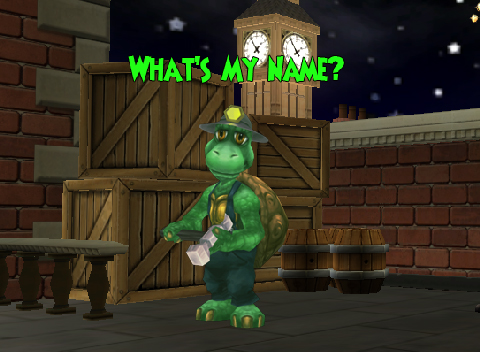

Back to: [West Karana](/posts/westkarana.md) > [2009](/posts/2009/westkarana.md) > [April](./westkarana.md)
# Wizard 101: Name the Turtles!

*Posted by Tipa on 2009-04-20 10:00:15*

I come from a big family, so big that Mom didn't even bother to name us! It was always "Hey, you!" and "That one, no not you, that OTHER one!" and "Everyone to my LEFT, time for dinner. Everyone to my RIGHT, homework time!". On my birth certificate, it just says "Baby Turtle #117".

Well, when Headmaster Ambrose hired me and my brothers and sisters to come to work building homes and islands for all the students of Ravenwood, I said, I will come, but under one condition. And Headmaster Ambrose asked, in that kind voice he has, what that condition was. I explained to Ambrose that we were all very proud of the homes we make -- we turtles carry our home everywhere, so we very much want them to always be at their best! And that when we built a home for a Ravenwood student, we wanted them to be able to tell people who built it for them. We need names!

Headmaster Ambrose thought this over for awhile, and then he agreed! He said that he was not wise enough to name all of us himself, but that he would ask the students, because in all his long years at Ravenwood, he had never seen a more clever group.

Now, Ambrose tells me I am going to be building homes for wizards who would enjoy living in Marleybone. I've drawn up the plans, gathered the materials -- all I need to know is my name so I can get started!

Won't you help? Fill in the form below with your Wizard101 username and what you think my name ought to be, and send it in! I couldn't be happier to know you're going to be helping!

Your browser does not support iframes.

My brother and sister builder turtles need names, too! Help name the Wizard City turtle by [visiting the Wizard 101 website](https://www.wizard101.com/site/home2/wizard101/page_8ad6a4041fea461f01207c374f82158a) (but I bet you already went there!). My friends at Wizard101 Central are helping [name the builder turtle for Krokotopia](https://www.wizard101.com/site/home2/wizard101/page_8ad6a4041fea461f01207c374f82158a)! The Friendly Necromancer's readers will [name the builder turtle for Moo Shu](http://thefriendlynecromancer.blogspot.com/), and the last of us, the one who will brave the monsters of Dragonspyre to make the grandest homes of them all -- well, you'll have to [follow the Ravenwood professors](http://twitter.com/Wizard101) on [Twitter](http://twitter.com) to find out how to name that turtle.

Prizes? You bet there are prizes! Aside from being the one to name us, the first wizard who submits the chosen name will win a Very Rare Housing Item for their house! WOW! And even if you weren't the first to choose my name, you get 101 Crowns just for suggesting the winning name!

There are a couple of rules, of course. First rule is, I get the BEST name! Heh... well, no, not really.

> No purchase is necessary to participate in this contest.
All submissions are the property of KingsIsle Entertainment.
All submissions are subject to approval.
The account for the submitter must be in good standing.
Only the first submission of each name will be counted as the original submission.
The first submissions for each name that are chosen will be contacted by email and will have 3 days to respond to the email to claim the prize. The winner will be chosen by KingsIsle Entertainment and the winner will be notified through the email address associated with their Wizard101 account. By submitting your suggestion, you understand and comply with these Regulations. Winners chosen from our fansites must provide a valid Wizard101 account name in their contest submission.

## Comments!

**[Wizard 101: A Tale of Two Turtles &laquo; Bio Break](http://biobreak.wordpress.com/2009/04/20/wizard-101-a-tale-of-two-turtles/)** writes: [...] be posting about Wizard 101 again, but I had to encourage you Harry Potterites to check out this new “Name the Turtle” contest that Tipa is helping to host over on West Karana.  It’s got prizes and glory and fame and [...]

---

**[West Karana » Web Log 4/21](https://chasingdings.com/index.php/2009/04/21/web-log-421/)** writes: [...] to the post since, this being a blog, stuff scrolls off the front page almost immediately, and the Name the Turtles contest is already buried under THIS post, and a long, long comic about two hobbits discussing how cool a X [...]

---

**[marleyest](http://www.wizard101.com)** writes: i lone this game.i play it mostley all the time.whoo hoo whoo hoo.

---

**[Tipa](https://chasingdings.com)** writes: What was your choice for the name for the Marleybone turtle?

---

**[West Karana » Web Log 4/22 &#8212; Earth Day edition](https://chasingdings.com/index.php/2009/04/22/web-log-422-earth-day-edition/)** writes: [...] 2 of the Wizard 101 Name the Turtles contest! My site stats show that well over a THOUSAND wizards have come to this site to choose a name for [...]

---

**[HermioneGrainger](http://wizard101)** writes: I think it was fun i did Trevor The Turtle

---

