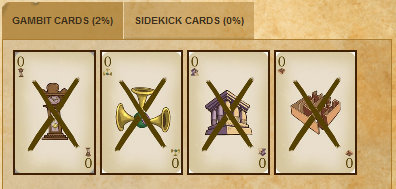
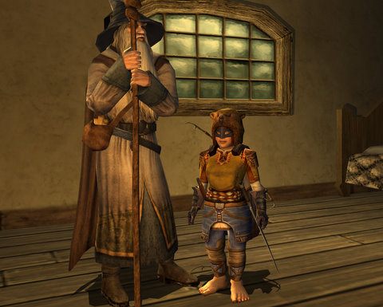
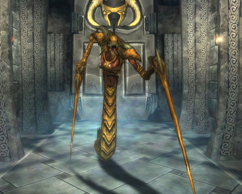
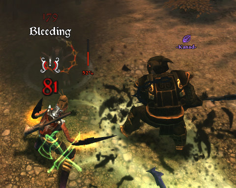
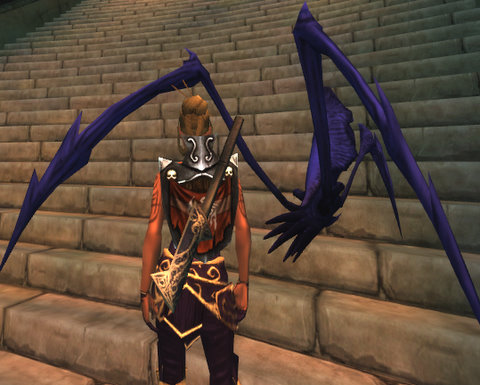

Back to: [West Karana](/posts/westkarana.md) > [2009](/posts/2009/westkarana.md) > [April](./westkarana.md)
# What I'm Playing: Easily Distracted edition

*Posted by Tipa on 2009-04-19 13:37:38*

These are the games I've played at least a little in the past week. I'm going to end up with Chronicles of Spellborn, because I haven't talked about it in awhile.

First up: I've been spending quite a lot of time in Free Realms and as much time as I'm allowed in another which I can't even name. What I can say is that I predicted awhile back that 2009 could be the best year ever for MMOs, and I'm sticking to that. There is some incredible stuff coming this year.

**Super Casual games**

I wrote a little about [Legends of Zork](../../../index.php/2009/04/17/achiever-games-legends-of-zork-and-progress-quest/), how it wasn't much like the Zork of old and how strongly aligned it was with Achiever gameplay, but that doesn't mean this game isn't a pleasant diversion. You spend ten minutes clicking links each day, and your character becomes marginally more powerful. It's not World of Warcraft, but it's not trying to be anything but what it is: A game you can play when you have a couple of minutes.

Cards above is my current Double Fanucci Gambit hand. I don't know if it does anything. The rules are ... somewhat vague. It MIGHT boost some attack or defense by 2% sometimes. I don't know!

Tomorrow, [Kasul](http://shatteredblog.wordpress.com) and I are going to try a group adventure... it's something you have to plan in advance.

I play My Brute each morning. I have four "brutes" making their way through the lower levels -- A Dire Bear, Wet Sprocket, Scottie Dog and Race Car (pictured). I think all of them are level 5 now. This game is even more non-interactive than Legends of Zork, but it's fun to watch the little pixel characters fight it out, and I like to cheer them on with cheers like "USE YOUR SWORD" and "WHY DID YOU JUST THROW YOUR WEAPON AWAY?" and "WHERE THE HECK DID YOU LEARN TO FIGHT?"

I used to carefully choose their opponents, now I just always choose the first on the list. You can join the fight against my hilariously incapable main guy, A Dire Bear, [by heading to My Brute](http://a-dire-bear.mybrute.com/), making a "brute" of your own, and tossing D.B. around the arena.

**MMORPGs**

I haven't touched my Windfola characters since I restarted with my hunter on Landovar in Lord of the Rings Online. After soloing the epic prologue and every step until the final one, I joined a group for an anticlimactic journey through the truncated version of the Great Barrows that is the final instance. Afterward, Strider takes off and Gandalf sends me to my death -- he advises me to go deep into the Lone Lands and take service with Radagast the Brown, whom we know from the books is allied with Saruman and has turned the birds into spies for the White Hand. It just doesn't seem like a Smart Idea.

I'd have played more, but Free Realms, of which I can't write, has taken a lot of my free time.

Having finished (except the farming!) Wizard 101 with my Life wizard, I restarted as a Myth wizard. Myth is what I played in beta, I kinda missed it, I now know what to do with my training points, and the shared bank means I can pass high value loot to alts so they can sell it for their own needs. My main is at max money pending housing, she can't sell anything any more.

Marissa is level 6 at the moment, but I'm in no hurry. As long as she looks cool, I'm happy.

REALLY looking forward to the housing, and waiting with anticipation for it to go live on the Test server so I can get a peek before it goes live.

I, um, haven't adventured in EQ2 for weeks. One of the cool things about EQ2 is that you DON'T HAVE TO. There's plenty to do if you don't want to go out looking for a group or solo or whatever. Aside from going to the [tenth anniversary celebration](../../../index.php/2009/04/17/happy-10th-birthday-everquest/), I've mostly been doing some [one panel comics](../../../index.php/category/general/humor/one-panel-comix/) with Petrified Eye illusions and the Station Marketplace animated dolls.

Why not? It's FUN. Also, I finally remembered to grab my Prismatic Longsword from my house vault so now I look REALLY glowy! I have Raincaller equipped too, but it's not shown here.

**The Chronicles of Spellborn**

Kasul and I both did the first Trial of the Vault, the Vault of Lessons Learned, last night. I died trying this solo instance at level 11 with my rune mage on the EU servers a few months ago; as I level 14 ancestral mage, I didn't have any troubles. Kasul did it at level 9, sailed right through it, made me totally envious.

You don't fight this critter, by the way. He pops up in a cinematic when you finish, and I don't know what it's for. A preview of the next trial? I don't know! Completing the first trial grants you access to NPCs who can port you between the bottom and the top of the Vault's mountain, to save pilgrims some travel time.

The whole idea of the Vaults is to bring you back to earlier times in the shattered realm's history, but the first trial is just telling you about how different critters attack.

In front of the Arena District in Quarterstone. This is a quick idea of the look and feel of the entire game. Massive, stylized -- I want to say Teutonic. An NPC in front of the Arena, when asked why they aren't having competitions and stuff, says some players have been cheating with their PeP... so kinda breaking the fourth wall there.

Kasul and I had a lot of quests that took us down to the Graveyard in the Pit District, a PvP-enabled area CRAWLING with deadly, swarming hyenas and other players, all of which might want to kill you. I've been attacked there before, but with Kasul and I grouped, those few who passed weren't interested. It's not uncommon to face four or five level 15-ish hyena at once, and without a good skill deck, you just aren't going to survive. And then you're going to lose PeP. And losing PeP is BAD.

Level 15 let me wear this shiny shield I found a long time ago, and have been saving until I was skilled enough to wear it. No stats, like all Spellborn armor, but it still looks cool. At 15, I also got a new pet, a Calaspider, VERY creepy, but it slows enemies and does good dps as well. I still feel more comfortable with my healing pet, but I find myself starting fights with the healing pet and then following up (after the healing pet is inevitably killed through heal aggro) with this slow/dps pet.

I ended the night at level 16 and dead asleep on my chair. Spellborn is a pretty intense game :) Almost done with Quarterstone quests, which are designed to bring characters from levels 10 through 15 in a mostly non-combat manner (Hoggsridge on Parliament is the combat-focused way to do the same), and then it's back to Parliament for awhile and then, I think, off to the shard of Ringfell, an entirely new shard for me.

Tomorrow -- Monday -- West Karana will be taking part in a little bit of a contest. Check it out, it'll be fun :)

## Comments!

**[Dragonchasers &raquo; Blog Archive &raquo; Failing the Focus Saving Throw](http://dragonchasers.com/2009/04/19/failing-the-focus-saving-throw/)** writes: [...] guess if Tipa can own up to being distracted, so can [...]

---

