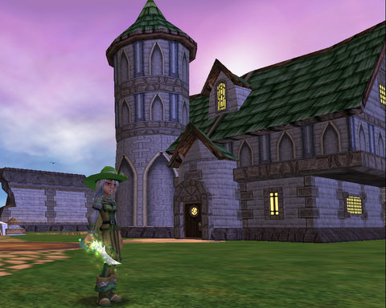

Back to: [West Karana](/posts/westkarana.md) > [2009](/posts/2009/westkarana.md) > [April](./westkarana.md)
# Wizard 101 Player Housing ON TEST!

*Posted by Tipa on 2009-04-23 01:24:47*

  
*Welcome to my island!*

This was truly LATE breaking news! After midnight my time, checked my email one last time before bed and read this:

---

To our Subscribers and players who have made a Crowns purchase in the last 30 days, we invite you to test out some of our new features on the Wizard101 Test Realm.  
  

We will be looking to you to test out the following additions to Wizard101:

 * Housing - Housing and housing item vendors can be found in all the worlds of the Spiral. Decorate your house or your Dorm room!

 * Voiceovers have been added for Marleybone, MooShu and Dragonspyre

 * Tips will appear to alert you to any items you have received as a reward.

 * Run Speed modifiers can be found on Crowns items and as boss drops.

 * Markers can now be placed that will allow you to recall back to a marked location.

 * New messaging for Dungeons when you enter and if you log out while inside.

 * New messaging for Quest drops such as 'Collect Armor'.

 * Boat and Balloon rides are now optional.

 * Friend Requests show more information about the character.

 * The ghosts have fled from Firecat Alley and Triton Avenue to be replaced with different creatures.

Naturally, I went right for the housing, though I'll be sure to check out the other changes soon. I'm sorry this has to be pretty much just pictures, but I'm dog tired so it will have to do for now.

I started off with 99,999 gold; I ended with under 15,000 after buying up everything I could find for the biggest islands in Wizard City and Marleybone. Additional items are available for purchase with Crowns. The turtle names are NOT the final names, they are just placeholders.

Any questions about any of the pictures, let me know. All the furnishings inside and out were bought with gold from the furniture vendors in the house/furniture shops. You can buy floor and wall designs as well as more standard fare.

[gallery link="file"]
## Comments!

**[stargrace](http://mmoquests.com)** writes: Oh neat! What a great day yesterday was for news! I don't have nearly enough money yet to buy a home and fit it out but they look awesome!

---

**[MmoQuests.com » Exciting News All Around](http://mmoquests.com/2009/04/23/exciting-news-all-around/)** writes: [...] housing has gone to the test server in Wizard 101! I have really been looking forward to this. Even though I don’t play Wizard 101 as much as [...]

---

**[West Karana » Wizard 101: All ten player houses](https://chasingdings.com/index.php/2009/04/26/wizard-101-all-ten-player-houses/)** writes: [...] my excited overspending on the first night of housing on the Test realm, was erased! When I logged in, I found more than that had been erased — all [...]

---

**[MMOHUB.ORG :: &#8216;Wizard101&#8242; introduces player housing :: May :: 2009](http://mmohub.blogsome.com/2009/05/08/wizard101-introduces-player-housing/)** writes: [...] website. If you are interested in how some of the housing might look like, head over to the West Karana blog and check out all the neat new [...]

---

**[mae](http://youtube.com)** writes: um i dont know how to join the test realm
can you help me?

---

**[Tipa](https://chasingdings.com)** writes: This is an older article. The test realm isn't live at the moment. Sorry :(

---

