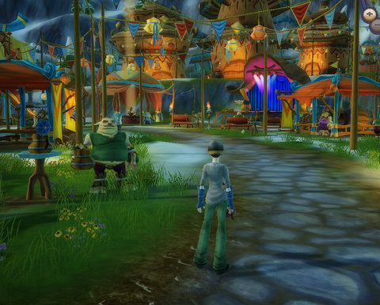
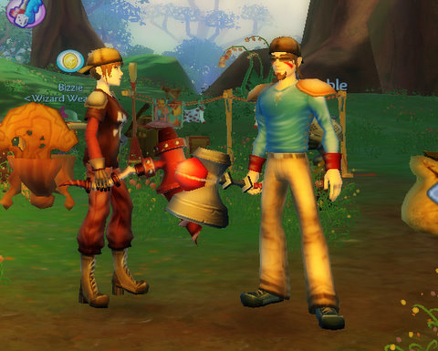
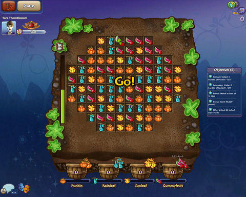
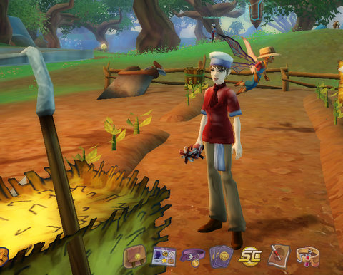

Back to: [West Karana](/posts/westkarana.md) > [2009](/posts/2009/westkarana.md) > [April](./westkarana.md)
# Free Realms: SOE discovers Technicolor

*Posted by Tipa on 2009-04-23 08:32:13*

Time to put on your shades, spin the name wheels and step into your time machine, because it's 2004 and SOE has just released World of Warcraft: Kids Edition.

This isn't a criticism. WoW is a great game, but the similarities are unmistakable. It looks JUST like WoW, the game is HIGHLY polished, consistent look everywhere. You are in a cartoon, but it's a fun cartoon.

Character creation is meant to be easy and simple. The small number of choices will be instantly familiar to anyone who plays WoW or Wizard 101 because in Free Realms, as in those others, you are recognized by your gear. Fifteen different outfits for fifteen different jobs. The name wheel will also be familiar to Wizard 101 players, though you can request a custom name which, if approved, will replace your name wheel name.

There are no irreversible choices in Free Realms. It's nearly always, can't decide between Option A and Option B? Choose them BOTH! Your first choice in the game proper is which job you should train first, Chef or Brawler. No matter which you choose, you get to try the other before you leave the tutorial.

The choice between Chef and Brawler is, in reality, the choice between Minigames and Combat. Free Realms is two interlocked but separate games. In one, you travel from location to location playing minigames to advance -- Chef, Kart Driver, Demolition Driver, Postman, Pet Trainer, Miner, Blacksmith and so on. In the other, you enter instances to fight monsters or take treasure from dungeons -- Brawler, Ninja, Wizard, Medic, Archer and so on.

There's a bunch of non-profession specific minigames as well -- harvesting, certainly, but they have a broad selection of themed games like various flavors of Tower Defense and an in-game collectible card game that, like in Final Fantasy VIII, has you seeking out trainers all over the game world.

The professions themselves are evenly split between free jobs everyone can play, and those requiring you to be a member. There's no need to pay real money for anything in game, but if you want to be a blacksmith and make weapons, or an archer and zap from a distance, you need to be a member.

Free Realms isn't shy about pushing their membership; you'll see a basic version of a minigame available, with a more advanced version stamped with the Members Only badge. And so forth.

Free Realms offers SO much variety, it's hard NOT to like the game... except for the issues, which may be because I have a crummy computer, admittedly.

The game sometimes gets in a state where it starts choking and stalling. I think this might be because of interactions with XFire, the tool I need to run because it is the official communication tool of Nostalgia the Meta Guild. In this state, it becomes impossible to play unless I reboot.

The chat window plain doesn't work for me and I don't know why. It's okay until it needs to scroll, and then -- it's a jumbled mess.

Even with the issues, it's a fun game that I look forward to playing when it goes live. There's a sense of humor -- and a sense of wonder -- that I enjoy, and for a kid game, the dungeons are extremely clever and cool and often quite challenging.

The game is even MORE fun in a group!

Totally recommend this game, and Free Realms is one of the big reasons why I think 2009 will be a fantastic year for MMOs.

## Comments!

**[stargrace](http://mmoquests.com)** writes: I've said this a few times, but I LOVE the bright bold colourful world. After playing so many games where colour just isn't an option (barring LotRO which is also quite colourful) it's a nice change. I also love the mini games - will it be my main mmo of choice, no of course not. But when I have a few minutes here and there you'll definitely see me heading off to the next derby race or cooking up a pot of stew.

---

**[Pete S](http://dragonchasers.com)** writes: Consider my interest re-invigorated. (Is that a word?)

Do we know if they're going to do a wipe between this beta period and launch? Normally I'd assume yes, but with a casual game like this I'm not as sure. I don't really want to start playing seriously until I know my dude will stick around (since launch isn't too far off, is it?)

---

**[rob](http://www.lostaneighth.com)** writes: Is it wrong for me to be surprised at how polished the game is? I mean, EQ2 is a great product, but I don't think the more realistic art style has aged as well as the more stylized look of WoW has. However, when I talke about Free Realms polish I am not just talking about the games UI and art style, I mean everything. The web based installation was brain dead easy and fast. The game runs like a million bucks, even on my lower end laptop. Once I did that cooking quest in the tutorial and they said I was going to have to make some stew I just KNEW it was going to be your typical gather X, Y, and Z, and click "combine" type of thing and I couldn't have been more wrong. The mini games are BRILLIANT. 

I haven't had time to play a ton of it, but I think it is an AMAZING product and one that I can't WAIT to share with my daughter.

---

**[rob](http://www.lostaneighth.com)** writes: Oh, and another thing ... unlike many "mainstream" MMO games, Free Realms has no set "genre" of setting. I love that you can be in a dark and scary dungeon area and an hour later you are romping through unicorn and rainbow land. The best thing about that is that they can go anywhere with this in the future. New races, classes, areas to explore, etc.

---

**[Green Armadillo](http://playervsdeveloper.blogspot.com)** writes: I'm with Pete in wondering how they're handling the beta transition. Judging from the station cash icon in the last screenshot, I'm guessing that they're already accepting not-so-micro-transaction cash, which would seem to augur for no reset. Either way, it's free to try, so I'm not feeling the usual "need to try the beta to learn whether it's worth paying for the launch game" rush. :) 

I am definitely glad to hear that SOE took the time to get the polish in before launch. This thing is almost certain to make them tons of money, and it'll be nice to see someone actually take the long view on quality for a change.

---

**[Saylah](http://notadiary.typepad.com/mysticworlds)** writes: My biggest dislike about FreeRealms is that EVERYTHING IS INSTANCED. I can't count this as an MMO anymore than most people do GuildWars. It is so much like PoTBS that I'm not sure I can get past that to see what's good. I simply can not stand being whisked off into a private instance for every flippin' thing in the game. I mean geez. Does that change later in the game and I didn't stick it out long enough or is that just the design? *ugh*

---

**[MmoQuests.com » A Little Free Realms](http://mmoquests.com/2009/04/23/a-little-free-realms/)** writes: [...] Tipa writes about creating a character and the basics of this kid-friendly game. [...]

---

**[Don't Fear the Mutant » Let&#8217;s talk Free Realms, shall we?](http://blog.dontfearthemutant.com/?p=503)** writes: [...] 2 on my DS was stronger than staying up and writing about FR. Since then, a few people - such as Tipa and Stargrace - have had time to at least give some initial impressions of what might just turn out [...]

---

**the friendly necromancer** writes: Exactly my feelings, tipa. Wow for kids. Tons of fun too!

---

**[Free Realms: WoW Killa &laquo; Bio Break](http://biobreak.wordpress.com/2009/04/23/free-realms-wow-killa/)** writes: [...] even though (by her own admission) she’s got some major bias when it comes to this title.  Tipa calls it “Technicolor WoW” and sings its qualities to the heavens.  Some are just thrilled about the trading card game [...]

---

**Neiebuse** writes: Saylah, yeah, that's the design. IS it a 'real' MMO? I dunno, that depends on what you call an MMO, really. Are there thousands of people playing together in a single world? Yes. Is your character persistent through play sessions? Yes. Personally, I consider that an MMO.

The thing to bear in mind is that Free Realms is not like, say, WoW, where combat IS the entire game. In FR, you have a collection minigames and one of those happens to be combat.

Personally? I think the instances are part of the biggest reason I like it, but not for any sort of social reason. In most games, in order to support a healthy population, you end up with fields upon fields of mobs, crafting stations, and stuff that, really, adds nothing to the game on its own. With all the content in FR being instance, the game world has been shrunk quite a bit and that's allowed the developers to just PACK it with little nooks and crannies to explore. There's so many little places to just see and you can drop in on NPC conversations.. sometimes I run around just to see what I can find. You can't do that if you need to consider that this game needs to have enough mobs for x people to kill at y level.

---

**Quantize** writes: Hey take a look at this...

Wizard101 System Requirements

Processor: 1GHz Intel Processor
RAM Space: 512 Megabytes
Video Card: Best results with GeForce 2 or equivalent
 (standard in most PCs)
Disk Space: 5 Gigabytes

Free Realms System Requirements

GeForce3 or better video card 
Intel Pentium 4 or greater processor 
Windows XP or Windows Vista operating system 
Broadband internet connection 
512 MB RAM 

Free Realms System Recommended

GeForce6 or better video card 
Intel Pentium 4 or greater processor 
Windows XP or Windows Vista operating system 
Broadband internet connection 
1 Gig RAM 

Can Sony really be this stupid?
Free Realms runs like crap on my 2003 Dell Windows ME. Wizard101 runs perfectly flawless.

---

**[Tipa](https://chasingdings.com)** writes: @Quantize -- I mentioned it has problems on my computer as well, but I think it's because XFire conflicts with it. I've turned off a lot of XFire's features. I agree, it takes a lot more resources than Wizard 101, but then, GeForce 6 tech is at least three years old.

@Saylah -- well, you're right. Everything is instanced, but you don't spend as much time in instances as in Guild Wars. Unlike GW, though, the overworld is not instanced. You always see people going here and there.

---

**[Free Realms - My First Hour &laquo; Girl Unplugged](http://girlunplugged.wordpress.com/2009/04/29/free-realms-my-first-hour/)** writes: [...] West Karana [...]

---

**Hello There** writes: I am loving the game. though i looks like the bastard child of Everquest and WOW. I signed up via Candystand.com and got this pretty sweet Spook sphere. Running around as a monster FTW!

---

**[Tipa](https://chasingdings.com)** writes: Oh wow, I didn't even hear about that!

---

**[Review: Free Realms &laquo; Welcome to Spinksville!](http://spinksville.wordpress.com/2009/05/02/review-free-realms/)** writes: [...] Tipa has a technicolour review with lots of pictures. [...]

---

