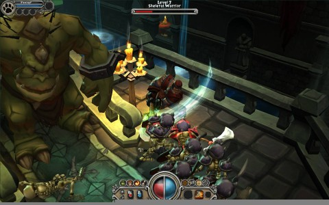

Back to: [West Karana](/posts/westkarana.md) > [2009](/posts/2009/westkarana.md) > [April](./westkarana.md)
# Torchlight: The second coming of Mythos?

*Posted by Tipa on 2009-04-23 19:38:04*

The founders and developers at Flagship Studios-Seattle, makers of the doomed but wonderful Mythos MMO, formed Runic Studios from the phoenix ashes of Flagship and have come back to life with the Mythos dream clenched in their fiery beak.

Um. Too flowery?

These two screen shots are from Torchlight, an action-adventure RPG in the style of Diablo and Mythos. Click on them for the full-sized originals.

[Runic Insider](http://www.runicinsider.com/) correspondent Taylor Balbi, ex-community manager for Mythos, saw a preliminary build of Torchlight at the recent Game Developers Conference, and has a [long, long feature list for the game](http://www.runicinsider.com/forums/showthread.php?t=20). 

Torchlight is, like Mythos was before it, a technology test that is itself a real, separate game. After Torchlight is released, work begins on the MMO set in the same world.

VERY exciting -- you can bet I'm going to be watching this closely.

If it comes out the same time as Diablo 3? We could have a problem, there... two similar games close together would be a Very Bad Thing, but at this time -- I'm looking more forward to Torchlight.

## Comments!

**[Pete S](http://dragonchasers.com)** writes: OMG! OMG! OMG!

Sorry... I'm just really excited at how much those shots look like Mythos (with maybe a dash of the silly/fun Dungeon Runners mixed in).

One of my great gaming disappointments was that I was in the Mythos beta, started playing it and LOVED IT SO MUCH that I didn't play it, because I wanted the "live" game to be fresh and new to me (sometimes betas burn me out for launch). And of course, it never launched. 

Very excited about this news, thanks Tipa!

---

**[Green Armadillo](http://playervsdeveloper.blogspot.com)** writes: Launching right before DIII, probably not a good idea. Launching a few months after, though, might be an ideal time to harness a market that's looking for more. I hope it turns out, it sounds like Mythos would have been good.

---

**[Robert](http://worldofsolitaire.com)** writes: I'm still having a blast playing Titan Quest (with it's expansion Immortal Throne). I loved Diablo 1 and 2. I even enjoyed Dungeon Runners for a wee bit. I didn't like the 'feel' of Sacred 2, the graphics/feel of the game just felt a little unpolished, a little off. Titan Quest however is like a very overlooked gem. It's a great, great game. For those curious, it's available via Steam.

---

**[Saylah](http://notadiary.typepad.com/mysticworlds)** writes: I never got around to trying Mythos. I think I was enthralled with W101 at the time. I did like the look and still do. I'd give it a try at least.

---

**[/AFK - April 26 &laquo; Bio Break](http://biobreak.wordpress.com/2009/04/26/afk-april-26/)** writes: [...] Torchlight looks interesting, but I’ve been burned by this sort of thing already (RIP Mythos!). [...]

---

