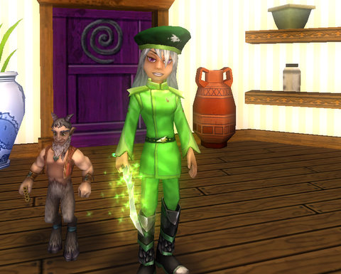
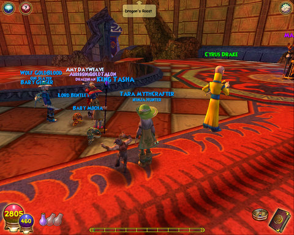

Back to: [West Karana](/posts/westkarana.md) > [2009](/posts/2009/westkarana.md) > [April](./westkarana.md)
# Wizard 101: Malistaire finally coughs up my robe!

*Posted by Tipa on 2009-04-25 20:10:06*

Way back in February, I was getting within a few weeks of finishing Dragonspyre and was [wondering how many times I would have to complete the final instance](../../../index.php/2009/02/09/wizard-101-how-many-times-must-malistaire-die/) before I got Malistaire's drop, my Life class robe, the best Life robe in the entire game, bar none.

After running the numbers, I concluded: "How many times will you, personally, run the last instance? Count on at least seven."

Tonight, with a pickup group, I got my Life robe on my seventh try.

After so many times through, all but this one with [Thomas, the Friendly Necromancer's](http://thefriendlynecromancer.blogspot.com/) help, I was used to disappointment, though in all the times through I did pick up the other two drops from the instance, the class ring and class athame.

It was a decent group, considering I formed it by jumping through realms in front of the Great Spyre, looking for people waiting to do the instance. I found two, and I logged Allison, my level 28 Balance wizard alt, in for the fourth in the group.

We got through the instance in decent time, though we flubbed the three crystal spires the first couple times, and almost (but didn't) flub the twin encounters before the final doors.

Icing on the cake? Allison got the Balance robe from Malistaire, too!

I still have to farm the hat and boots, but at least the one for which I need a group is done.

YAY.
## Comments!

**[The Friendly Necromancer](http://thefriendlynecromancer.blogspot.com)** writes: Gratz, Bren! Both sad and happy for you. Sad that I wasn't there. Happy that you got it. :-)

---

**[Spinks](http://spinksville.wordpress.com/)** writes: Congrats!

---

**[stargrace](http://mmoquests.com)** writes: WOOT! About time! Congratulations!

---

**Hegemon** writes: Well done :)

---

**[Tipa](https://chasingdings.com)** writes: @Friendly -- You had more important places to go. Family > ANYTHING.

Thanks everyone :)

Now to run the numbers on Kraysys....

---

**[ryan icesword](http://westkaren)** writes: woohoo yay im just lvl tyen but yay

---

**[ryan icesword](http://westkaren)** writes: acttually im lvl 11

---

**[ching ching](http://awesome.com)** writes: It took me forever too get it to, but asides from that congrats :-)

---

**[shelby darktamer](http://wizard101)** writes: i want to fight him to but i am only level tweenty two and i am stuck on the second world how do i get to marlybone

---

**[Tipa](https://chasingdings.com)** writes: You have to complete the Temple of Storms and kill Krokopatra in Krokotopia. Then Ambrose will send you off to Marleybone.

---

**[shelby darktammer](http://wizard101)** writes: hey did you know that there is a glitch that can make you skip all the battles and go straight ti malastare

---

**[Tipa](https://chasingdings.com)** writes: Not sure it's a glitch so much as a strategy, but yes, you can skip many of the battles.

---

**carson** writes: Question for Tipa:

If it is not too much to ask for, but could you please post a new newsletter about the new festives at Wizard 101. It would really make me happy:) Thanks.

Your biggest fan, Carson

---

