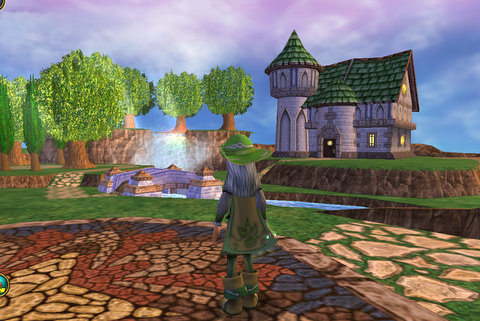
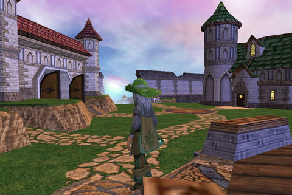
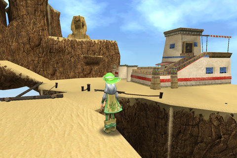
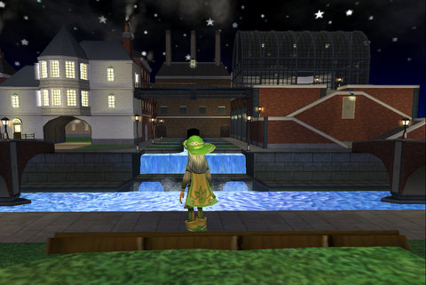

Back to: [West Karana](/posts/westkarana.md) > [2009](/posts/2009/westkarana.md) > [April](./westkarana.md)
# Wizard 101: All ten player houses

*Posted by Tipa on 2009-04-26 09:04:12*

I read on [The Friendly Necromancer's site](http://thefriendlynecromancer.blogspot.com/2009/04/fwd-free-gold-on-test-realm.html) that little leprechauns had appeared all over Wizard City, ready, willing and hoping to give everyone who talked to them 50,000 gold.

So, my excited overspending on [the first night of housing](../../../index.php/2009/04/23/wizard-101-player-housing-on-test/) on the Test realm, was erased! When I logged in, I found more than that had been erased -- all the characters had been reset, and I had all my original money back but had to buy those islands again.

With the leprechaun's help, I bought ALL TEN homes, just so I could bring them here as sort of a virtual real estate agent's storefront window.

div.x { text-align:center; padding-bottom:10px; font-style:italic; }

  
Wizard City small island

  
Wizard City large island (with theater!)

  
Krokotopia small island (surprisingly roomy tent)

  
Krokotopia large island

  
Marleybone small island

  
Marleybone large island

  
Moo Shu small island

  
Moo Shu large island

  
Dragonspyre small island

  
Dragonspyre large island. It's a tower. You remember Dragonspyre towers, right?

I also noticed a section on the left side of the screen which showed icons of all the stuff you have recently won in battles -- VERY handy if you miss the text after the battle, or can't figure out what that item WAS.

Wizard 101 continues to add features that truly make this, in my opinion, the very best of the Family MMOs.

## Comments!

**[Beau](http://www.spouseaggro.com)** writes: CUTE! And yes, I can say cute. I am perfectly comfortable using that word. Now, which one do I waaannnttt? lol

 Beau

---

**Quantize** writes: The recent loot feature and the mark location feature go a long way in making the game simpler and easier to use. I enjoy them a lot.

---

**[The Friendly Necromancer](http://thefriendlynecromancer.blogspot.com)** writes: Awesome. Think I will go try before I buy. How was the Marleybone housing? Wasn't that the one you were most excited about?

---

**[Tipa](https://chasingdings.com)** writes: I was thinking about Marleybone, but I don't like the layout. Being shrouded in night, Marleybone and Dragonspyre are both essentially gloomy. I never did like Krokotopia much, so that really leaves Moo Shu and Wizard City as candidates -- and of them, I like Wizard City best. I can still decorate it with the combined loot of five worlds, though.

---

**[Green Armadillo](http://playervsdeveloper.blogspot.com)** writes: I'm probably supposed to like the biggest and baddest house from the highest level zone, but somehow I think the little version on Wizard Island is my favorite visually. Go figure.

---

**[Tipa](https://chasingdings.com)** writes: I like the WC ones too :)

---

**Cameron Shadowflame** writes: I think i'm gonna get a nice MooshuMansion :D

---

**nestor** writes: i like the small island house of wizard city alot and the i like the big masion on mooshu i get both those houses.when this game realeses the houses.

---

**[West Karana » Wizard 101: Housing goes LIVE Wednesday!](https://chasingdings.com/index.php/2009/05/05/wizard-101-housing-goes-live-wednesday/)** writes: [...] Necromancer has been finding lots of treasures everywhere, and I’ve gotten a good look at all ten of the currently available homes (and a closer look at a [...]

---

**[jordan](http://wizard101)** writes: Can you try to make the member ship amout a little bit lower? Plz!? Cause i really want to be a member but my mom and dad said trhat its to much money and it sucks when i have a lot of quest to do but i have to be a member! Being a member makes you lvl up faster, but its too much money! I hope when i grow up i get to be a member. Like When i get my own credit card. I'm only 10. and i have a wizard. But i am addicted to wizard 101! I mean i LOVE it! Its so much fun! Exept not being a member. :( I always wanted to be a member so its not too hard for me to do the quests! And again plz try to lower the prices on member ship amounts cause i really, really, want to become a member! So i can do my quest already! But thank you for listening! :) 
 From, Jordan

---

**[Tipa](https://chasingdings.com)** writes: Hi, Jordan! Unfortunately, I have no control over how KingsIsle runs Wizard 101 -- I'm just a player like you. If you want to talk to the people who run the game, you can go to their support page by [following this link](https://www.wizard101.com/site/CustomerSupport/wizard101?siteId=8ad6a4041b4fd6c1011b5160b0670010).

---

**Molly Isabella Chloe** writes: Hey Tipa. Could you search around for the prices for each of the houses and then post em. Or maybe just post a link to a place where I may find the prices? I am trying to save up for a house but I spend gold right after I get it (spent my last gold on clothes in marlybone hehe). Thx! 8-)
~Molly Isabella Chloe

---

**[Tipa](https://chasingdings.com)** writes: Hey, nothing wrong with spending money on cool clothes :)

I'll look around!

---

**Marcus** writes: hey the marleybone houses rock i have the mansion it rocks especially the secret room

---

**[Tipa](https://chasingdings.com)** writes: I have that one! And I love the secret room -- that's my sorcery chamber!

---

**hitv** writes: this is soooooooooooooo stupid.... although i do play wizard101 those houses were dumb and stupid in every way! HAHA1

---

**[ryan icesword](http://westkaren)** writes: im just only lvl 11 but that last house big dragonspyre house has a big crystal in the middle flaoting look awesome
im just saving my money till im lvl so what ever im just a boy but sweet house you got there rich! so yea

---

**Marcus** writes: Out of those houses, could you tell me which has the most room starting from the greatest to the least? I would think the last one would have the most, i have 67k (67,000) and still pending which house I should get. But I really do want the last one though.

---

**pier** writes: they are awesome right

---

**[Michael](http://Wziard101)** writes: GO GO GO GO GO GO GO MOOSHU MOOSHU GOOOOOOOO0 I GOT the little all tenth houses

---

**Trevor** writes: the most costy one is the big dragonspireone, the least is the small wc one, i have had the little wc one, then now i have the big wc one and the little kt one! i want the big kt one really bad!

---

**carson** writes: I have that big Dragonspyre castle.IT IS HUGE.I love it because there sooo much space.It also took me forever to get up to 50,000 gold.

---

