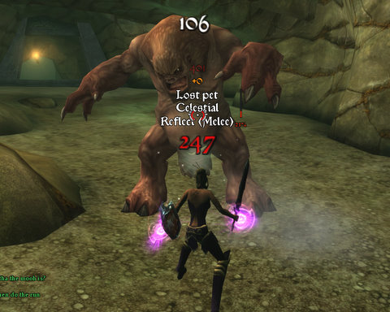

Back to: [West Karana](/posts/westkarana.md) > [2009](/posts/2009/westkarana.md) > [April](./westkarana.md)
# Chronicles of Spellborn: Returning to Parliament

*Posted by Tipa on 2009-04-27 12:00:58*

I spent a couple of days wandering lost through the silver mines in Quarterstone's Statue District, which ended the only way they could possibly end -- with my character's death and revival at the dungeon exit, whereupon I took off. While wandering through the dungeon, which is mostly a PvP-enabled area, I was attacked by packs of hyenas, hunted by raptors, burned by salamanders and tied to a plank by pirates. Vicious, vicious place, and I only got half of the incredibly rare resource I needed to harvest there. 

I did find someone from another House in the dungeon. Meeting someone from another High House in a PvP zone means you are mutually KoS. They had just been fighting, were low on health and suffering from a DoT. It would have been an easy kill, but after confirming with them that they wouldn't be coming after me when they healed, I moved on. I don't like PvP servers because I like ganking people -- I don't, and actually, I suck at PvP. I like PvP servers because you have to be more careful.

On Parliament, I advanced the epic House Shroud quest that moves us sneaky types through the game, found the mailbox and checked my mail. Oh dear, there's a lot of mail there, and most of them offered quests.

Looks like I'll be on Parliament for awhile.

Had my first chance in awhile (remember: lost in a dungeon for days) to check my loot, and I found this cool looking leaf blade, plus a REALLY cool looking two hander sword and a meh two hander axe. I totally don't remember these dropping. This sword is level 13, the two two-handers were both level 15, and in Spellborn, higher level doesn't mean better stats -- weapons have no stats. They just look cooler.

I fitted the sword with sigils for healing and rune damage (not that I do rune damage, it was the only sigil I had for the slot) and went out to find interesting ways to die.

And guess what? I go and get myself lost in another dungeon. Sigh. I did find an exit -- to Sorrowmist, a level 35+ zone. So I'm pinned in the dungeon by level 36 cats on one side and this horrible, horrible boss mob named Munch on the other. That's him in the top picture. I did manage to take him down without dying, though I went through easily a dozen pets. As soon as he drops, another Munch rounds the corner running straight for me.

That's when I discovered Sorrowmist.

Wish me luck.

## Comments!

**[Isaiah Spelldust](http://Isaiahswizardise.webs.com)** writes: hey dude! can you please bacome a mamber of my new site! i would love it! i really need some feed back and new members because the only member there is there is me!

Isaiahswizardise.webs.com

---

**[Tipa](https://chasingdings.com)** writes: You lost me at "hey dude!"...

---

**[Ramon](http://dalayan.wordpress.com)** writes: Every time you write something about TCoS, I download the thing again and see what's changed :) At the start, I did it mostly for the nicy shiny red-and-black armor I have, but meanwhile I see the game come together nicely.

Wonder if it's soon worth paying for, but I'm always afraid there just isn't enough spare time to warrant a full-price MMO :(

---

**[Tipa](https://chasingdings.com)** writes: You can just play the low level stuff for free, check out all the different classes... but I love reading about your adventures in Shards of Dalaya so much, I'd miss it if you switched to TCoS!

---

**[Ramon](http://dalayan.wordpress.com)** writes: Yeah, I've played TCoS right after it came out of beta -- or maybe I was in the beta test? I don't really remember. Though if it was the beta, then you might expect an NDA, and I can't remember that.

Thanks for the nice words :) By the way, a few others have started SoD character blogs as well and it's great fun. I'm working on a Planet that aggregates all those blogs, but it's not really official yet until it gets a pretty theme to look at. I'll blog about it once it's up :)

---

**[Isaiah Spelldust](http://Isaiahswizardise.webs.com)** writes: um just go to my site! become a member! Hey dude!

---

