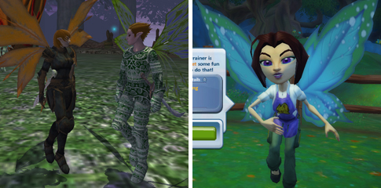

Back to: [West Karana](/posts/westkarana.md) > [2009](/posts/2009/westkarana.md) > [April](./westkarana.md)
# Can we get back to talking about EverQuest 3 now?

*Posted by Tipa on 2009-04-28 08:08:50*

  
*Will EverQuest 3 be going cartoony?*

Free Realms looks great and I know I'll be playing it for a long while, but I came into this genre playing EverQuest (if you don't count Nexus: Kingdom of the Wind), and I'll leave it playing EverQuest, so now that they have Free Realms out of their system, what's next for ~~our~~ *my* favorite franchise?

One of the things I liked least about EverQuest 2 was that EverQuest still existed. Here I was in EverQuest with several high level characters, and I had to start all over? A lot of EverQuest players said, well, if I have to start over anyway, I might as well do it in World of Warcraft as EverQuest 2. Because they still had EverQuest, you see, for their Norrathian fix.

EverQuest 3 mustn't divide the player base like that. SOE will likely manage that by not releasing EQ3 on the PC at all, instead making it a Playstation 3 exclusive title.

That's a mistake. While EQ has had some success on alternate platforms -- EverQuest Original Adventures for the Playstation 2, EverQuest Mac for the Macintosh -- the heart of the EverQuest community is firmly on the PC.

I think Free Realms might hold the answer, here.

Not that EverQuest should become a collection of minigames. I don't mean that AT ALL.

Well, actually... I totally DO.

EverQuest 2 got off on the wrong foot by competing with EverQuest, hurting both titles. EverQuest 3 should work WITH its predecessors, and not try to replace them.

SOE already has a game, by the way, that builds from and enhances both EverQuest and EverQuest 2. That game is Legends of Norrath, the themed collectible card game built into both games. 

EQ+EQ2+Free Realms+Legends of Norrath = EverQuest 3.

While EQ3 should definitely be a complete and enjoyable experience on its own, it should tie closely in with the earlier games. Free Realms has unlockable, special jobs? EQ3 should do the same. Having a sufficiently leveled adventurer or crafter in EQ1 or EQ2 opens up special prestige classes in EQ3. You can open these special jobs by leveling up some other class in EQ3, but EQ1 and EQ2 players get them from the start. Special jobs could be things like Beastlord, Mount Breeder, etc.

Special items could be craftable only in EverQuest 3, but sent back to characters in EQ and EQ2, similar to the loot items in LoN.

New characters would still start in newbie lands. Fast travel wouldn't get you to any other location until you had traveled there, on foot, from the start, after which you could travel easily, or more easily, between them.

EQ3 shouldn't even start on Norrath. Norrath should be something you EARN. Players should start in the ruins of the dying Demiplanes -- orc/ogre/troll characters in the remnants of the Plane of War, elves in the shreds of the Plane of Growth, and as part of the process, gain the ability to explore Norrath and see how it has evolved since the Gods returned and wiped all the player races from the planet to start over with new, BETTER races.

In EQ, the gods LEFT the world. In EQ2, they returned. In EQ3 -- WE return.

Anyway, just some thoughts.

## Comments!

**[openedge1](http://simple-n-complex.blogspot.com)** writes: All good questions...but, the biggest is not asked.

When would we see EQ3. 

EQ2 is so long in the tooth and it shows with it's old archaic client. How long can EQ2 continue until they lose that audience? 
With several games vying for it's audience (Aion I think is a perfect EQ2 replacement thanks to the crafting system being like a mini game, and flying will be awesome, and it high fantasy setting totally takes over visually), can EQ2 survive like original EQ?

Guess it will, but it sure can't be a money maker.

Cheers

---

**[Green Armadillo](http://playervsdeveloper.blogspot.com)** writes: I've only been visiting Norrath for a few months now, but I'd play your version of EQ3 if it didn't require hardware I don't own (like a PS3). 

That said, part of me wonders whether it's actually a good idea for SOE to make a third EQ at the moment. If you ask around with players who haven't been to Norrath (particularily EQ2) recently, the EQ brand is still strongly associated with the aspects of the game that convinced many of us not to start playing MMORPG's during EQ1's hayday - forced grouping, massive death penalities, and lots of grinding on mobs. If the EQ brand name isn't necessarily a selling point for people who aren't playing it currently, and marketing to players who ARE playing it currently risks splitting the market, why does it make sense to release an EQ3 while BOTH version 1 and 2 are going strong? Perhaps the station pass mitigates the revenue cannibalization, but it doesn't help with the problem of splitting the community. 

I would think that the smarter play would be to have their next big game be a new IP. A formal return to Norrath can come somewhere down the line, after it no longer makes sense to be expanding EQ1 and EQ2. For what it's worth, Blizzard seems to have come to this conclusion - the only thing we know about their next MMO is that it will be set in a new IP, rather than positioned as a market-dividing WoW2.

---

**[rob](http://www.lostaneighth.com)** writes: The Vanguard that was promised, but never quite delivered was the EQ3 I wanted. I adore the mini games in free realms and I think that going down this route has a ton of promise. One of the things I want to see EQ3 get away from it the notion of zones and instancing of major areas. I am fine with instanced dungeon runs and stuff like that. It gives developers places to make content that is heavily scripted and tailored to the party and individual players that are participating. However, for all other areas I want to see no instancing at all, nor zoning for that matter.

I think that going multi-platform is a great idea as well, especially on the PS3. Right now both The Agency and DCUO are going to be available on the PS3 ( Free Realms too? ) so this seems to be SOE's plan moving forward.

I guess I am not picky enough. :\\ The real question to me is "What itch would EQ3 scratch that isn't already being scratched by EQ2, WoW, and LOTRO." I think this is the biggest reason I tend to only play one of these games at a time and never seem to stick with Vanguard for long. They are all essentially the same style of game. I know that I don't want to see EQ3 become an action RPG style game, but I think that making it multi-platform would force SoE to streamline the interface and flow of gameplay enough that it would be radically different from all the existing MMOs.

Say what you will about FFXI, but it plays and feels like a very different MMO than just about everything else out there.

---

**[Keen](http://www.keenandgraev.com)** writes: I think you have some good suggestions here Tipa, like prestige classes and leaving the Norrath that we know behind. If you change the recipe too much though then it fails to be Everquest. Well, if you change it too drastically. 

What you have to really ask yourself is what made the original EQ special. You're saying the problem with EQ2 was that it had too much EQ in it, but I'm wondering if that wasn't so much the case. I'm thinking that it had too much of the *other* games in it that you mentioned, and those other games did it better. 

Rob has the right idea. What itch isn't being scratched? Well, for me it's the EQ itch. I entered the genre around 96, well before EQ, but I'll leave it (perhaps in spirit) playing EQ like you . Rob mentions the vanguard that was not delivered is the EQ3 he wanted and I think I agree with him. Boats, vast cities, open, group oriented, player cities, servers with PvP rule sets and those without, etc. 

I really like where this discussion could go, theorycrafting about EQ3, so I'll just stop there and observe what others have to say before commenting more. I may even blog about it myself. :) One thing I will say though in response to the multi-platforming is that EQ is anything but a game that should be streamlined. We don't need the Diet Coke of EQ and we don't need the "how can we make this like WoW" EQ for the next iteration - we need something that will shake the foundation as the original did.

---

**[The Wandering Rogue » EverQuest 3: Legends of Norrath](http://www.thewanderingrogue.com/?p=162)** writes: [...] the possbility of EverQuest 3, a game that I also hope sees the light of day in the coming years. Tipa talks about not stepping on the toes of the former games, and how EQ3 could borrow a few things from Free Realms. I understand where she’s coming [...]

---

**[/AFK - May 3 &laquo; Bio Break](http://biobreak.wordpress.com/2009/05/03/afk-may-3/)** writes: [...] thinks it’s high time to start pumping for EverQuest 3 info.  Wouldn’t that be EverQuest [...]

---

**Dyspayre** writes: *New characters would still start in newbie lands. Fast travel wouldn’t get you to any other location until you had traveled there, on foot, from the start, after which you could travel easily, or more easily, between them.*

this was done in Guild Wars and it was one of the major factors that i absolutely stopped playing that game. if EQ ever does this, right off the bat ALOT of players will not play.

---

**[Tipa](https://chasingdings.com)** writes: Well, EQ DOES do this. PoK books, spires, teleports.... travel in EQ is NOTHING like it was back in 1999.

---

