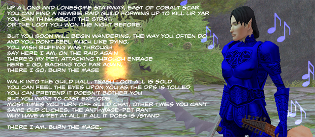

Back to: [West Karana](/posts/westkarana.md) > [2009](/posts/2009/westkarana.md) > [August](./westkarana.md)
# Daily Blogroll 8/7 -- Band Camp edition

*Posted by Tipa on 2009-08-07 07:54:54*

Back in EverQuest, the raid leader had banned all mage pets because they tended to push bosses into walls. The mages were not amused.

Aion: Next WoW killer? Caliga thinks Aion might take that coveted #2 spot of ranked subscription-based MMOs right behind World of Warcraft with [a final tally of 800,000 players](http://mmogamers.freeblogit.com/2009/08/06/the-guessing-game-again-aion/). He's forgetting that WoW players always return to WoW. Always. My own prediction? 200,000 six months in because A) it's a WoW-like, and B) it isn't WoW.

The subscription-based MMO currently in that second position? According to XFire, [it's EVE Online](http://www.xfire.com/genre/mmo/massively_multiplayer_online/). New games aren't competing against WoW. They are competing against a game that is NOTHING like WoW. Will Aion lure people from EVE Online? I doubt it. But hey, maybe CCP will be taking their unique space game to ground with their [mysterious new Dust 514 game](http://www.rockpapershotgun.com/2009/08/05/ccp-trademark-and-dodgy-logo/)...

Werit, btw, re-subbed to WoW (but only for a month!) to check out the battleground xp added with the latest patch. Is it a good place to level? Werit concludes, [not so much](http://www.weritsblog.com/2009/08/wow-pvp-leveling.html). But will it get twinks off the BGs?

Mr. Anderson of Juxtaposed Life [wonders about Blizzard's priest math](http://www.xenopulse.com/blog/?p=687). If Healer A and Healer B are meant to be able to heal just as well, but Healer B can do it using only half the spells, and also tank, nuke, fly, breathe underwater and do dps, then just what is the advantage of playing Healer A again?

And [via the Ancient Gaming N00b](http://tagn.wordpress.com/2009/08/06/quitting-eternal-skirmish/), Lore Sjöberg’s generic MMO exit survey. They want you back. Really. [Unless you're a big macrame fan, anyway](http://badgods.com/quittinggame.html).

Is that enough WoW news? Let's move on.

Beau Turkey, sensing with his spider senses a gap in the world of gaming social networks with GAX Online's shuttering, [is thinking about starting one of his own](http://epicdolls.com/beauturkey/?p=1911), with moderation to deflect off topic posts. For me, Google Reader does a good enough job of collecting all the blog posts I want to read :)

Sean Emeraldweaver of Modern Automagic wants people to know [the difference between a noon and a n00b, Wizard 101-style](http://www.modernautomagic.com/2009/08/word-of-day-difference-between-n00b-and.html). (You're welcome, Sean!)

"[Second Skin: Losers in Basements](http://en.wikipedia.org/wiki/Second_Skin_%28film%29)" is available for your viewing pleasure at [SnagFilms](http://www.snagfilms.com/films/title/second_skin/) and [Hulu](http://www.hulu.com/watch/87648/second-skin) for this coming week. Am I being unfair to a film I haven't seen all the way through? 

I've only seen ten minutes of it so far, and it makes me feel awful about myself, so there you go.

*Added: I almost forgot until reminded by [Scopique](http://www.cedarstreet.net/) on [Twitter](http://twitter.com/Scopique): This is a Champions Online beta preview weekend! I'm eager to see how the game has improved since the last time I was able to play. I hope the servers stay up this time.*

## Comments!

**[Andrew](http://teethandclaws.blogspot.com)** writes: "He’s forgetting that WoW players always return to WoW. Always. "

We do? Crap... I'm doomed then. I cannot escape my own legacy.

"The subscription-based MMO currently in that second position? According to XFire, it’s EVE Online. "

I've seen a lot of people try to use numbers from XFire to state facts about popularity of different games. All it really tells us is that, among XFire users, the number two MMO is EVE. It tells us nothing about the position of the game relative to others throughout the entire MMO gaming space.

XFire numbers for EVE are particularly dangerous to take as gospel because CCP & XFire had some sort of special promotion running at some point, and so the odds are good that more EVE players use the service than general MMO gamers.

Just saying.

---

**[Tipa](https://chasingdings.com)** writes: Granted, but it's the only numbers we have. If the game devs want us to have real numbers, give us real numbers. They stay silent, so we have to go with what we've got, right? And EVE Online truly is popular. 45,000+ players each and every night? WoW gets that, I'm sure, but I doubt any other subscription-based MMO does.

---

**[Ron](http://www.random-abstract.com)** writes: I deleted my Level 70 and her underlings 18 months ago? No going back to an empty server.

---

**[Andrew](http://teethandclaws.blogspot.com)** writes: Agreed on the annoying void when it comes to concrete numbers. For whatever reason devs want to use subscriber/registration numbers as a marketing ploy, and so only release stats that make them "look good".

And I'm not disputing the popularity of EVE.... but I'm not sure that we can declare it the second place western subscription-based MMO on the strength of the XFire numbers precisely because the selection bias of that utility is badly skewed based on the CCP promotion.

---

**[Tipa](https://chasingdings.com)** writes: Well, as far as having exact numbers, at 11:30EST, EVE Online has 30,267 players playing concurrently, right now. I doubt very much that the #3 contendor, LotRO, has even half of that. Xfire ranks may only be loosely correlated to actual rank, but in this case I think they tell a true story, and do tend to support the idea that fantasy MMOers are largely content with WoW, and that being different is not an automatic fail.

---

**Endelon** writes: Hey,

I check your blog everyday with my usual list of sites. I came across yours while looking for EQ2 information a long time ago (ex-EQ1 player too heh) but I've never left a comment =P

Anyways, I just wanted to comment about EVE Online being number two. There's no way that game has the second most subscriptions after WoW. Aion already has several million in Korea and well...Asia in general as seen in this article http://uk.pc.ign.com/articles/985/985368p1.html and while they don't technically "subscribe" to the game (Koreans buy game time as opposed to monthly fees for unlimited access) they still pay for it. Not to mention Lineage1 is still very popular in Korea (as is Lineage2) and I am pretty sure those games have more subscribers than EVE... and I want to say Final Fantasy XI is still the top game in Japan, but I could be wrong. Doesn't EQ2 even have more subscriptions than EVE?

---

**[Tipa](https://chasingdings.com)** writes: Hi, Endelon!

Last I heard, EQ2 has about 150,000 subscriptions while [EVE has north of 300,000](http://www.massively.com/2009/05/06/eve-online-turns-6-today-announces-over-300k-subscribers/). 

It's not fair to compare Western subscribers to Eastern, since they pay far less, and paying a quarter for an hour every month is enough to call them a subscriber. If I could play an hour every month for a quarter, I'd still be playing WoW, too.

I really think based on all evidence that has come my way, that EVE Online is the West's #2 subscription-based MMO. Lord of the Rings Online likely next, followed by Warhammer, all centered around 300K subscribers. There's another plateau at 150K where I believe EQ2, FFXI, City of Heroes, and other moderately successful subscription MMOs sit.

---

**Endelon** writes: That's really interesting, I didn't realize EVE had that many subscribers. I'm also surprised I missed that article since I check Massively everyday too =P

I suppose if you don't count Eastern subscriptions, although they still pay money to play the game. Maybe rating games by total revenue instead of total subscriptions would be a better measure? I kind of agree with you since I hate that WoW likes to throw around 11 million subscriptions when half or more are in China (which is in limbo now).

---

**[Tipa](https://chasingdings.com)** writes: Revenue would be the best way, I agree, but revenue is even HARDER to discover.

---

**[Sente](http://adingworld.wordpress.com)** writes: *XFire numbers for EVE are particularly dangerous to take as gospel because CCP & XFire had some sort of special promotion running at some point, and so the odds are good that more EVE players use the service than general MMO gamers.*

@Andrew: When there were some special promotions going on it did show in the XFire numbers and EVE briefly became more popular than the #2 on the MMO list, Guild Wars. After a while it settled down to the usual positions. 

But it is certainly dangerous to take \_any\_ XFire numbers as fact, other than what the numbers show (number of XFire hours played and # of XFire users playing a particular game).

*It’s not fair to compare Western subscribers to Eastern, since they pay far less, and paying a quarter for an hour every month is enough to call them a subscriber. If I could play an hour every month for a quarter, I’d still be playing WoW, too.*

@Tipa: The Eastern market is not as uniform as the Western market in terms of MMO pricing. There can be significant different between countries such as China (which is cheap) and Japan and Korea (which is relatively expensive). The price models used can also be more diverse in some cases there, which does not help in comparisions either.

And that is also only considering absolute prices, not comparing to the buying power of the target audience in each country. 

The problem with most comparisions is that we are not really saying what we want to get out of the comparision. If revenue is the best measurement, then we are interested in it because we are just interested in which MMO company can pull in the most money. Which is also a separate measurement from profit, which perhaps would be more relevant, or rather profit/player.

And if we want to compare it due to "popularity" there always tends to be a number of caveats inserted because there are attempts to remove or normalize factors that are not pure gameplay (e.g. price models). But what to we actually want to get out of the comparision? Everyone is looking for different things (to some extent), which make the whole comparision task difficult at best if it is not clearly stated.

---

