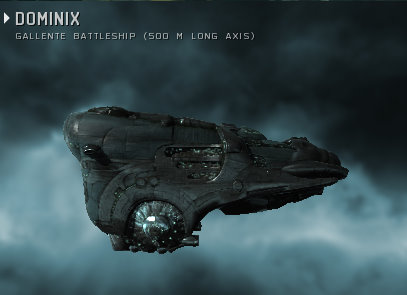

Back to: [West Karana](/posts/westkarana.md) > [2009](/posts/2009/westkarana.md) > [August](./westkarana.md)
# Daily Blogroll 8/12 - Dominix edition

*Posted by Tipa on 2009-08-12 07:45:14*

EVE Online wants you to make money. It's hard NOT to be swimming in the stuff. So your given level 3 mission might have a couple dozen enemies in it. You get a bounty on every one you kill, they drop loot which can sell for a fair bit, can be salvaged for loot worth a million or more (sometimes much more) if you get a decent price, and many have asteroids that you can mine with very little danger that anyone will locate you. I've been sending my mining proceeds to one of the corp officers, and last night he parked a battleship at the local trading hub for me -- the mainstay of the Gallente Federation Navy, the Dominix drone tank battleship. Half a kilometer of hurt clad in a meter-thick skin of tritanium. Now I have to train for a few days to be able to fly it to my base in Aunia -- the EVE Online equivalent of bringing a new battery and a pair of jumper cables to check out a used car. (THANKS, RED!!!)

Spinks is of the opinion that not only are Achievement systems the latest and greatest evolution of the MMO genre, but [they are so wonderful](http://spinksville.wordpress.com/2009/08/12/achievements-for-non-achievers/) that even those people who really don't care about in-game achievements, now really do. No, seriously, even in my favorite MMO currently, Wizard 101, I don't bother grinding for the rare badges. I honestly don't care about achievements in MMOs, and I doubt I'm the only one. Achievements in EQ2 make me not want to log in.

The Ancient Gaming Noob [tosses out a line and drags back some wild guesses](http://tagn.wordpress.com/2009/08/11/the-approaching-cataclysm/) about WoW's (unconfirmed) next expansion, Cataclysm. Could WoW use the next expansion to revisit some of the older lands in new ways? Maybe. Guild halls and player housing? Hmmm.... maybe. But if they did it, there would be an achievement for papering the walls with mounted fish -- count on it.

Green Armadillo is back in the Lord of the Rings Online and [taking another look at the Mines of Moria](http://playervsdeveloper.blogspot.com/2009/08/more-early-re-impressions-of-moria.html) expansion. Forewarned is forearmed, he learns, with legendary weapons, and the long-abandoned, deadly mines of Khazad-Dum is now a bustling metropolis complete with invincible goats. But he's liking the increased challenge of the solo game.

Darren at Common Sense Gamer wonders if MMOs, in their headlong rush to make their games easier and more rewarding to new and casual players, [are abandoning precisely the things that made MMOs fun in the first place](http://commonsensegamer.com/?p=1435) -- challenge and depth. The sorts of things he's now finding in war gaming. Can this be true? Possibly -- even experienced game developers find themselves [confused by too many choices](http://www.wolfsheadonline.com/?p=2570) in their games. David Messer of the Wizard of Duke Street [didn't have much luck](http://dukestreet.org/archives/004713.html) with the plethora of choices in EQ2, either. 

Significantly, EQ2's variety was considered a selling point back at launch. This was before WoW lowered the bar on almost every element of MMO gaming to that point. Now WoW is the standard, and anything more difficult than WoW is -- just too hard.

I've been thinking about doing a Historical Daily Blogroll from 2001, back when EQ was the king of online gaming, and games like [Horizons](http://www.istaria.com/) and [Dawn](http://www.glitchless.com/dawn.html) (stop laughing, Dawn was gonna be [the EQ killer everyone was waiting for](http://www.sharkyforums.com/archive/index.php/t-105220.html)) were vying to make things harder and even more complex....

Ysharros of Stylish Corpse likes EQ2's crafting fine -- AFTER level 20. [Why does crafting from level 1-20 have to be so tedious](http://stylishcorpse.wordpress.com/2009/08/12/only-hurt-20-levels/)? (Seems to me that the levels 1-9 go by pretty fast, but maybe I just haven't done it lately).

Calming fears that Aion would be going the "subscription PLUS RMT" route that seems to be all the rage these days, RER of (Insert Awesome Aion Name Here) reports that [the Aion cash store would only be selling vanity items and character services](http://insert-awesome-aion-name.blogspot.com/2009/08/micro-transactions.html). (via [Aionic Thoughts](http://aionicthoughts.wordpress.com/2009/08/11/new-information-from-ayase-calms-my-worries/)).

WoW, eat your heart out. It's [shoulderpads for everyone](http://www.thenoobcomic.com/index.php?pos=357) at the Noob Comic. And Ben Kuchera at Ars Technica looks at how poorly designed games actually [push their players away from the computer](http://arstechnica.com/gaming/news/2009/08/why-we-quit-the-moments-that-push-us-away-from-gaming.ars).

And lastly, via Wandering Goblin -- [is your boyfriend a noob](http://www.wanderinggoblin.com/2009/08/11/n00b-boyfriend-disappoints/)?

## Comments!

**[Andrew](http://teethandclaws.blogspot.com)** writes: "I honestly don’t care about achievements in MMOs, and I doubt I’m the only one. Achievements in EQ2 make me not want to log in."

I'm with you there. Hate 'em with a passion. WoW (that game I'm never returning to ;) has achievement announcements turned on for your local zone by default, which is spammy. You can turn those off, but then you're stuck with guild achievement announcements. They really made me want to stab someone repeatedly.

---

**user@example.com** writes: On EQ2 crafting, when I did it recently, 1-9 was basically a case of crafting one item, talking to the questgiver, dinging, and repeating. I think hitting 9 might have taken me two items or something, and once I hit 9 I spoke to a trainer, picked my tradeskill class, and... ding! 1-20 was pretty painless, and hitting 30 didn't take much longer - admittedly, I did 15(or 17, I can't remember)-30 in a guild, with a crafting room and basic materials provided. It still didn't take long at all, and I have a minimal attention span when there are so many other things to do.

Oh, and from level 20 onwards, I was making a fair amount of money via the broker, and at 30 (adventurer and tradeskill) I'm logging in after 12 hours away and finding at least a plat waiting for me - it's not a plat in profit, but 40-60 gold on a regular basis, for maybe five minutes of crafting at most, isn't anything to sneeze at at my level.

---

**user@example.com** writes: ...and once again, I forget the actual point of what I was posting. When I was doing the 1-9, and 10-19 crafting, the items didn't take long at all - the complaint is that your arts are too weak at that level, but I really didn't find it to be slow. It got faster after those levels, but at the time it seemed to take a reasonable, short amount of time.

---

**[wilhelm2451](http://tagn.wordpress.com/)** writes: Now how are your drone skills doing? The Domi has a big drone bay so you can have minions go do your fighting.

---

**Ryver** writes: Congrats on the new ship! You'll be out there flying it in no time.

Now if I can just get myself back in game consistently ...

---

**[mbp](http://mindbendingpuzzles.blogspot,com)** writes: Congrtaulations on you shiny new Domi Tipa. I played EVE for about six months and I didn't quite make it to my first battleship. I think the Dominix happens to be one of the coolest ship designs in EVE. There's a real Flash Gordon / Art Deco thing going on there.

---

**[Tesh](http://tishtoshtesh.wordpress.com/)** writes: Yeah, I'm not a fan of Achievements. I don't mind that some people like them, but I have no use for them, and wish I could turn them off.

---

**[Tesh](http://tishtoshtesh.wordpress.com/)** writes: Gah, hit "post" too soon. While I don't like Achievements, it is pretty easy to argue that they have had a significant impact on the MMO world. They are another treadmill that keeps people playing the games. That's another reason why I don't like them, but they have proven to be a useful tool for the game devs to keep sucking in those sub dollars.

...and the more I hear about EVE, the more I remind myself that I should at least try the trial, either the 14-day one via the EVE site or the 21-day one via Steam. Or both. :)

---

**[Sentry Drones are Boring &laquo; The Ancient Gaming Noob](http://tagn.wordpress.com/2009/08/12/sentry-drones-are-boring/)** writes: [...] entertainment. Tags: Dominix trackback On my last post about a mission in the Sushi Boat, the ever popular Gallente battleship the Dominix, my drone armed AFK mission runner, Tony suggested that I give [...]

---

**quimbius stormfyre** writes: While I am still emjoying EQ , been 10 years already !!! My first online games were sci fi based I think I will give EVE a try just not sure on the learning curve. I ewnjoy your visits to Erolissi Marr as Tipa, but I think I may be coming to an Asteroid belt near you soon.

---

**[Tipa](https://chasingdings.com)** writes: EVE Online isn't that hard to learn. The big thing with EVE is setting your own goals. But no EQ player should have a problem with that :) I'd love to see you in New Eden!

---

**Egat** writes: I'm still waiting for your historical blogroll Ms. Tanglewood.

---

