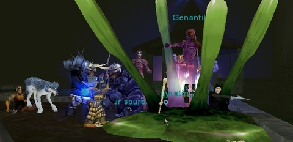

Back to: [West Karana](/posts/westkarana.md) > [2009](/posts/2009/westkarana.md) > [August](./westkarana.md)
# Daily Blogroll 8/13: Gyrating Goo edition

*Posted by Tipa on 2009-08-13 08:00:24*

I THINK this screen shot came while we were raiding the City of Mist for Jalanea's shaman epic. Remember when guilds used to raid the City of Mist? Something I really liked about EverQuest was the mix of raid targets in leveling zones. Now it's all instances and keeping people away from each other as much as possible. Sad.

Speaking of EverQuest, most gaming sites have been showing the new trailer for EverQuest's hundred and twentieth (or so...) expansion, "Underfoot". This trailer, "[The Road to Underfoot](http://www.gametrailers.com/video/debut-trailer-everquest-underfoot/54174)", shows all manner of giant killing all over Norrath that lead up to the opening of the Plane of the Duke of Below to players this autumn. Both group and raid targets are on the table, and both high and low level, so gear up, find someone taller than yourself, and have at 'em. Gnomes and haffers, go crazy :)

Wolfshead, who famously took EverQuest 2 apart in his "15 Minutes" look at the Queen's Colony newbie island, has turned his critical eye toward [the first of the newer newbie experiences, Greater Faydark and Kelethin](http://www.wolfsheadonline.com/?p=2828). I don't want to be all [Ms. Negative](../../../index.php/2009/08/13/eq2-how-to-find-the-banker-in-kelethin/) about the post, but, as with his last article, I don't agree that WoW is the gold standard by which all Fantasy MMORPGs shall be judged. I liked the original Kelethin in EQ1, like the update done in EQ2, and I've done enough of the quests to understand why it is that the Fae overrun the place and there's precious little there to do with the other races native to Faydwer. So I'm not an impartial judge.

He liked the community, though. The community for both EverQuest and EverQuest 2 are among the best anywhere.

Unlike, say, Aion's. Rer of (Insert Awesome Aion Name) [has been perusing Aion's Ranger class forums](http://insert-awesome-aion-name.blogspot.com/2009/08/sippin-on-hatorade.html) and finds *"L33t players" are drowning out legitimate posts asking basic questions with "get lost newb", "go roll another class", "stupid question", etc.* A bad start for the Aion community or just an isolated instance? Hoping for the latter.

I love reading Warhammermer's blog for the fascinating looks into F2P games I haven't gotten the chance to try yet. This [Ether Saga parody video](http://exploringwar.wordpress.com/2009/08/13/ether-saga-fun/) almost has me downloading the game right now :)

[Taymar](http://www.mmorpg-info.org/eq2/search-for-knowledge/), [Feldon](http://fanfaire08.feldoncentral.com/2009/08/12/the-thirst-for-knowledge/) and [Stargrace](http://mmoquests.com/2009/08/12/a-mysterious-package-eq2-scavenger-hunt/) have each received mysterious packages, each containing a shard of a shattered crystal tablet. Will more turn up? What lore does this reveal? Well, it's clearly a substitution cipher, so it shouldn't be that hard to figure out ... when more shards turn up.

This is the [last week to play in Champions Online's closed beta](http://www.massively.com/2009/08/12/champions-online-open-beta-and-early-start-schedule-revealed/) before it goes into open beta next week. So, I'm thinking NDA drops this weekend? I'll be ready!

Unrelated point, it really cheesed me that Aion cut off the beta access for a lot of us so early. I'd have loved to get deeper into the game and perhaps write about the PvP, but before I knew it, my time in that world had come to an end. Champions Online let me see the game from its very early stages until its fairly polished launch, and I really thank them for that.

The Evil Theurgist has just found out that KingsIsle has gone into lockdown as they ready their followup to their innovative indie MMO hit, Wizard101. What could it be? [A blurry picture could hold a clue](http://eviltheurgists.blogspot.com/2009/08/second-project.html).

And lastly, Syncaine returns to an old argument of his, that [EVE Online's mechanics would work really well in a fantasy MMO setting](http://syncaine.wordpress.com/2009/08/12/repeating-the-same-mistake-why-eves-skill-system-is-the-way-to-go/), this time applying it to the world of Darkfall. I agree! So why doesn't someone TRY it?

Beautiful day outside, gray and cloudy and maybe a bit rainy. I think I'll go drive in it. See you later, and keep gaming!

## Comments!

**[Stargrace](http://www.mmoquests.com)** writes: I envy your weather! Here it's 36c and bright and sunny, for the next week or so at least. I miss the rain.

---

**[syncaine](http://syncaine.wordpress.com)** writes: Perhaps CCPs World of Darkness will be a fantasy game that uses some of EVE's better systems. One can only hope...

---

