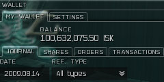
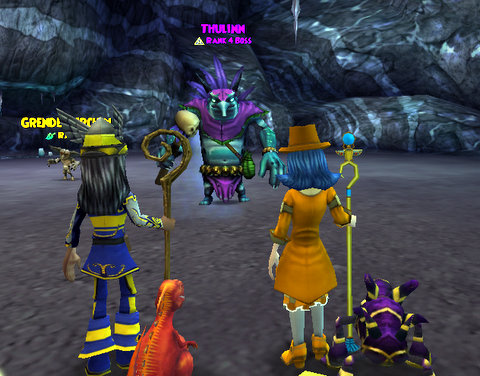

Back to: [West Karana](/posts/westkarana.md) > [2009](/posts/2009/westkarana.md) > [August](./westkarana.md)
# Weekly update: EVE, Champions and Wizard 101

*Posted by Tipa on 2009-08-14 08:01:17*

This has been a pretty decent week in EVE Online, which is running neck and neck with Wizard 101 as my main game. Earlier, Otakudyne corp officer Sredans made a Dominix battleship for me as reward in part for a couple of nights of mining; I'll be able to fly that Sunday evening. I was kinda disappointed to not find the skill to fly Gallente Battleships among the skills sold by the Federation Navy loyalty point store, so I put in a BUY order for the skill at a 20% discount from the average regional price set to expire just about the time I will need to train it. If nobody sells me one for my three million ISK, I'll just buy it, no big woop. After all, I AM a millionaire.

Yup, last night I hit 100 million ISK for the first time, then promptly lost it by placing that BUY order. I'll be losing a lot more than that when I buy the 1-run only Gallente Navy Comet blueprint after I earn a few more loyalty points. The Comet is the rarest of Gallente frigates, and having one is a real feather in the warp drive. I haven't had a frigate since I lost my flagship, Isis' Dark Laughter, in a stupid stare-down with a fleet of battleships. Yeah, I really thought I could outrun all those missiles. The blueprint will cost 30,000 LP and 10m ISK. Or I could get it for 50,000 LP and no ISK if I wanted to farm low-sec rats for their drops. Or I could just spend 80,000 LP and get it already made. It's all about the options.

My Myth and Balance duo finished the first section of Grizzleheim, Savarstaad Pass, last night. About 3/4 of a level for level 20 wizard Marissa, and maybe a quarter of a level for level 30 wizard Allison. I was kinda hoping Grizzleheim would be an alternative to leveling through Krokotopia, but that apparently won't be happening, so it's back to Krok for the team until Marissa reaches level 25 and can continue on to Grizzleheim's next quest hub.

The encounters would have demolished Marissa had she been soloing. I'd been on the fence about spending her skill points, and Grizzleheim pushed me off that fence and into the Life school. Marissa is now a Myth/Life wizard, and can cast pretty sprites on people to heal them and return them to life -- a good counterpoint to Allison's Balance/Death wizard.

Aside from a couple of touch-and-go fights (before I specced Marissa for Life secondary), the trip through Savarstaad settled down and it was fairly enjoyable with a good haul of house items. One jewelry upgrade dropped for Marissa; everything else was sold. Lots of harvests waiting for the ability to trade them back to Tara for crafting.

Took two different heroes from creation, through the tutorials and through both crisis zones last weekend. I'm so good at the tutorial now that I could complete all missions -- including optional ones -- in less than an hour.

Daddy's Little Girl (above), Analemma, Badger, Lederhosen Man -- all will meet their doom tonight. Tonight is the last chance to play in the closed beta. I'm just gonna have to log in one last time to say goodbye. DLG was the most fun to play of them all, but I did enjoy Badger and Lederhosen Man was just too much fun :) But you'll read all about LM, DLG and Moonmist when the NDA drops this weekend.

## Comments!

**Ryver** writes: Congrats on the nice pocket change.

If you don't mind, what are you doing to make your cash? I see you are mining. Did that start paying off for you?

I've been mission running in high-sec (level 1 missions) and ratting with corp-mates in low-sec. Slow, but steady income.

---

**[Tipa](https://chasingdings.com)** writes: Salvaging and then using the salvage to play the market for the best price. I make 2-5 million from salvage on most non trivial L3 missions.

---

**[Wiqd](http://wiqdintentionz.com/studios/blog2)** writes: I've played EVE a few times and I love it, but the thing for me is never being able to find a corporation I enjoy. Sometimes I can't even find a good corporation period! I've been a part of Eve University to start out and learn and while helpful, they're so big that it really does feel like you have little to no contact with anyone. How'd you find Otakudyne?

I love salvaging, personally and have a destroyer fitted with like 6 salvagers and 2 tractor beams that I run through an instance after I've wiped it clean with my Thorax. Lately though, I've wanted to explore the galaxy and use those devices that you send out to actually scout unknown places, etc. I forget what it's called. I've also wanted to get into research and construction to fill buy orders, but man ... so much to do! It's wonderful, really.

---

**Ryver** writes: Widq: Those are the probes that you want to look at. I believe you need to study Astrometrics to use the core probes which will help you find anomolies. 

Good to hear that you are not really doing much different than me then. I'll get up to L3 missions eventually :) I just ran a L1 mission a little while ago during lunch and made probably 600k ISK from salvaging even without playing the market for best pricing. Not too bad.

---

**Boogie** writes: If Grizzleheim isn't the alternative for krokotopia, is it one for marleybone?
Because I got out of krokotopia counting 27 levels, and that's only 2 levels above your aim for Grizzleheim.

---

**[Tipa](https://chasingdings.com)** writes: I think Grizzleheim's intended to be a little extra for Krokotopia, Marleybone AND Moo Shu, coming in at level 20, 25 and 30 for the full experience.

---

**Thistleborn** writes: You will find the ship skill for Gallente BS in the Space Ship Command section. Its 3.6 million and check the date until it expires, anything that 365 days is NPC seeded which refreshes every downtime and the cheapest you will find it at most newb stations like Fed Navy Acad. , CAS, or Cailie Schools. The Dominix is a drone boat, if you plan to fly it start on your drone skills or since you have piloted a Thorax the Megathron is the cheaper of the two gun ship BS. You will also need tons of support skills to fly a BS: Capacitor, Hull, Armor, Sensor (lock time on frigs is in the 20 second range =/ ), it adds up to at least another month of skilling to be able to use it effectively. Might want to get a Battlecruiser like the Myrmidon drone ship or Brutix gun ship.

Additional sub skill to train should be your learnings to 4 with learning skill 4 and advanced to 3 if you haven't done so already along with Cyber Implants to put in +3 stat. Can cut off up to a day on some of those 3 week level 5 rank 3 skills.

Anyway, off to hunt D'Vinn and Emperor Crush in the Balle system. They got the Journeyman's Afterburner and Short Hybrid Cannon of Yeksha drops. :p

---

**[Tipa](https://chasingdings.com)** writes: Well, a lot of the Gallente specific skills + a lot of gunnery skills are in the loyalty point store :P

EQ + EVE? IT COULD WORK!

---

**[We Fly Spitfires](http://blog.weflyspitfires.com)** writes: I haven't been able to play EVE for 2 weeks since I've been on holiday (have it installed on my laptop and it runs well enough to log on and queue up skills but not great to play plus I was way busy). I'm working Salvaging myself and am looking forward to getting my first Cruiser and doing some L2 missions to make some better cash!

---

**Amberlee** writes: WHY CAN I NOT GET OUT OF THE TUTORIAL????????????????????????????????????? I KEEP POSTING QUESTIONS AND GO THRU EVERY AVENUE FOR HELP AND NOTHING>>>I AM ASKING PLEASE>>>FOR SOME HELP...FUCK!!!!!!!

---

