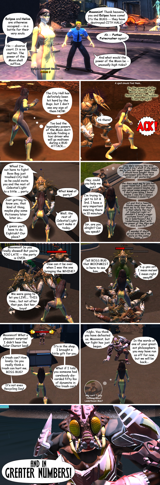

Back to: [West Karana](/posts/westkarana.md) > [2009](/posts/2009/westkarana.md) > [August](./westkarana.md)
# Part-Time Champions: Episode 1 - Moonmist

*Posted by Tipa on 2009-08-17 10:00:54*

The first of three comics set in Champions Online introduces Moonmist, the least famous member of the supergroup "Celestial Light". This comic was made early in closed beta and the game's look has improved substantially since. Also, the plot of the comic has absolutely nothing to do with the actual storyline of the tutorial.

## Comments!

**[Green Armadillo](http://playervsdeveloper.blogspot.com)** writes: I'm too used to meta-commentary, and thought that you had named your character MMO-ist. I was expecting powers like boredom immunity or anger-fueled rampages. ;)

---

**[Champions Online: Beta Impressions Collected &laquo; Bio Break](http://biobreak.wordpress.com/2009/08/20/champions-online-beta-impressions-collected/)** writes: [...] don’t miss West Karana’s Champions webcomic: Part One, Part [...]

---

