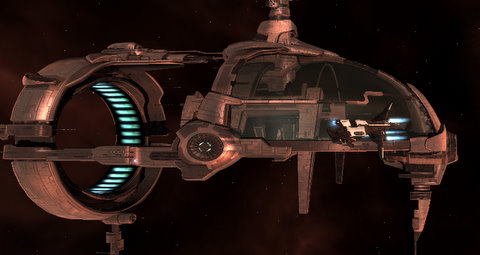

Back to: [West Karana](/posts/westkarana.md) > [2009](/posts/2009/westkarana.md) > [August](./westkarana.md)
# EVE: EVEMon is a crutch.

*Posted by Tipa on 2009-08-18 06:19:41*

To mix things up while gathering enough loyalty points for a Gallente Navy Comet blueprint (so I can see if I can make copies of it and thereby enter the 30m ISK-a-pop Comet business), I moved my base from Aunia to Marsalla and offered my services to the Public Relations department of the Federation Navy, reasoning I could use relatively safe courier missions to quickly raise my LP total. 

Well, there's wrong and then there's dead wrong. The first two missions they gave were the toughest L3 missions I'd ever taken, and in the second one, I lost my prized battlecruiser, the Myrmidon "End of Innocence", and had to trash fit my new Dominix "Ignominious Defeat" to finish the mission, though too late to gather anything from "Innocence"'s wreck.

The next few missions were the courier missions I'd hoped for, but with very small LP rewards. The last was a trip into 0.0 space. I used my speedboat, the Gallente Navy Comet, slightly refit for more cargo space to carry the mission item. Being a noob, the presence of free-floating warp disruptors at the 0.0 gate to the final system was a complete surprise. These drop you out of warp within firing range of gate campers, but not within jump range of the gate. I turned tail immediately for a random planet, dropping a bookmark along the way, then immediately jumped to my new deadspace bookmark while I thought about it.

They only had two disruptors, and they seemed to be guarding the warp path to the other gate in the system, and the path to the station in the system. If I came at it from a different direction, I could probably avoid the gate camp and be out of the system before they could even see me coming. I headed to the gate from my deadspace point, avoided the MWDs and was safely out of there, mission completed, and just an easy couple of jumps from Empire space and systems with names instead of numbers.

I'd waffled a bit about replacing the Myrmidon vs just moving ahead with the battleship. EVEMon reported me months away from a decent fitting. I bought another Myrmidon (and christened it "Not This Time") and sat down to figure out how to fit it.

EVEMon had suggestions for fits, but most of EVEMon's suggestions are for people with far more skills than I currently possess. I only started EVE three months ago, I simply haven't had time to get all the necessary skills up to 5, while at the same time training for things just purely for fun (like manufacturing, mining, refining and so on, skills which aren't directly in the path of combat).

It was really clear as I pored over the fittings for the battleship and the battlecruiser that EVEMon wasn't really going to be a lot of help, and after ignoring all the numbers, colors and graphs of the fitting screen in favor of just getting a list of parts from EVEMon, buying them on the market and fitting them, I was going to have to take the time to make sense of them all.

So that's where I am at the moment. No longer relying solely on Battleclinic for my fittings, but more taking the things I loot in missions and instead of just selling or reprocessing them, seeing how they would fit in my ships. I'll be able to use Battleclinic again in a couple of months, but while I train up my skills, I'll be learning how to fit my ships on my own, and really, it's about time.

## Comments!

**Akura** writes: Well done for having the presence of mind to warp off and make a bookmark! the first time I got pulled into a bubble, I was still saying "WTF!?!" when I found myself back at a station and minus my brand spanking new cruiser..

I'd advise against taking faction frigates into 0.0 space though - quite an expensive thing to loose :-)

---

**[Rick](http://slashrandom.wordpress.com)** writes: Echoing Akura's praise :) I wouldn't have had the presence of mind to warp in from another direction. That was keen observation.

It took a very long time for me to be able to fit a battleship. I learned to love my Hurricane battlecruiser :) Missions in the 'cane, salvage in my Thrasher, more missions, more salvage, while I watched my BS support skills slowly fill in over weeks :)

---

**[mbp](http://mindbendingpuzzles.blogspot,com)** writes: Hmm. Dropping a bookmark in space as you warp is quite cleve Tipa. You've been getting lessons.

I thought EVE-Mon was just for skills and Eve Fitting Tool was the ship loadout tool - has this changed?

---

**[JC](http://phoenq-magson.blogspot.com/)** writes: EVEMon has a "Battleclinic Fittings" link that brings up a window and people rate various fittings and whatnot, plus you thne have the option to import the needed skills for said fitting into your plan. You can't monkey with the fittings yourself like in EFT, though.

/echo the "warped away and made a safe" praise. I probably woulnd't have done that either.

Also /agree on the "you took a faction frig to 0.0?!?!?!?!?!" question. Faction frigs are considered "cool killmails" and are high priority targets.

IIRC, the BP's you get from the LP stores are 1-run copies, sometimes 2-run, but still, they are limited run copies all the same.

FWIW, for me, I focused early on learning skills (had my kids for the summer and so couldn't play much, so it was easy to just let them go) then got into a Drake BC asap. Still only could do T1/named fittings, but could do the L3 missions if I was careful. Once I was in the Drake, I looked at what I needed to train to get a T2 fit, plugged all the skills into EVEMon and then prioritized from shortest training time to longest. It took slighlty over 2 weeks, was all, but even before I had the full T2 fit I was able to take full room aggro and tank it easily in any L3.

I don't know if you've trained any shield skills, but the Myrm actually can have a very impressive passive shield tank, in spite of being bonused for active armor. If you can field T2 medium drones, you can look at putting the passive shield on, letting your drones do most of the work, and filling your highs wih a gun to draw aggro, and then a bunch of tractors and salvagers.

Downside is that then you've got shield skills and not the armor skills you need in the Domi, so it's more training in the end. But it does make crosstraining easier, I suppose.

---

**[Tipa](https://chasingdings.com)** writes: Okay, I have never used the EVE Fitting Tool before ((O.o)) It's WONDERFUL! Using it, I was able to turn a battleclinic plan into something I could actually use and life suddenly became a lot more fun. I'm in love -- THANKS!

Re: warping away and leaving a bookmark in deadspace -- a friend, Tracker Wolf, taught me that trick.

Re: taking a faction frigate into 0.0 -- yeah, I don't really want to lose the Comet. I nearly took it into a wormhole last night when the corp did a wormhole op but I thought back to your comments, parked it, and took my Exequoror instead. Probably saved the two members of BONES who were shadowing us in the wormhole from dying of laughter.

My Myrm is currently half active, half passive armor tank. I hope to make that more active as my skills grow.

Thanks for all the help and advice!

---

**[Shirrath](http://shirrath.blogspot.com/)** writes: Tip: The directional scanner allows you to detect and avoid gatecamps without risking your ship.
1. Warp to a planet near the stargate you want to go through.
2. Open your directional scanner
3. Move your camera so that the gate icon is in the middle of your screen.
4. Set your directional scanner's range to reach the gate. If you're unsure, just type in a large number to set it to max range.
5. Adjust the angle to something like 30 degrees
5. Uncheck "use overview settings" and hit scan
6. If the results show ships and/or warp disruption bubbles, the gate is camped from that side.

---

**AnrDaemon** writes: EFT is a real tool for your life.
As you already realized, BC loadouts are merely an ideas for your own fittings. You can't use that precious T2 thing, or you can't afford that faction/deadspace mod? Replace it with what you have in stock, being aware of the fact it will perform worse, but will still do the job.
Actually, I have posted some solid T1/named fittings already, they are affordable and perform well for starter skills. They are for frigates mostly, though...

---

**[Sky Grunthor](http://eve.battleclinic.com)** writes: BattleClinic is about helping you learn how and why to fit a ship properly. It is not about getting the best or "right" fitting. If it where we wouldn't allow anyone to post a fit. The highly rated fittings (when they are not a lolz rating) are good guidelines but just as important is the conversation that occurs about the fitting. In the end, why is much more important than what when in comes to learning to fit. If you know why, YOU can figure out the what.

Anyway, welcome to EVE. You seem to be getting into it very well. (and don't dual tank)

---

**[Tipa](https://chasingdings.com)** writes: BattleClinic has been a BIG help as I learn my way around EVE's fitting screen. It's not BC's fault that I took its recommendations a little too much to heart. The EFT is a great complement to it. Thanks for a great tool, Sky Grunthor :) This is two of the things I love about EVE -- the amazing community, and a game with a depth with no bottom. You can always become better.

---

**APS** writes: Yeah, EFT is awesome, and so is EVEMon, but they each serve their own purpose... personally, I never really bothered to use EVEMon for the BattleClinic fitting lists. I've always just used it for skill planning, and keeping track of skill training regardless of what I'm doing on the computer (love the G15 LCD functionality).

---

**Jirikisunta** writes: BTW - as far as your goal to enter production of valuable ships - a few pieces of information that you should have:

1 - All BP's gotten through LP stores are BPC's.
 1a - You can not make copies of copies (BPC's)
2 - There are no BPO's for faction/navy ships. Only T1 and T2 items/ships have BPO's, and there are VERY few T2 BPO's and they're very expensive.
3 - The only way to come by T2 BPC's is to create them via invention, or buy them from folks who are inventing or who have BPO's and make copies.

---

**[Tipa](https://chasingdings.com)** writes: Ah, I didn't know that about copies of copies. I thought there might be a way through invention or something to increase the production run or make a copy. Well, there goes THAT get rich scheme ;) Thanks!

---

